# F1 `class-configuration` — Flowchart

> Descriptive analysis (Pathfinder 2026-10-04). Normative authority: DOM-CLASS-001 v3.8,
> DOM-CLASS-002 v2.1, DOM-CLASS-003 v2.4, FEAT-CLASS-001/002/003/004/005/006/008, FEAT-ECON-001 v3.0.
> Code is cited by file:line as read on 2026-10-04 (HEAD `381a12d49`).

## Mandated path (docs)

1. **Ownership.** Class Configuration is the sole schema/mutation authority over `classes`, `economic_engine`, `class_features`, `feature_settings` (DOM-CLASS-001 §VI). It does not own rent/store/insurance/payroll/banking rules and does not mutate ledger/attendance/obligation/entitlement tables (§VIII).
2. **Class creation (FEAT-CLASS-001 §III–§IV, §VIII).** Teacher Provisioning Context (user_id only, *no* class_id/seat_id) → create Class → provision Teacher Seat → initialize required class configuration → update `last_active_class_id/seat_id` → enter new boundary. Atomic. `timezone` fixed at creation (DOM-CLASS-001 §V). `payroll` enabled at creation and never disabled (§VII.3).
3. **Feature enablement (FEAT-CLASS-004 §I, §V).** FEAT-CLASS-004 is the **sole** writer of `class_features`; append-only rows `(class_id, feature, effective_at)`; enable links an `economic_version_id`; disable appends a row with `deleted_at` and, for `rent`, withdraws untouched advance rent assessments via the Obligations withdrawal in the same transaction (§V.2; DOM-OBL-001 §V.8). A request to disable `payroll` is refused (DOM-CLASS-001 §VII.3).
4. **Economic engine evolution (FEAT-CLASS-005 §I, §V.1, §VI).** FEAT-CLASS-005 is the **sole** writer of `economic_engine`; new immutable version carries forward fields from the version in force at `effective_at`, links `previous_version_id`, and writes `class_features` rows for the listed features; one resolver (greatest `effective_at` ≤ t) answers "which version" (DOM-CLASS-003 §VII).
5. **Rebalance (FEAT-ECON-001 §V–§VIII; FEAT-CLASS-005 §XI; DOM-CLASS-003 §IX).** Rebalance writes nothing of its own; each selected change routes to its owning command (rent → `rent_settings` supersession dated to first unbilled period; store → product-version supersession; overdraft fee → engine evolution). Must be idempotent with `correlation_id/idempotency_key/feat_id/class_id` (FEAT-ECON-002); mode change never revokes a scheduled rebalance (§X).
6. **Banking directive (DOM-CLASS-001 §X v3.8; DOM-CLASS-002 §VII).** `get_banking_directive(class_id, effective_at?, include_fees=False)` is a pure, immutable projection; the initiating FEAT passes it to Ledger; no fee/CWI evaluation unless `include_fees`.
7. **Class destruction (FEAT-CLASS-006 §III–§V).** CanonicalContext target only; lock `users` then `classes`; re-evaluate under lock whether principal survives — else fail closed (FEAT-IDEN-007's job); compose plain `_destroy_class_scope_rows`; clear canonical pointers (§IV step 4; §VI calls this a route concern). Atomic. Terminal roster deletion triggers same rule (DOM-CLASS-001 "Terminal Roster Deletion").
8. **Unpaid-work notice (FEAT-CLASS-008 §III–§IV).** Teacher seat of the class, ownership verified, conditional write-once `UPDATE classes … WHERE … IS NULL`.
9. **GET purity / one FEAT per request.** No writes on GET (FEAT-CLASS-008 §II citing INV-ARC-007; FEAT-ECON-001 §XII); one FEAT per request, FEATs compose domain commands, never other FEATs (FEAT-CLASS-006 §V; FEAT-CLASS-003 §VII citing INV-ARC-000 §VIII.2, INV-ARC-021 §V.2).

## Code path

**A. Class creation (two live entry points, neither uses the FEAT-CLASS-001 implementation)**
- `POST /admin/create-class` `create_new_class` admin.py:9711 → canonicalize tz admin.py:9743 → `generate_join_code` admin.py:9751 → **route-opened** `FEATContext("FEAT-CLASS-001")` admin.py:9758 → `classroom_setup.create_class` classroom_setup.py:91 (insert `classes` :117–127, Seat :129–135, IdentityProfile :137–145, user pointers :147–150) → ORM `after_insert` listener `_seed_default_class_features` models.py:2945 inserts root `economic_engine` (:2964) and `class_features` for `DEFAULT_ENABLED_FEATURES=('payroll','banking')` (models.py:2672, :2980) on the raw connection → commit at FEATContext exit base.py:437 → `establish_teacher_session` admin.py:9769.
- Teacher signup: `complete_signup` teacher_signup_feat.py:67 under **FEAT-IDEN-101** → `create_teacher` → `create_class` teacher_signup_feat.py:78 (same listener side effects).
- `execute_create_class_boundary` feat_class_001_create_class_boundary.py:53/94 — no production caller (only tests/test_class_creation_timezone_invariant.py:144–183). It requires an existing teacher seat (:112–137), creates no Seat, and does not update pointers.

**B. Feature enablement (CWI gate)**
- `POST /admin/feature-settings/update` admin.py:9284 → hardcoded valid set admin.py:9300 → route-level ESSENTIAL_FEATURES refusal (payroll, banking) admin.py:9307–9312 → enable: `get_current_economic_engine` admin.py:9319 → `execute_enable_feature` admin.py:9330 → `_execute_enable_feature_impl` feat_class_004:190 (context/seat/class checks :209–253, already-enabled :257, feature valid :266, engine version :276, **CWI gate** `resolve_base(...).is_ready` for `CWI_DEPENDENT_FEATURES={'insurance','rent','store'}` :290–298 / economic_engine.py:214,286, temporal checks :300–342, natural-key replay :345–358, insert :368–377).
- disable: `execute_disable_feature` admin.py:9339 → `_execute_disable_feature_impl` feat_class_004:390 → insert soft-delete row :544–553 → if rent `_withdraw_untouched_advance_rent` :151 → `withdraw_obligation_feat.withdraw_assessment` (plain command) withdraw_obligation_feat.py:41.
- Read-side gate: `admin_bp.before_request` admin.py:575 → `ADMIN_FEATURE_ENDPOINTS` capability check admin.py:607–632.

**C. Economic engine evolution**
- `POST /admin/economy-policy` admin.py:6512 → enabled-feature list admin.py:6531–6532 → `execute_evolve_economic_engine` admin.py:6537 → `_execute_evolve_economic_engine_impl` feat_class_005:222 (validation :241–336, field whitelist `_validate_engine_field` :55, temporal :338–380, replay via class_features :383–415, resolver `economic_engine_effective_at` :420 / query_service:120, insert engine :446–455, insert class_features :458–469) → **second** `FEATContext("FEAT-CLASS-005")` admin.py:6560 writes `feature_settings` (lazy create + `economy_policy_updated_at`) via economy_policy.py:362–386.
- `POST /admin/economy/update-expected-hours` admin.py:7883 → `execute_evolve_economic_engine` admin.py:7926.
- `POST /admin/banking/settings` admin.py:8779 → route-side field validation :8801–8839 → `execute_evolve_economic_engine` admin.py:8866.

**D. Rebalance (FEAT-ECON-001)**
- `POST /admin/economy-policy/rebalance` admin.py:6576 → `_load_economy_rebalance_context` admin.py:2124 → `EconomyBalanceChecker.analyze_economy` economy_balance.py:889 → `_build_rebalance_preview` admin.py:1971 → custom-amount bounds admin.py:6639–6661 → fingerprint key admin.py:6671–6686 → `FEATContext("FEAT-CLASS-005")` admin.py:6687 → `execute_rebalance` economy_rebalance.py:241 → rent: `schedule_rebalance_changes` :278 → `supersede_rent_settings` :319 (dated `_get_rent_effective_at` :85 via `get_latest_bill_cycle`); store: `store_service.supersede_product` :164; overdraft: `_execute_evolve_economic_engine_impl.__wrapped__` :186.

**E. Banking directive (read)**
- `get_banking_directive` class_configuration_query_service.py:738 → `economic_engine_effective_at` :744 → optional `canonical_temporal_resolver(... 'evaluation_period_boundaries')` :745–755 → `calculate_cwi` :757 (query_service:423) → frozen `BankingDirective` :727. Callers: store_purchase_feat.py:409 (`include_fees=True`), rent_payment_feat.py:412, insurance_premium_payment_feat.py:89, insurance_coverage_renewal_feat.py:297, attendance_interval_invalidation_feat.py:97/258/376/388, ledger_proof_inputs.py:43.

**F. Class destruction**
- GET `/admin/class-delete` admin.py:8973 (pure; renders phrase + `deletes_account` preview).
- `POST /admin/join-code/delete` admin.py:4133 → ownership admin.py:4154–4156 → gate `_validate_destruction_gate` admin.py:4163 → unlocked dispatch `_class_deletion_destroys_principal` admin.py:4170 / :1299 → (a) last seat → `_hard_delete_teacher_account_scope` (FEAT-IDEN-007) admin.py:1146/4174; (b) else `_hard_delete_class_scope` `@requires_feat_context("FEAT-CLASS-006")` admin.py:1119 → `_lock_class_destruction_scope` (users then classes) admin.py:1108–1116 → locked re-check admin.py:1136 → `_destroy_class_scope_rows` teacher_destruction.py:46 (`SET LOCAL cth.class_universe_destroying` :68, bulk deletes across domains :133–209, `classes` delete :214 cascading engine/features/seats, `_delete_orphan_students` :224) → **after FEAT exit** pointer clear admin.py:4200–4203.
- Roster terminal deletion: `_execute_class_scope_deletion` `@requires_feat_context("FEAT-CLASS-006")` admin.py:3997 → `_locked_deletion_plan` → gate → `_destroy_class_scope_rows` admin.py:4006 → pointer clear inside FEAT admin.py:4008–4010.

**G. Unpaid-work notice** — route admin.py:2531–2550 → `_execute_acknowledge_unpaid_work_notice_impl` feat_class_008:57 → checks :66–87 → `record_unpaid_work_notice_acknowledgement` :94.

## Flowchart

```mermaid
flowchart TD
  classDef dev fill:#fde2e2,stroke:#c0392b,stroke-width:2px,color:#000;
  classDef dead fill:#eee,stroke:#888,stroke-dasharray:4 3,color:#555;

  %% ---------- A. Creation ----------
  A0["POST /admin/create-class<br/>app/routes/admin.py:9711"] --> A1["canonicalize_class_timezone<br/>app/routes/admin.py:9743"]
  A1 --> A2["⚠ route-opened FEATContext FEAT-CLASS-001<br/>app/routes/admin.py:9758"]:::dev
  A2 --> A3["create_class service (class+seat+profile+pointers)<br/>app/services/classroom_setup.py:91"]
  S0["complete_signup under FEAT-IDEN-101<br/>app/feats/teacher_signup_feat.py:67"]:::dev --> S1["⚠ create_class outside FEAT-CLASS-001<br/>app/feats/teacher_signup_feat.py:78"]:::dev
  S1 --> A3
  A3 --> A4["⚠ ORM after_insert seeds root engine + class_features<br/>app/models.py:2945"]:::dev
  A4 --> A5["commit at FEATContext exit<br/>app/feats/base.py:437"]
  A5 --> A6["establish_teacher_session<br/>app/routes/admin.py:9769"]
  AX["⚠ execute_create_class_boundary (no prod caller)<br/>app/feats/class_configuration/feat_class_001_create_class_boundary.py:53"]:::dead

  %% ---------- B. Feature enablement ----------
  B0["POST /admin/feature-settings/update<br/>app/routes/admin.py:9284"] --> B1["⚠ payroll/banking refusal in route only<br/>app/routes/admin.py:9307"]:::dev
  B1 -->|enable| B2["get_current_economic_engine<br/>app/routes/admin.py:9319"]
  B2 --> B3["_execute_enable_feature_impl<br/>app/feats/class_configuration/feat_class_004_feature_enablement.py:190"]
  B3 --> B4["CWI gate resolve_base.is_ready<br/>app/feats/class_configuration/feat_class_004_feature_enablement.py:290"]
  B4 --> B5["insert class_features enable row<br/>app/feats/class_configuration/feat_class_004_feature_enablement.py:368"]
  B1 -->|disable| B6["_execute_disable_feature_impl<br/>app/feats/class_configuration/feat_class_004_feature_enablement.py:390"]
  B6 --> B7["insert soft-delete row<br/>app/feats/class_configuration/feat_class_004_feature_enablement.py:544"]
  B7 -->|rent| B8["_withdraw_untouched_advance_rent<br/>app/feats/class_configuration/feat_class_004_feature_enablement.py:151"]
  B8 --> B9["withdraw_assessment (OBL command)<br/>app/feats/withdraw_obligation_feat.py:41"]
  BX["⚠ replace_enabled_class_features (unused direct writer)<br/>app/utils/economy_policy.py:294"]:::dead

  %% ---------- C. Engine evolution ----------
  C0["POST /admin/economy-policy<br/>app/routes/admin.py:6512"] --> C3
  C1["POST /admin/economy/update-expected-hours<br/>app/routes/admin.py:7883"] --> C3
  C2["POST /admin/banking/settings<br/>app/routes/admin.py:8779"] --> C3
  C3["_execute_evolve_economic_engine_impl<br/>app/feats/class_configuration/feat_class_005_economic_engine_evolution.py:222"]
  C3 --> C4["economic_engine_effective_at (sole resolver)<br/>app/services/class_configuration_query_service.py:120"]
  C4 --> C5["insert economic_engine + class_features<br/>app/feats/class_configuration/feat_class_005_economic_engine_evolution.py:446"]
  C0 -.after commit.-> C6["⚠ 2nd FEATContext FEAT-CLASS-005 writes feature_settings<br/>app/routes/admin.py:6560"]:::dev

  %% ---------- D. Rebalance ----------
  D0["POST /admin/economy-policy/rebalance<br/>app/routes/admin.py:6576"] --> D1["analyze_economy<br/>app/utils/economy_balance.py:889"]
  D1 --> D2["_build_rebalance_preview<br/>app/routes/admin.py:1971"]
  D2 --> D3["⚠ FEATContext named FEAT-CLASS-005 (not FEAT-ECON-001)<br/>app/routes/admin.py:6687"]:::dev
  D3 --> D4["execute_rebalance<br/>app/utils/economy_rebalance.py:241"]
  D4 -->|rent| D5["supersede_rent_settings (POL)<br/>app/utils/economy_rebalance.py:319"]
  D4 -->|store| D6["store_service.supersede_product (STORE)<br/>app/utils/economy_rebalance.py:164"]
  D4 -->|overdraft| D7["⚠ FEAT body via __wrapped__<br/>app/utils/economy_rebalance.py:186"]:::dev
  D7 --> C5

  %% ---------- E. Banking directive ----------
  E0["store/rent/insurance/attendance FEATs<br/>app/feats/store_purchase_feat.py:409"] --> E1["get_banking_directive (pure)<br/>app/services/class_configuration_query_service.py:738"]
  E1 --> C4
  E1 --> E2["⚠ calculate_cwi (float dup of resolve_base)<br/>app/services/class_configuration_query_service.py:423"]:::dev

  %% ---------- F. Destruction ----------
  F0["POST /admin/join-code/delete<br/>app/routes/admin.py:4133"] --> F1["destruction gate<br/>app/routes/admin.py:4163"]
  F1 --> F2["unlocked dispatch _class_deletion_destroys_principal<br/>app/routes/admin.py:4170"]
  F2 -->|last seat| F3["FEAT-IDEN-007 _hard_delete_teacher_account_scope<br/>app/routes/admin.py:1146"]
  F2 -->|principal survives| F4["FEAT-CLASS-006 _hard_delete_class_scope<br/>app/routes/admin.py:1119"]
  F4 --> F5["lock users then classes<br/>app/routes/admin.py:1108"]
  F5 --> F6["locked re-check / fail closed<br/>app/routes/admin.py:1136"]
  F6 --> F7["_destroy_class_scope_rows<br/>app/services/teacher_destruction.py:46"]
  F7 --> F8["delete classes (cascade engine/features/seats)<br/>app/services/teacher_destruction.py:214"]
  F8 --> F9["⚠ pointer clear after FEAT exit<br/>app/routes/admin.py:4200"]:::dev
  R0["roster terminal deletion FEAT-CLASS-006<br/>app/routes/admin.py:3997"] --> F7
  R0 --> R1["pointer clear inside FEAT<br/>app/routes/admin.py:4008"]

  %% ---------- G. Notice ----------
  G0["POST acknowledge notice<br/>app/routes/admin.py:2550"] --> G1["FEAT-CLASS-008 impl<br/>app/feats/class_configuration/feat_class_008_acknowledge_unpaid_work_notice.py:57"]
  G1 --> G2["conditional write-once UPDATE classes<br/>app/feats/class_configuration/feat_class_008_acknowledge_unpaid_work_notice.py:94"]
```

## Side effects

| Path | Writes (table) | Ledger | Audit / external / scheduler |
|---|---|---|---|
| Create class | `classes`, `seats`, `identity_profiles`, `users.last_active_*` (classroom_setup.py:117–150); `economic_engine`, `class_features` (models.py:2964, :2980, raw connection) | none | FEAT-CLASS-001 FEATContext commit; session established admin.py:9769. No audit emission observed on this path. |
| Enable / disable feature | `class_features` (feat_class_004:368, :544); rent disable → OBL withdrawal rows via `withdraw_assessment` | none | none |
| Engine evolution | `economic_engine`, `class_features` (feat_class_005:446, :458); policy-mode also `feature_settings` (admin.py:6564–6566) | none | logger only |
| Rebalance | `rent_settings` (POL), `store_products` (STORE), `economic_engine`+`class_features` | none | logger admin.py:6695 |
| Banking directive | none (pure) | consumed by Ledger plan resolution in callers | none |
| Destroy class | bulk DELETE across `pending_actions`, `entitlement_events`, `attendance_sessions`, `hall_pass_logs`, `payroll_event`, `ledger_balance_snapshot`, `issues`, `ledger_transaction`, `rent_settings`, `store_products`, `classes` (+FK cascade), orphan `users` (teacher_destruction.py:133–224); `users.last_active_*` | deletes ledger rows under `cth.class_universe_destroying` | `forget_owner` student-setup cache teardown :101–103 |
| Notice ack | `classes.unpaid_work_notice_acknowledged_at` | none | none |

No scheduler job touches this feature (activation is time-based by resolver, as mandated by DOM-CLASS-003 §VII / FEAT-ECON-001 §VII).

## Deviations from docs

1. **⚠ FEAT-CLASS-001 implementation is dead; the live creation path is a service under a route-opened (or foreign) FEAT.** `execute_create_class_boundary` (feat_class_001:53) has no production caller and contradicts FEAT-CLASS-001 §III/§IV (requires an existing seat, provisions none, no pointer update). Live creation is `classroom_setup.create_class` (classroom_setup.py:91) invoked under a route-opened `FEATContext` (admin.py:9758) and, on signup, under **FEAT-IDEN-101** (teacher_signup_feat.py:67/78) — class creation recorded under an identity FEAT's execution identity (cf. FEAT-CLASS-006 §I "Why this is a separate execution identity").
2. **⚠ Root `economic_engine` + `class_features` are written by an ORM `after_insert` listener** (models.py:2945–2988) on the raw connection, outside FEAT-CLASS-005/004, which each claim to be the *sole* writer (FEAT-CLASS-005 §I, §VII; FEAT-CLASS-004 §I, §VII). It also uses `utc_now()` instead of the canonical resolver (acknowledged in its docstring). Seeds `banking` as default-enabled in addition to the doc-mandated `payroll`.
3. **⚠ Payroll-disable refusal lives only in the route** (admin.py:9307–9312); `_execute_disable_feature_impl` (feat_class_004:390–553) would disable payroll for any other caller, against DOM-CLASS-001 §VII.3. The route also refuses `banking`, which no normative doc makes non-disableable (the model docstring models.py:2949 says teachers *can* disable banking).
4. **⚠ Rebalance executes under FEAT-CLASS-005's identity, not FEAT-ECON-001** (admin.py:6687); FEAT-ECON-001 is absent from `FEAT_REGISTRY` (base.py:230–241). The overdraft branch invokes the FEAT-CLASS-005 body through `__wrapped__` (economy_rebalance.py:186). FEAT-ECON-002 idempotency ("duplicate execution MUST NOT record a change twice") rests only on a key string; FEATContext stores the key thread-locally (base.py ~L325, L380) and no reservation table was found — PLAUSIBLE replay gap.
5. **⚠ Two FEAT contexts in one request** on `POST /admin/economy-policy` (admin.py:6537 then :6560), the second writing `feature_settings` under the name FEAT-CLASS-005 — violates one-FEAT-per-request (FEAT-CLASS-006 §V / FEAT-CLASS-003 §VII citing INV-ARC-000 §VIII.2) and no FEAT doc names a `feature_settings` writer.
6. **⚠ Canonical-pointer clear on `/admin/join-code/delete` runs after the FEAT-CLASS-006 transaction has committed** (admin.py:4200–4203, after `_hard_delete_class_scope` returns at :4192), so it is outside any FEAT and not committed by it (FEAT-CLASS-006 §IV step 4 / INV-ARC-012 §V). The roster path does it inside the FEAT (admin.py:4008–4010). (Likely masked if `users.last_active_class_id` FK is ON DELETE SET NULL — not verified.)
7. **Unused direct writer** `replace_enabled_class_features` (economy_policy.py:294–342): imported at admin.py:95, never called; writes `class_features` and can mint an `EconomicEngine` with `economic_version_id="v1"` (:309–315) outside any FEAT. Latent violation of FEAT-CLASS-004/005 sole-writer clauses.
8. **Inconsistent seat-authority checks.** FEAT-CLASS-004/005 check only `seat.class_id == class_id` (feat_class_004:237–238, :436–437; feat_class_005:269–270) — no `role == 'teacher'`, no `seat.user_id == ctx.user_id`, no `verify_teacher_owns_class` — whereas FEAT-CLASS-008 checks all three (feat_class_008:75–86). FEAT-CLASS-004/005 §III require "teacher seat SHALL be lawful for the class boundary".
9. **Teardown command deletes other domains' tables directly** (teacher_destruction.py:133–209). FEAT-CLASS-006 §V names this command explicitly, but §I says "Persistence remains delegated to the owning domains" — internal tension in the doc; the code follows §V.
10. `get_banking_directive` CWI uses float `calculate_cwi` (query_service:757→423) rather than the Decimal canonical `resolve_base` (economic_engine.py:286), which its own sibling modules name as the CWI authority (SPEC-ECON-003 §3/§4.1 per class_configuration_economic_service.py:43–52 docstring).

## Within-feature repetition

| Logic | Sites |
|---|---|
| CWI formula `pay_rate×60×expected_weekly_hours` | class_configuration_query_service.py:423–456; economic_engine.py:286–325 (declared canonical); economy_balance.py:256–320; class_configuration_economic_service.py:43–56 |
| Expected-weekly-hours resolution | class_configuration_query_service.py:459; class_configuration_economic_service.py:38; admin.py:1688; economy_balance.py:283–301 |
| "Engine in force now" wrapper | class_configuration_query_service.py:138; admin.py:1800 (`_resolve_economic_engine_for_class_id`) |
| "List enabled features" comprehension | admin.py:6531–6532; admin.py:7917–7918; admin.py:8844–8845; economy_rebalance.py:190–193 |
| `_parse_effective_at_timestamp` (identical) | feat_class_004:41; feat_class_005:124 |
| Context/teacher/seat/class validation block | feat_class_004:209–253; feat_class_004:408–453; feat_class_005:241–286; feat_class_001:112–147; feat_class_008:66–87 |
| `effective_at` parse + "not in the past" check | feat_class_004:310–342; feat_class_004:484–516; feat_class_005:348–380 |
| Valid feature set | admin.py:9300 (hardcoded); models.py:2666 `feature_names()`; feat_class_004:266, :456; feat_class_005:320 |
| Essential/default features | models.py:2672 `DEFAULT_ENABLED_FEATURES`; class_configuration_view_models.py:27 `ESSENTIAL_FEATURES`; economy_policy.py:301 (`payroll` forced) |
| Interest/compound field validation | admin.py:8809–8827 (route); feat_class_005:49–85 (FEAT) — and they disagree (`never` accepted by FEAT, rejected by route for compound) |
| Timezone canonicalization at create | admin.py:9743; classroom_setup.py:113; feat_class_001:159–168 |
| Rebalance key/mode lookup loop | admin.py:6639–6646; admin.py:6672–6679 |
| Change-owner validation | economy_rebalance.py:225, :250, :303 (`_owner_for_change` on same list up to 3×) |
| Pointer clear after destruction | admin.py:4008–4010; admin.py:4200–4203 (different conditions) |

## External dependencies

| Called domain | Call | Via FEAT? (INV-ARC-021) |
|---|---|---|
| Identity (DOM-IDEN-007) | `create_class` creates Seat/IdentityProfile/pointers classroom_setup.py:129–150 | Inside FEAT-CLASS-001 (route) or FEAT-IDEN-101 (signup) — service-level, not a domain command boundary |
| Identity (DOM-IDEN-005) | `_delete_orphan_students` teacher_destruction.py:224; FEAT-IDEN-007 dispatch admin.py:4174 | Composed inside FEAT-CLASS-006; dispatch selects one FEAT per request — OK |
| Obligations (DOM-OBL-001) | `withdraw_assessment` feat_class_004:182; reads `BillCycle`/`ObligationAssessment` :163–180; `get_latest_bill_cycle` economy_rebalance.py:92 | Plain command composed inside FEAT-CLASS-004 — OK |
| Policies (DOM-POL-001) | `supersede_rent_settings` economy_rebalance.py:319; `get_payroll_settings`/`get_rent_settings`/`get_hall_pass_settings` reads in CLASS query service :324–420 | Rent write composed in rebalance (FEAT mislabelled, Dev #4); POL reads hosted in CLASS query service |
| Store (DOM-STORE-001 / product catalog) | `store_service.supersede_product` economy_rebalance.py:164; `list_products` admin.py:6608 | Composed inside rebalance FEAT — OK aside from Dev #4 |
| Ledger (DOM-LED-001) | Banking directive consumed by ledger plan resolution in 7 FEATs (see §E); teardown deletes `ledger_transaction`/`ledger_balance_snapshot` directly teacher_destruction.py:148, :169 | Directive: FEAT-coordinated as DOM-CLASS-001 §X requires. Teardown: direct deletes under the terminal-destruction exception |
| Productivity | `payroll_event`, `attendance_sessions`, `hall_pass_logs` deletes teacher_destruction.py:145–147 | Direct (teardown) |
| Support | `issues`, `announcements` deletes teacher_destruction.py:166 | Direct (teardown) |

## Sources consulted (paths + line ranges)

- docs/DOMAIN/DOM-CLASS-001_CLASS_CONFIGURATION_DOMAIN.md L1–192; DOM-CLASS-002 L1–111; DOM-CLASS-003 L1–390
- docs/FEATURE-EXECUTION/FEAT-CLASS-001 L1–198; FEAT-CLASS-002 L1–274; FEAT-CLASS-003 L1–135; FEAT-CLASS-004 L1–190; FEAT-CLASS-005 L1–221; FEAT-CLASS-006 L1–214; FEAT-CLASS-008 L1–112; FEAT-ECON-001 L1–247
- PATHFINDER-2026-10-04/00-features.md (whole)
- app/feats/class_configuration/__init__.py L1–71; feat_class_001 L1–286; feat_class_004 L1–566; feat_class_005 L1–482; feat_class_008 L30–99
- app/feats/base.py L196–241, L300–475; app/feats/teacher_signup_feat.py L60–90; app/feats/withdraw_obligation_feat.py L41
- app/services/classroom_setup.py L55–260; class_configuration_query_service.py L43–774 (index), L112–160, L423–520, L640–774; class_configuration_economic_service.py L30–60; economic_engine.py index + L286–326; teacher_destruction.py L40–232
- app/utils/economy_rebalance.py L1–352; economy_policy.py L270–390; economy_balance.py index + L256–320
- app/models.py L2666–2672, L2930–2990
- app/routes/admin.py L575–632, L1060–1200, L1299–1318, L1488–1505, L1688–1700, L1800–1805, L3985–4020, L4133–4232, L6505–6760, L7883–7952, L8576–8640, L8779–8890, L8973–9002, L9259–9370, L9704–9790, L9824–9935 (headers)

## Confidence & gaps

- **High** on deviations 1, 2, 3, 5, 7, 8 and the repetition table (read line-by-line).
- **Medium** on #4 idempotency gap (did not exhaustively search for a reservation mechanism keyed on FEATContext idempotency keys) and #6 (did not verify FK `ON DELETE` behaviour of `users.last_active_class_id`, which may make the post-FEAT write moot).
- Not traced: FEAT-CLASS-002 (implementation `execute_modify_student`/`execute_remove_student_seat` has no production caller — roster edits go through identity-domain paths, out of this feature's scope) and FEAT-CLASS-003 (insurance definition writes at admin.py:5950–6110 belong to POL per 00-features; FEAT-CLASS-003 §VIII.3 still cites draft FEAT-OBL-004 as purchase authority — doc conflict flagged in 00-features).
- `_build_rebalance_preview` (admin.py:1971–2123) and `api_economy_analyze/validate` (admin.py:9824–9990) read only; not traced in depth. No audit-event emission found on any CLASS path; not confirmed whether FEATContext emits one implicitly.
