# F2 identity-student: flowchart

> Descriptive analysis only. Authority: DOM-IDEN-001/002/005/007, FEAT-IDEN-001..004, 006.
> Code is mapped onto them. Line numbers are as of `381a12d49` (2026-10-04) plus the working tree.

## Mandated path (docs)

1. **Roster provisioning (FEAT-IDEN-006 §Contract, §Additive roster import; DOM-IDEN-005 §VII).** A teacher in canonical
   context for an existing owned class provisions one NEW unclaimed `Seat` and `IdentityProfile` per row, plus claim
   artifacts. It creates no User and no credentials. The whole batch is validated first. Under the class lock the system
   assigns distinct dedupe codes to same-name unclaimed seats. All rows commit in one FEAT transaction. Explicit
   `correlation_id` and `idempotency_key` are required.
2. **Unauthenticated claim (FEAT-IDEN-001 §II.0, §III, §VI).** Preconditions: no authenticated principal, gated at a
   single boundary. The flow is read-only: `join_code` resolves to `class_id`, then unclaimed seats (`user_id IS NULL`)
   are matched by claim hashes, with the dedupe code applied. The flow infers no User. It writes the Seat ref and
   `claim_generation` to the signed onboarding session. Each attempt emits an `ACT-IDEN-001` audit record that carries
   neither `join_code` nor names.
3. **Credential setup (FEAT-IDEN-002 §III, DOM-IDEN-002 §VIII.7–9; SPEC-IDEN-001).** The student must pass a
   username-retention proof held only in memory. One transaction then locks the Class and then the Seat, rechecks that
   the seat is unclaimed and still at the recorded `claim_generation`, creates the User with 4 hashes, binds the seat,
   clears the claim artifacts and sets the `last_active_*` pointers. §B Step 5 then establishes the session
   (`current_session_*`) and Step 6 emits `ACT-IDEN-002`.
4. **Authenticated class binding (DOM-IDEN-005 §VII–VIII; FEAT-IDEN-001 L18 points at "FEAT-IDEN-005").** A signed-in
   student binds an existing User to an unclaimed seat. The one-seat-per-class refusal happens before any mutation.
   Claim artifacts are cleared the same way (DOM-IDEN-002 §VIII.7).
5. **Login (DOM-IDEN-002 §VII).** Lookup is by `username_lookup_hash`. The flow checks `user_role == student`, verifies
   the passphrase, writes `current_session_started_at`, `current_session_expires_at` and `current_session_nonce`, then
   restores context per DOM-IDEN-006. No FEAT contract governs login.
6. **Recovery (DOM-IDEN-002 §IX, FEAT-IDEN-003/004).** The teacher, holding the class's teacher seat, issues an 8-char
   code on the student User (row lock, 10-minute TTL). Issuing clears any earlier recovery nonce and emits
   `ACT-IDEN-003`. The student then redeems the code with no principal signed in. Redemption locks the User, consumes
   the code, stores only the nonce verifier and expiry, emits `ACT-IDEN-004`, and looks up no Seat, class or profile.
   Rate limiting and a per-identity lockout are mandatory (§IX, FEAT-IDEN-004 §IV.6). Completion goes through
   FEAT-IDEN-002, which replaces all four credential hashes and rotates the nonce atomically.
7. **Unclaim (DOM-IDEN-005 §Explicit Unclaim; FEAT-IDEN-006 §Explicit Unclaim).** The teacher enters fresh names; the
   system may not derive them. The unclaim increments `claim_generation`, writes the claim hashes and the display name
   from the same input, preserves notes and facts, revokes the seat's recovery code and deletes the orphaned User.
8. **Roster deletion (FEAT-IDEN-006 §Roster removal).** A preview with no lock selects exactly one FEAT: IDEN-006
   (seats only), CLASS-006 (the class universe) or IDEN-007 (the principal). The chosen executor re-derives the plan
   under lock and fails closed if the scope has changed. Deletion is physical; the User is destroyed with its last Seat
   (DOM-IDEN-001 §VI, DOM-IDEN-005 §V).

## Code path

| Path | Entry | FEAT / service | DB writes |
|---|---|---|---|
| Roster import | `admin.py:8074 upload_students` | `identity_feat.py:678 import_student_seats` (FEAT-IDEN-006) → `classroom_setup.py:330 create_roster_student_seat` → `identity_feat.py:619 _ensure_distinct_claim_codes` | `seats` INSERT, `identity_profiles` INSERT, `seats.dedupe_code/roster_fingerprint` UPDATE |
| Claim verify | `student.py:720 claim_account` (Turnstile L740) | `identity_feat.py:163 resolve_seat_claim` (**no FEAT**) | none in DB; Redis setup record via `student.py:503 _begin_username_setup` → `student_setup.py:78 begin` |
| Username + retention | `student.py:786 create_username`, `:824 verify_saved_username` | `student_setup.py:163 generate`, `:176 verify` | Redis only |
| Credential setup | `student.py:885 setup_pin_passphrase` | `student_setup.py:189 take_verified` → `identity_feat.py:269 activate_student_credentials` (FEAT-IDEN-002) → `classroom_setup.py:221 create_student_user_for_seat` | `users` INSERT; `seats` UPDATE (bind + clear artifacts); `users.last_active_*` |
| Add class | `student.py:972 add_class` (`@login_required`) | `identity_feat.py:493 bind_authenticated_student_to_class` (FEAT-IDEN-005), then a 2nd `FEATContext("FEAT-IDEN-005")` at `student.py:1083` → `auth.py:448 switch_student_session_context` | `seats` UPDATE; `users.last_active_*` |
| Login | `student.py:2899 login` (`@requires_feat_context("FEAT-IDEN-001")` L2901) | `auth.py:302 find_canonical_user_by_auth_username`, `verify_password` | `users.current_session_started_at/expires_at/nonce`, `last_active_*` |
| Class select | `student.py:3057 select_class_context`; `:3133 switch_class` (FEAT-IDEN-001) | `auth.py:448 switch_student_session_context` under FEAT-IDEN-005 (L3107) | `users.last_active_*` |
| Reset code issue | `admin.py:3852 generate_student_reset_code` (limits 5/h per student, 20/h per teacher) | `identity_feat.py:377 generate_teacher_reset_code` (FEAT-IDEN-003) → `student_recovery.py:35 issue_student_recovery_code` | `users.reset_code*`, nonce cleared |
| Reset code redeem | `recovery.py:29 account_lookup` (10/min, Turnstile) | `identity_feat.py:457 validate_recovery_code` (FEAT-IDEN-004) | `users.recovery_setup_*`, `reset_code*` cleared |
| Recovery completion | `student.py:885` (same route) | `identity_feat.py:298-334` (recovery branch) | `users` 4 hashes, nonce rotate, recovery fields cleared |
| Claimed-seat rename | `admin.py:3771 edit_student` (`@requires_feat_context("FEAT-IDEN-006")`) | **inline in route** L3827-3829 | `identity_profiles` UPDATE |
| Unclaim | `admin.py:4092 unclaim_student` | `identity_feat.py:739 unclaim_student_seat` (FEAT-IDEN-006) → `recovery_service.py:221`, `student_deletion.py:286 delete_user_if_orphaned` | `seats` UPDATE, `identity_profiles` UPDATE, `users.last_active_*`, `users` DELETE, `recovery_*` |
| Roster delete | `admin.py:4120 bulk_delete_students` → `:4040 _dispatch_student_deletion` | `:3982 _execute_seat_deletion` (IDEN-006) → `student_deletion.py:291 remove_student_from_teacher_scope`; or `:3997` (CLASS-006) / `:4014` (IDEN-007) | cross-domain DELETEs (below) |
| Principal gate | `app/__init__.py:936` before_request | `identity_establishment.py:75 refuse_authenticated_identity_establishment` | none |

## Flowchart

```mermaid
flowchart TD
  classDef dev fill:#fde2e2,stroke:#c0392b,color:#000;
  classDef redis fill:#e8f0fe,stroke:#3367d6,color:#000;

  subgraph Provision[Roster provisioning]
    UP["upload_students<br/>app/routes/admin.py:8074"] --> IMP["import_student_seats FEAT-IDEN-006<br/>app/feats/identity_feat.py:678"]
    UP -.random idem key.-> IK["⚠ idempotency_key=uuid4 per request<br/>app/routes/admin.py:8104"]:::dev
    IMP --> CLK1["ClassEconomy FOR UPDATE<br/>app/feats/identity_feat.py:719"]
    CLK1 --> CRS["create_roster_student_seat<br/>app/services/classroom_setup.py:330"]
    CRS --> EDC["_ensure_distinct_claim_codes<br/>app/feats/identity_feat.py:619"]
  end

  subgraph Gate[Establishment boundary]
    BR["before_request gate<br/>app/__init__.py:936"] --> RAE["refuse_authenticated_identity_establishment<br/>app/routes/identity_establishment.py:75"]
  end

  subgraph Claim[Unauthenticated claim + setup]
    CA["claim_account + Turnstile<br/>app/routes/student.py:720"] --> RSC["⚠ resolve_seat_claim (no FEAT, no ACT-IDEN-001, logs join_code)<br/>app/feats/identity_feat.py:163"]:::dev
    RSC --> SESS["session onboarding_seat_ref + claim_generation<br/>app/routes/student.py:766"]
    SESS --> BUS["_stage_username_setup (Class/Seat locks, Redis begin)<br/>app/routes/student.py:514"]:::redis
    BUS --> CU["create_username<br/>app/routes/student.py:786"]:::redis
    CU --> VU["verify_saved_username<br/>app/routes/student.py:824"]:::redis
    VU --> SPP["setup_pin_passphrase<br/>app/routes/student.py:885"]
    SPP --> TV["take_verified (consume proof)<br/>app/services/student_setup.py:189"]:::redis
    TV --> ASC["activate_student_credentials FEAT-IDEN-002<br/>app/feats/identity_feat.py:269"]
    ASC -->|claim| LCK2["Class then Seat FOR UPDATE + generation check<br/>app/feats/identity_feat.py:339"]
    LCK2 --> CSU["create_student_user_for_seat (User+bind+clear+last_active)<br/>app/services/classroom_setup.py:221"]
    ASC -->|recovery| RCV["User FOR UPDATE, replace 4 hashes, rotate nonce<br/>app/feats/identity_feat.py:302"]
    CSU --> NOAUD["⚠ no ACT-IDEN-002 audit; no session established (§B.5)<br/>app/routes/student.py:957"]:::dev
    RCV --> NOAUD
    NOAUD --> SC["setup_complete (login_required)<br/>app/routes/student.py:3181"]
  end

  subgraph Login[Login and class context]
    LG["⚠ login wrapped in FEAT-IDEN-001 (read-only claim FEAT) yet writes users<br/>app/routes/student.py:2899"]:::dev
    LG --> FCU["find_canonical_user_by_auth_username<br/>app/auth.py:302"]
    FCU --> SW["write current_session_started/expires<br/>app/routes/student.py:2961"]
    SW -->|no valid last_active| SCC["select_class_context<br/>app/routes/student.py:3057"]
    SW -->|valid last_active| ESS["establish_student_session + nonce<br/>app/routes/student.py:3037"]
    SCC --> SSC["⚠ switch_student_session_context under FEAT-IDEN-005<br/>app/routes/student.py:3107"]:::dev
    SWC["⚠ switch_class under FEAT-IDEN-001<br/>app/routes/student.py:3133"]:::dev --> SSC2["switch_student_session_context<br/>app/auth.py:448"]
  end

  subgraph AddClass[Authenticated class binding]
    AC["add_class<br/>app/routes/student.py:972"] --> BAS["bind_authenticated_student_to_class FEAT-IDEN-005<br/>app/feats/identity_feat.py:493"]
    BAS --> AIC["ALREADY_IN_CLASS refusal pre-mutation<br/>app/feats/identity_feat.py:530"]
    AIC --> BIND["bind seat + clear artifacts<br/>app/feats/identity_feat.py:595"]
    BIND --> FEAT2["⚠ second FEATContext same request<br/>app/routes/student.py:1083"]:::dev
  end

  subgraph Recovery[Student recovery]
    GRC["generate_student_reset_code<br/>app/routes/admin.py:3852"] --> GTR["generate_teacher_reset_code FEAT-IDEN-003<br/>app/feats/identity_feat.py:377"]
    GTR --> ISR["issue_student_recovery_code (User lock, TTL 10m)<br/>app/services/student_recovery.py:35"]
    ISR --> NA3["⚠ no ACT-IDEN-003 audit<br/>app/feats/identity_feat.py:443"]:::dev
    AL["account_lookup + Turnstile, 10/min<br/>app/routes/recovery.py:29"] --> VRC["validate_recovery_code FEAT-IDEN-004<br/>app/feats/identity_feat.py:457"]
    VRC --> NA4["⚠ no per-identity lockout; no ACT-IDEN-004<br/>app/routes/recovery.py:30"]:::dev
    NA4 --> BUS
  end

  subgraph Remove[Unclaim and deletion]
    UC["unclaim_student<br/>app/routes/admin.py:4092"] --> UCS["unclaim_student_seat FEAT-IDEN-006<br/>app/feats/identity_feat.py:739"]
    UCS --> DUO["delete_user_if_orphaned<br/>app/utils/student_deletion.py:286"]
    BD["bulk_delete_students<br/>app/routes/admin.py:4120"] --> DSD["_dispatch_student_deletion (preview picks FEAT)<br/>app/routes/admin.py:4040"]
    DSD --> ESD["_execute_seat_deletion FEAT-IDEN-006<br/>app/routes/admin.py:3982"]
    DSD --> ECD["_execute_class_scope_deletion FEAT-CLASS-006<br/>app/routes/admin.py:3997"]
    DSD --> EAD["_execute_account_scope_deletion FEAT-IDEN-007<br/>app/routes/admin.py:4014"]
    ESD --> RST["remove_student_from_teacher_scope<br/>app/utils/student_deletion.py:291"]
    RST --> DSR["⚠ direct DELETE of LED/STORE/SUP/PROD rows<br/>app/utils/student_deletion.py:162"]:::dev
    RST --> DUO
  end

  ED["⚠ edit_student mutates IdentityProfile inline in route<br/>app/routes/admin.py:3827"]:::dev

  RAE -. guards .-> CA
  RAE -. guards .-> AL
  RAE -. guards .-> SPP
```

## Side effects

| Path | Tables written | Ledger | Audit (`audit_events`) | External / volatile | Scheduler |
|---|---|---|---|---|---|
| Import | `seats`, `identity_profiles` | — | none | — | — |
| Claim verify | none | — | **none** (ACT-IDEN-001 mandated) | Redis `cth:student-setup:*` (`student_setup.py:78`); Cloudflare Turnstile HTTP (`student.py:741`) | — |
| Credential setup | `users` INSERT/UPDATE, `seats` UPDATE | — | **none** (ACT-IDEN-002) | Redis take/restore/forget (`student_setup.py:189,207,107`) | — |
| Add class | `seats`, `users.last_active_*` | — | none | — | — |
| Login | `users.current_session_*`, `last_active_*` | — | none (no contract) | Turnstile | — |
| Reset issue / redeem | `users.reset_code*`, `recovery_setup_*` | — | **none** (ACT-IDEN-003/004) | Redis `forget_owner` (`student_recovery.py:41`); Turnstile | — |
| Unclaim | `seats`, `identity_profiles`, `users` (pointer clear or DELETE), `recovery_requests`, `student_recovery_codes` (via `recovery_service.py:221`) | — | none | Redis `forget_owner` | — |
| Seat deletion | DELETE `pending_actions`, `entitlement_events`, `issue_resolution_actions`, `issue_status_history`, `issues`, `actor_request_trace`, `student_recovery_codes`, `ledger_transaction`, `hall_pass_logs`, `ledger_balance_snapshot`, `identity_profiles`→`seats` (FK cascade for `attendance_sessions`, `payroll_event`), `users`; UPDATE `issues.related_transaction_id` | ledger rows hard-deleted (`student_deletion.py:216`) | none | Redis | — |

Logging: `FEATContext` writes only `FEAT-ENTRY` log lines (`base.py` ~L425). `grep ACT-IDEN app/` returns nothing:
no identity FEAT emits an audit event.

## Deviations from docs

1. **No identity audit emission.** FEAT-IDEN-001 §VI, 002 §III.B.6, 003 §III.B.3 and 004 §III.B.6 mandate
   `ACT-IDEN-001..004` via DOM-OPS. No code path calls `emit_audit_event` or `audit_protected` for identity; `grep -rn
   'ACT-IDEN' app` is empty. Logger lines only (`identity_feat.py:443`).
2. **Login and class switching run under FEATs whose contracts do not cover them.** `login` is decorated
   `FEAT-IDEN-001` (`student.py:2901`), and `switch_class` is decorated the same way (`student.py:3135`). FEAT-IDEN-001
   §IV.1 says that FEAT "SHALL NOT write to the database", yet login writes `current_session_*`, the nonce and
   `last_active_*` (`student.py:2961-2962, 3014, 3032-3040`). `select_class_context` uses FEAT-IDEN-005
   (`student.py:3107`). The teacher `set_current_class` is also FEAT-IDEN-001 (`admin.py:3278`). DOM-IDEN-002 §VII
   defines login but no FEAT contract exists for it.
3. **FEAT-IDEN-001's verification phase runs outside any FEAT.** `resolve_seat_claim` (`identity_feat.py:163`) has no
   `requires_feat_context`, no `idempotency_key` (§V requires one to be "accepted or generated") and no audit. It also
   logs `join_code` on failure (`identity_feat.py:217-220`), while §VI says to keep `join_code` out of the record.
4. **FEAT-IDEN-005 has no contract document.** It is registered (`base.py:212`) and implemented
   (`identity_feat.py:493`), and FEAT-IDEN-001 L18 refers to it, but no `docs/FEATURE-EXECUTION/FEAT-IDEN-005*` file
   exists.
5. **Two FEATs in one request (INV-ARC-000 §VIII.2, as cited by FEAT-IDEN-006).** `add_class` runs FEAT-IDEN-005
   twice: once in the bind (`identity_feat.py:493`) and once to set the pointers (`student.py:1083`). As a result the
   binding and the `last_active_*` initialization (DOM-IDEN-002 §VIII.9) are not atomic.
6. **FEAT-IDEN-002 §B Step 5 (context establishment) is not performed.** After activation the route clears the
   session and asks the student to log in (`student.py:948-958`). This is deliberate according to
   `identity_establishment.py:21-23`, but the FEAT text still mandates it. One of the two needs amending.
7. **Recovery lockout missing.** DOM-IDEN-002 §IX requires "Lock recovery flow after repeated failed submission
   attempts per identity", and FEAT-IDEN-004 §IV.6 (MANDATORY) asks for 5 per 15 minutes per IP plus a per-code lockout.
   Code has only `10 per minute` per IP (`recovery.py:17`) and no failure counter.
8. **Route-level domain mutation.** `edit_student` writes `IdentityProfile` fields directly in the route
   (`admin.py:3827-3829`) under a decorator labeled FEAT-IDEN-006. The IDEN-006 contract covers provisioning, removal
   and unclaim, not renaming a claimed seat. Its Boundary section says routes "must not create seats or profiles
   inline".
9. **Import idempotency is nominal.** The key is a fresh `uuid4` per request (`admin.py:8104-8110`), so a retried POST
   provisions duplicate seats. FEAT-CORE-000 §III.3 / FEAT-IDEN-006 §Contract require replay safety.
10. **Dead or illegitimate code still present.**
    - `app/utils/claim_credentials.py` (whole file, 122 lines) builds DOB-sum claim hashes. DOM-IDEN-002 §XI forbids
      "DOB or DOB-derived fields for any purpose". Nothing imports it.
    - `student_deletion.py:104 _unclaim_all_seats_for_student` bulk-unclaims without incrementing `claim_generation` or
      requiring entered names, which violates DOM-IDEN-005 §Explicit Unclaim. It has no callers.
    - `student_deletion.py:91 _collect_related_ids` is dead.
    - `classroom_setup.py:159 create_student` creates a User at provisioning, which FEAT-IDEN-001 §IV.2 forbids. It is
      used only by tests.
    - `identity_feat.py:120 execute_provision_student_seat` has no class lock and no distinct-code assignment, which
      the additive-import rule requires. It is used only by tests.
    - `identity_feat.py:38 remove_pending_student_seat` is imported at `admin.py:195` but never called.
    - `feat_class_002_modify_class_boundary.py:240 execute_remove_student_seat` with `force=True` deletes a claimed
      seat with neither orphan-User deletion (DOM-IDEN-001 §VI) nor ledger cleanup. It is exported but called only by
      tests.
11. **Claim-state test.** DOM-IDEN-002 §VIII.4 says "`user_id` is the test". `get_enrolled_student_seat_ids`
    (`identity_service.py:74`), login (`student.py:2929`) and class select (`student.py:3095`) filter on `claimed_at`
    instead. The two columns are equivalent only while the invariant holds.
12. **Cross-domain direct deletes.** `_delete_student_scoped_rows` (`student_deletion.py:162-231`) deletes rows owned
    by LED, STORE, SUP and PROD directly instead of going through those domains' FEATs (INV-ARC-021). Its legitimacy
    rests on INV-ARC-013 (anchored records cease with their anchor). The ledger-row DELETE at `:216` needs an owner
    check against DOM-LED-001 §VII.

## Within-feature repetition

| Logic | Locations |
|---|---|
| Join-code resolution, then the unclaimed-seat hash match, then dedupe disambiguation | `identity_feat.py:182-246` (claim) and `identity_feat.py:513-584` (authenticated bind). The bind copy also filters `claimed_at` and locks; the claim copy does not. |
| Bind seat and clear the 4 claim artifacts | `classroom_setup.py:242-247` and `identity_feat.py:595-600` |
| Seat + IdentityProfile creation | `classroom_setup.py:159` (`create_student`), `:254` (`create_student_seat_with_profile`), `:294` (`update_or_create_roster_seat`), `:330` (`create_roster_student_seat`). Four builders; only `:330` is on the live import path. |
| Teacher-seat-in-active-class authorization | `identity_feat.py:143-145`, `:422-426`, `:691-696`, `:755-758`; `identity_service.py:120`; `feat_class_002...py:~317` |
| "Seat still unclaimed at this generation" check | `student.py:448-449`, `student.py:525`, `student.py:771`, `identity_feat.py:341-342` |
| Recovery-authorization validity | `identity_feat.py:258` (definition), called at `student.py:444`, `student.py:520`, `identity_feat.py:304` |
| Session onboarding-key cleanup lists | `student.py:765-769`, `:949-954`, `:2949-2953`; `recovery.py:69-71`, `:78-86`, `:94` |
| Setting the `last_active_*` pointers | `student.py:3032-3033` (login, inline), `auth.py:461-463` (`switch_student_session_context`), `classroom_setup.py:248-249`, `admin.py:3280-3281` (teacher) |
| Claimed-seat rename | `admin.py:3827-3829` (live) and `feat_class_002...py:219` via `update_or_create_roster_seat` (not called by app) |
| Seat removal | `student_deletion.py:291` (full cascade), `classroom_setup.py:370` `delete_seat_with_profile` (Issue/Trace/profile only), reached from `identity_feat.py:52` and `feat_class_002...py:364` |
| Claim-code alphabet | `identity_feat.py:607` and `student_recovery.py:13`, which hold identical alphabets as two separate constants |

## External dependencies

| Called domain / module | From | Through a FEAT? |
|---|---|---|
| CLASS: `get_class_economy_by_join_code` (`class_configuration_query_service.py:83`), `get_class_economy`, `verify_teacher_owns_class` | `identity_feat.py:183,514,146,425,694`; `admin.py:8096,3792` | Read-only query service, so no FEAT is needed |
| CLASS-006 class-universe destruction (`_destroy_class_scope_rows`) | `admin.py:4006` | Yes: `FEAT-CLASS-006` opened by the dispatcher |
| IDEN-007 principal destruction (`_destroy_teacher_account_rows`) | `admin.py:4022` | Yes: `FEAT-IDEN-007` |
| Teacher recovery (F3): `invalidate_recovery_participation_for_seat`, `delete_recovery_codes_for_seat` (`recovery_service.py:221,216`) | `identity_feat.py:791`; `student_deletion.py:214` | No. Service calls run inside the IDEN-006 FEAT. This is within the Identity domain, so INV-ARC-021 is not engaged. |
| LED / STORE / SUP / PROD tables (deletes) | `student_deletion.py:162-231` | **No.** Direct ORM deletes inside FEAT-IDEN-006 |
| SUP `Issue`, `ActorRequestTrace` (deletes) | `classroom_setup.py:381-384` | No |
| CLASS-002 writes `identity_profiles` (`update_or_create_roster_seat`) | `feat_class_002...py:219` | Its own impl is decorated `FEAT-IDEN-006` (`:102`), an Identity FEAT living in the CLASS package |
| Security infrastructure: Turnstile (`utils/turnstile.py`), limiter, `hash_utils` | routes | n/a |
| Redis volatile store (SPEC-IDEN-001) | `services/student_setup.py` | n/a (memory-only by contract) |

## Sources consulted

- `PATHFINDER-2026-10-04/00-features.md` (all)
- `docs/DOMAIN/DOM-IDEN-001_CANONICAL_IDENTITY_MODEL.md` L82-116
- `docs/DOMAIN/DOM-IDEN-002_STUDENT_IDENTITY_ARCHITECTURE.md` L140-400
- `docs/DOMAIN/DOM-IDEN-005_IDENTITY_BINDING_AND_LIFECYCLE.md` L43-270
- `docs/DOMAIN/DOM-IDEN-007_Identity_Models_and_References.md` L409-450 (headers L1-450)
- `docs/FEATURE-EXECUTION/FEAT-IDEN-001_*.md` L29-258; `FEAT-IDEN-002_*.md` L32-260; `FEAT-IDEN-003_*.md` L26-130,
  L241-255; `FEAT-IDEN-004_*.md` L27-146, L186-200; `FEAT-IDEN-006_*.md` (all)
- `app/feats/identity_feat.py` L1-801 (all)
- `app/services/identity_service.py` L1-125; `app/services/student_recovery.py` L1-50;
  `app/services/student_setup.py` L1-224; `app/utils/claim_credentials.py` L1-122;
  `app/utils/student_deletion.py` L1-311
- `app/services/classroom_setup.py` L159-388
- `app/routes/student.py` L160-195, L431-545, L700-1110, L2899-3190
- `app/routes/admin.py` L2140-2160, L3252-3298, L3771-4132, L8060-8135
- `app/routes/recovery.py` L1-102; `app/routes/identity_establishment.py` L1-106
- `app/feats/base.py` L196-214, L277-560 (grep), L600-700; `app/auth.py` L302, L404-475
- `app/feats/class_configuration/feat_class_002_modify_class_boundary.py` L180-250, L300-372 (grep)
- `app/cli_commands.py` L75-90; `app/__init__.py` L935-936

## Confidence & gaps

- **High:** the code path, the missing audit emission (confirmed by grep), the FEAT mislabeling, the dead DOB module,
  the double FEAT in `add_class`, and the random import idempotency key.
- **Medium:** whether the cross-domain deletes in `student_deletion.py` breach INV-ARC-021 or are sanctioned by
  INV-ARC-013. INV-ARC-013/021 and DOM-LED-001 §VII were not read in this pass.
- **Gaps:**
  - DOM-IDEN-006 (context resolution) was not read in depth, so the login/class-selection mandate rests only on
    DOM-IDEN-002 §VII.
  - SPEC-IDEN-001 and SPEC-SEC-001 were not read; the Redis retention flow is taken from its code comments and
    FEAT-IDEN-002.
  - `_destroy_class_scope_rows` and `_destroy_teacher_account_rows` belong to F1/F3 and were not traced.
  - `limiter` default limits on `claim_account` were not verified.
  - No tests were run.
