# F3 identity-teacher — Flowchart

Pathfinder audit 2026-10-04. Scope: DOM-IDEN-003, FEAT-IDEN-007 and FEAT-IDEN-101…107.
Normative docs are the authority. Code is descriptive.

## Mandated path (docs)

1. **Signup, which is also the initial provisioning** (DOM-IDEN-003 §VII "Account Provisioning", FEAT-IDEN-101 §I "Initial signup orchestration")
   - Staging is encrypted and expires after 30 minutes. It lives in `teacher_signup_attempts`, and the browser holds only the nonce.
   - Completion locks the attempt and re-checks the username and TOTP against the server payload.
   - In **one** transaction, completion creates the User, Class, teacher Seat and IdentityProfile, sets the active pointers, and deletes the attempt.
   - Restarting deletes the previous attempt. An hourly cleanup removes expired attempts. FEAT-IDEN-101 §III.B Step 4 and §VII require an `ACT-IDEN-101` audit event.
2. **Login** (DOM-IDEN-003 §VII "Login Flow", "Session Establishment", IX.A)
   - Look up the user by username lookup hash and check `user_role=teacher`.
   - Use passkey if one is enrolled, otherwise TOTP.
   - On success, write `current_session_started_at`, `current_session_expires_at` (a **fixed 60-minute window**) and `current_session_nonce`.
   - Record `last_signed_in_at` under the User row lock.
3. **Step-up** (DOM-IDEN-003 §VII "Step-Up Authentication") is required for:
   - final classroom deletion
   - replacing TOTP
   - registering or removing a passkey
   - issuing recovery codes for another actor
4. **Passkeys** (DOM-IDEN-003 §V `passkey_credentials`; FEAT-IDEN-102; FEAT-IDEN-107)
   - The credential is bound only from a server-verified `passkey_register` token. FEAT-IDEN-102 §IV.2 requires TOTP to be enrolled first.
   - Sign-in needs a `passkey_signin` token whose credential is recorded for the named principal.
   - **Removal deletes the credential remotely (passwordless.dev) before the local row**, for every removal path. Destroying a principal deletes its remote user first.
   - Each step runs under FEAT-IDEN-102 or FEAT-IDEN-107 and emits audit.
5. **Recovery: proof and selection** (DOM-IDEN-003 §IX "Initial proof and fixed selection", FEAT-IDEN-103)
   - One precheck takes join-code/username pairs for the full owned class set.
   - Usernames required per class follow the 6/3/2/1 table. Each class needs at least 3 claimed students. A resolved user_id may back only one pair.
   - On success, create the attempt (5-day lifetime, manifest, access-nonce verifier, per-class proof). Nothing is persisted on failure.
   - A separate class-scoped command samples 2 random recipients per class, freezes them, and **notifies both immediately**.
6. **Recovery: student issuance** (DOM-IDEN-003 §IX "Lifetimes and student issuance", FEAT-IDEN-104)
   - The selected student re-enters their passphrase inside the FEAT and receives a 6-digit code.
   - The verifier is request- and class-bound and lasts min(30 minutes, attempt expiry). Issuing replaces only that recipient's code. No codes are issued once the class is satisfied this round.
7. **Recovery: confirmation and aggregate result** (DOM-IDEN-003 §IX "Private class confirmations", FEAT-IDEN-105)
   - Every class-scoped code entry gets the same receipt. A match sets `satisfied_at`/`satisfied_round` and invalidates both codes for that class.
   - Full-set submission returns a generic result. On failure the round increments and nothing else is swept.
   - A resume PIN rotates the access nonce.
8. **Recovery: completion** (DOM-IDEN-003 §IX "Resume and credential completion", FEAT-IDEN-106 "Recovery completion contract")
   - Lock the attempt and verify the setup nonce, coverage and the new TOTP.
   - Atomically replace username and TOTP, **revoke passkeys** (using the remote-first rule in §V), rotate the session nonce, set verified/completed_at, and erase temporary data.
   - Require a fresh login.
9. **Destruction** (FEAT-IDEN-007 "Composition", "Automatic and roster-terminal entry points"; DOM-IDEN-003 §IX.A)
   - One FEAT envelope composes the domain commands, not FEATs:
     - per-class `_destroy_class_scope_rows`
     - `_delete_teacher_*`
     - orphan sweep
     - `delete_admin_account_rows`
   - Entry points are manual account delete, join-code delete of the last class, roster deletion of the final student, and the hourly retention sweep. The sweep re-checks staleness under the User lock: 180 days after last sign-in, or 30 days after creation if never signed in.

## Code path

**Signup**
- `admin.signup` (admin.py:2640). Step 1 calls `stage_signup` (teacher_signup_feat.py:41, FEAT-IDEN-101). That deletes the old row and inserts a `TeacherSignupAttempt`.
- Step 2 checks the username (admin.py:2750), then calls `prepare_totp` (teacher_signup_feat.py:55). That writes the encrypted username and seed.
- Step 3:
  - route TOTP verify (admin.py:2831)
  - ToS check
  - `complete_signup` (teacher_signup_feat.py:68): verifies TOTP again, then calls `create_teacher` (classroom_setup.py:58) and `create_class` (classroom_setup.py:91). `create_class` creates the ClassEconomy, Seat, an IdentityProfile *only if a first name is given*, and the pointers. Finally it deletes the attempt.
- The FEATContext commits.

**Signup purge**
- `purge_expired_teacher_signups_job` (scheduled_tasks.py:770, hourly) calls `purge_expired_signups` (teacher_signup_feat.py:87).

**TOTP login**
- `admin.login` (admin.py:2564): Turnstile check, `find_canonical_user_by_auth_username`, TOTP verify with `valid_window=1` (admin.py:2591).
- `FEATContext("FEAT-IDEN-001")` (admin.py:2596) wraps `record_teacher_sign_in` (teacher_lifecycle.py:11, takes the User lock) and `establish_teacher_session` (auth.py:390).
- The nonce is written to the session and the User. Class pointer resolution follows.

**Passkey**
- Registration start: admin.py:10084 calls `create_registration_token` (passkey_service.py:77). This is a remote HTTP call.
- Registration finish: admin.py:10120 runs under **FEAT-OPS-001**. It calls `complete_registration` (passkey_service.py:98), which verifies remotely and then calls `create_admin_credential` (admin_identity_service.py:49).
- Sign-in:
  - start (admin.py:10154) stores the username and user id in the session
  - finish (admin.py:10197, FEAT-OPS-001) calls `verify_sign_in` (passkey_service.py:117), which updates `last_used`
  - then `record_teacher_sign_in` and `establish_teacher_session`
- Delete: admin.py:10254 (FEAT-OPS-001) calls `remove_passkey` (passkey_service.py:151). That deletes remotely at :159, then locally through `delete_admin_credential` (admin_identity_service.py:110).
- Sysadmin mirrors all of this in system_admin.py:227-429.

**Recovery**
1. `admin.recover` (admin.py:2859): Turnstile check, then `begin_attempt` (teacher_recovery_feat.py:123, FEAT-IDEN-103) with `_proof_holds` (:95). Inserts `recovery_requests` and `recovery_class_challenges` rows.
2. `recovery_select_class` (admin.py:2895) calls `select_class_recipients` (:165). Uses `SystemRandom().sample` and inserts `student_recovery_codes` rows (`notified_at` defaults to now).
3. The student sees a pull prompt from `get_pending_recovery_code_for_seat` (recovery_service.py:73). `student.verify_recovery` (student.py:3407) verifies the passphrase in the route and calls `issue_confirmation` (:195, FEAT-IDEN-104).
4. `recovery_submit_class_code` (admin.py:2908) calls `confirm_class` (:217, FEAT-IDEN-105).
5. `reset_credentials` (admin.py:2941) calls `authorize_setup` (:246). That checks coverage; on failure it runs `_clear` and increments the round.
6. `confirm_reset` (admin.py:2982) calls `complete_setup` (:265, FEAT-IDEN-106), then `session.clear()`.
7. Side paths:
   - save PIN: admin.py:3000 → `save_progress` (:314)
   - resume: admin.py:3014 → `resume_attempt` (:332)
   - status page (a GET): admin.py:2921 → `attempt_status` (:347)

**Destruction**
- Manual: `account_delete` (admin.py:8894) runs an inline gate check, then `_hard_delete_teacher_account_scope` (admin.py:1147, FEAT-IDEN-007), then `_destroy_teacher_account_rows` (teacher_destruction.py:327).
- Join-code delete of the last class: `delete_join_code` (admin.py:4136) → `_validate_destruction_gate` (admin.py:1212) → `_hard_delete_teacher_account_scope` (admin.py:4174).
- Roster deletion of the final student: `_execute_account_scope_deletion` (admin.py:4015, FEAT-IDEN-007).
- Retention sweep: `purge_stale_teacher_accounts_job` (scheduled_tasks.py:765) → `purge_stale_teacher_accounts` (teacher_lifecycle.py:41) → for each user `destroy_stale_teacher` (:27, FEAT-IDEN-007, takes the lock and re-checks).
- `_destroy_teacher_account_rows` runs these steps in order:
  1. `forget_principal_remotely` (passkey_service.py:165)
  2. `_destroy_class_scope_rows` for each owned class (teacher_destruction.py:46)
  3. `_delete_teacher_*` (:229-311)
  4. `_delete_orphan_students` (:314)
  5. `delete_admin_account_rows` (admin_identity_service.py:129)

**Sysadmin login**
- `sysadmin.login` (system_admin.py:145) runs under FEAT-OPS-001 on GET and POST.
- It verifies TOTP with `valid_window=1`, calls `session.clear()`, then `establish_sysadmin_session` and writes the nonce. It does not record a sign-in timestamp.

## Flowchart

```mermaid
flowchart TD
  classDef dev fill:#fde2e2,stroke:#c0392b,color:#000;
  classDef ext fill:#e8eefc,stroke:#3b5bdb,color:#000;

  %% ---------- Signup ----------
  S0["admin.signup<br/>app/routes/admin.py:2640"] --> S1["stage_signup FEAT-IDEN-101<br/>app/feats/teacher_signup_feat.py:41"]
  S1 --> S2["route username exists check<br/>app/routes/admin.py:2750"]
  S2 --> S3["prepare_totp FEAT-IDEN-101<br/>app/feats/teacher_signup_feat.py:55"]
  S3 --> S4["⚠ route TOTP verify (dup of FEAT)<br/>app/routes/admin.py:2831"]:::dev
  S4 --> S5["complete_signup FEAT-IDEN-101<br/>app/feats/teacher_signup_feat.py:68"]
  S5 --> S6["create_teacher<br/>app/services/classroom_setup.py:58"]
  S6 --> S7["⚠ create_class (IdentityProfile only if first name)<br/>app/services/classroom_setup.py:91"]:::dev
  S7 --> S8["delete TeacherSignupAttempt + commit<br/>app/feats/teacher_signup_feat.py:82"]
  S8 --> S9["⚠ no ACT-IDEN-101 audit emitted<br/>app/feats/teacher_signup_feat.py:68"]:::dev
  SJ["purge_expired_teacher_signups_job hourly<br/>app/scheduled_tasks.py:770"] --> SP["purge_expired_signups FEAT-IDEN-101<br/>app/feats/teacher_signup_feat.py:87"]

  %% ---------- Login ----------
  L0["admin.login<br/>app/routes/admin.py:2564"] --> L1["TOTP verify valid_window=1<br/>app/routes/admin.py:2591"]
  L1 --> L2["⚠ FEATContext FEAT-IDEN-001 (student seat-claim FEAT)<br/>app/routes/admin.py:2596"]:::dev
  L2 --> L3["record_teacher_sign_in (User lock)<br/>app/services/teacher_lifecycle.py:11"]
  L3 --> L4["⚠ establish_teacher_session: no started/expires_at, 10-min idle not 60-min fixed<br/>app/auth.py:390"]:::dev

  %% ---------- Passkey ----------
  P0["passkey_register_start<br/>app/routes/admin.py:10084"] --> P1["create_registration_token (HTTP)<br/>app/services/passkey_service.py:77"]:::ext
  P2["⚠ passkey_register_finish FEAT-OPS-001, no step-up<br/>app/routes/admin.py:10120"]:::dev --> P3["complete_registration verify (HTTP)<br/>app/services/passkey_service.py:98"]:::ext
  P3 --> P4["create_admin_credential INSERT passkey_credentials<br/>app/services/admin_identity_service.py:49"]
  P5["passkey_auth_start<br/>app/routes/admin.py:10154"] --> P6["⚠ passkey_auth_finish FEAT-OPS-001<br/>app/routes/admin.py:10197"]:::dev
  P6 --> P7["verify_sign_in UPDATE last_used<br/>app/services/passkey_service.py:117"]:::ext
  P7 --> L3
  P8["⚠ passkey_delete FEAT-OPS-001, no step-up<br/>app/routes/admin.py:10254"]:::dev --> P9["remove_passkey remote delete first<br/>app/services/passkey_service.py:151"]:::ext
  P9 --> P10["delete_admin_credential<br/>app/services/admin_identity_service.py:110"]

  %% ---------- Recovery ----------
  R0["admin.recover + Turnstile<br/>app/routes/admin.py:2859"] --> R1["begin_attempt FEAT-IDEN-103<br/>app/feats/teacher_recovery_feat.py:123"]
  R1 --> R2["_proof_holds (ephemeral)<br/>app/feats/teacher_recovery_feat.py:95"]
  R2 --> R3["INSERT recovery_requests + recovery_class_challenges<br/>app/feats/teacher_recovery_feat.py:154"]
  R3 --> R4["recovery_select_class<br/>app/routes/admin.py:2895"]
  R4 --> R5["select_class_recipients FEAT-IDEN-103<br/>app/feats/teacher_recovery_feat.py:165"]
  R5 --> R6["⚠ INSERT student_recovery_codes; notify = passive pull only<br/>app/feats/teacher_recovery_feat.py:186"]:::dev
  R6 --> R7["student.verify_recovery (route passphrase check)<br/>app/routes/student.py:3407"]
  R7 --> R8["issue_confirmation FEAT-IDEN-104<br/>app/feats/teacher_recovery_feat.py:195"]
  R8 --> R9["recovery_submit_class_code<br/>app/routes/admin.py:2908"]
  R9 --> R10["confirm_class FEAT-IDEN-105<br/>app/feats/teacher_recovery_feat.py:217"]
  R10 --> R11["reset_credentials<br/>app/routes/admin.py:2941"]
  R11 --> R12["authorize_setup FEAT-IDEN-105 (fail: round+1)<br/>app/feats/teacher_recovery_feat.py:246"]
  R12 --> R13["confirm_reset<br/>app/routes/admin.py:2982"]
  R13 --> R14["complete_setup FEAT-IDEN-106<br/>app/feats/teacher_recovery_feat.py:265"]
  R14 --> R15["⚠ local-only PasskeyCredential delete (no remote delete)<br/>app/feats/teacher_recovery_feat.py:286"]:::dev
  R16["save_recovery_progress<br/>app/routes/admin.py:3000"] --> R17["save_progress FEAT-IDEN-105<br/>app/feats/teacher_recovery_feat.py:314"]
  R18["resume_credentials<br/>app/routes/admin.py:3014"] --> R19["resume_attempt FEAT-IDEN-105<br/>app/feats/teacher_recovery_feat.py:332"]
  R19 --> R11

  %% ---------- Destruction ----------
  D0["⚠ account_delete inline gate, no step-up<br/>app/routes/admin.py:8894"]:::dev --> D1["_hard_delete_teacher_account_scope FEAT-IDEN-007<br/>app/routes/admin.py:1147"]
  D2["delete_join_code last class<br/>app/routes/admin.py:4136"] --> D1
  D3["_execute_account_scope_deletion FEAT-IDEN-007<br/>app/routes/admin.py:4015"] --> D5
  D4a["purge_stale_teacher_accounts_job hourly<br/>app/scheduled_tasks.py:765"] --> D4b["purge_stale_teacher_accounts<br/>app/services/teacher_lifecycle.py:41"]
  D4b --> D4c["destroy_stale_teacher FEAT-IDEN-007 lock+recheck<br/>app/services/teacher_lifecycle.py:27"]
  D4c --> D5
  D1 --> D5["_destroy_teacher_account_rows<br/>app/services/teacher_destruction.py:327"]
  D5 --> D6["forget_principal_remotely (HTTP)<br/>app/services/passkey_service.py:165"]:::ext
  D6 --> D7["_destroy_class_scope_rows per class<br/>app/services/teacher_destruction.py:46"]
  D7 --> D8["⚠ _delete_teacher_* residue (no-ops after class delete)<br/>app/services/teacher_destruction.py:229"]:::dev
  D8 --> D9["_delete_orphan_students<br/>app/services/teacher_destruction.py:314"]
  D9 --> D10["delete_admin_account_rows<br/>app/services/admin_identity_service.py:129"]

  %% ---------- Sysadmin ----------
  A0["⚠ sysadmin.login FEAT-OPS-001 wraps GET too<br/>app/routes/system_admin.py:145"]:::dev --> A1["establish_sysadmin_session<br/>app/auth.py:397"]
```

## Side effects

| Path | DB writes (table) | External / other |
|---|---|---|
| Signup stage/prepare | `teacher_signup_attempts` INSERT/DELETE/UPDATE | Encrypted with the `encrypt_totp` key (ENCRYPTION_KEY) |
| Signup complete | `users` INSERT; `classes` INSERT; `seats` INSERT; `identity_profiles` INSERT (conditional); `users` UPDATE pointers; `teacher_signup_attempts` DELETE | None. No audit emission |
| Signup purge (hourly) | `teacher_signup_attempts` bulk DELETE | APScheduler |
| TOTP/passkey login | `users` UPDATE (`last_signed_in_at`, `current_session_nonce`, pointers); `passkey_credentials.last_used` | Flask session cookie; passwordless.dev verify (passkey) |
| Passkey register/delete | `passkey_credentials` INSERT/DELETE | passwordless.dev register_token / sign_in verify / delete_credential |
| Recovery | `recovery_requests` INSERT/UPDATE; `recovery_class_challenges` INSERT/UPDATE; `student_recovery_codes` INSERT/UPDATE; completion: `users` UPDATE (username hashes, TOTP, nonce), `passkey_credentials` DELETE | None remote. No audit emission |
| Destruction | Every class-scoped table for each owned class (ledger, attendance, hall pass, payroll, entitlements, pending_actions, issues, announcements, store, rent, payroll settings, `classes` cascade to `seats`); orphan `users`; `recovery_requests`/`student_recovery_codes`; `passkey_credentials`; `users` | passwordless.dev DeleteUser; `SET LOCAL cth.class_universe_destroying` and `app.attendance_teardown` |
| Retention sweep (hourly) | Same as destruction, one FEAT per user; per-user rollback on failure | APScheduler |

None of the identity-teacher FEAT modules call `emit_audit_event`. Running `grep` for `ACT-IDEN` / `IDEN-10x` audit codes in `app/` returns nothing. FEATContext tags the transaction with the FEAT code and commits it, but emits no domain audit.

## Deviations from docs

1. **⚠ Recovery completion deletes passkeys locally only.** `complete_setup` runs `PasskeyCredential.query.filter_by(user_id=...).delete()` at teacher_recovery_feat.py:286. DOM-IDEN-003 §V "Removal" requires the passwordless.dev credential to be deleted before the row. After recovery the remote credentials and alias survive, which is the alias-conflict state that `PasskeyAliasConflict` (passkey_service.py:41) describes.
2. **⚠ Teacher session contract differs from DOM-IDEN-003 §VII.** The doc requires a fixed 60-minute window persisted in `current_session_started_at` and `current_session_expires_at`. The code writes neither for teachers (auth.py:390, admin.py:2596-2606, admin.py:10224-10234). Teachers get `SESSION_TIMEOUT_MINUTES = 10` idle instead (auth.py:22; session_lifetime.py:9, :52-55). Only students write these fields (student.py:2961).
3. **⚠ Teacher login runs under `FEAT-IDEN-001`** (admin.py:2596), the student seat-claim FEAT. Passkey register, sign-in and delete run under `FEAT-OPS-001` (admin.py:10118, 10195, 10252) instead of FEAT-IDEN-102 and FEAT-IDEN-107. The FEAT attribution is wrong. FEAT-IDEN-007 calls out the same class of error for roster deletion.
4. **⚠ No step-up authentication** on account destruction (admin.py:8894-8940), passkey register or remove (admin.py:10120, 10254), or the authenticated TOTP rotation path. DOM-IDEN-003 §VII "Step-Up Authentication" makes step-up constitutional. The destruction gate is phrase, countdown and hold, and the countdown and hold are client-reported form values (admin.py:8925-8940, 1221-1241).
5. **⚠ No audit events.** FEAT-IDEN-101 §VII, FEAT-IDEN-102 §VII and FEAT-IDEN-107 §VII require DOM-OPS audit events. None are emitted from teacher_signup_feat.py, teacher_recovery_feat.py, passkey_service.py or teacher_destruction.py.
6. **⚠ Recipients are not notified when selected** (DOM-IDEN-003 §IX step 3, FEAT-IDEN-103). `select_class_recipients` only inserts rows (teacher_recovery_feat.py:186). The student sees the request only on a later page load through `get_pending_recovery_code_for_seat` (recovery_service.py:73). Read the "notify" as a passive prompt.
7. **⚠ The initial IdentityProfile is conditional.** `create_class` adds the teacher IdentityProfile only `if teacher_first_name` (classroom_setup.py:131). DOM-IDEN-003 §VII and FEAT-IDEN-101 say the final signup transaction creates the profile unconditionally.
8. **⚠ FEAT-IDEN-102 §IV.2 (TOTP before passkey) is not enforced.** `complete_registration` (passkey_service.py:98) does not check `totp_secret_encrypted`. Low risk, because signup always sets TOTP.
9. **⚠ Destruction residue commands do nothing.**
   - `_delete_teacher_residual_ownership_rows`, `_delete_teacher_settings_activity_and_audit_rows`, `_delete_teacher_rent_rows` and `_delete_teacher_issue_rows` (teacher_destruction.py:229-303) all select `ClassEconomy.teacher_user_id == user_id` *after* every owned class was deleted at :370-374. Each subquery is therefore empty.
   - `_delete_teacher_insurance_rows` (:272-279) is an explicit no-op.
   - The pre-delete scope check (:84-93) counts NULL `class_id` rows across all tables, not per class.
10. **⚠ Schema authority gaps in DOM-IDEN-003 §V.**
    - `recovery_class_challenges` (models.py:2509) is not listed as an owned table.
    - `recovery_requests` carries columns that §V does not list: `attempt_nonce_hash`, `setup_*`, `submission_round`, `required_class_ids`, `selection_started_at`.
    - §V still describes `code_hash = HMAC(code, b'')` with all-or-nothing invalidation. §IX and FEAT-IDEN-104 replaced that with a request- and class-bound HMAC and a round marker (teacher_recovery_feat.py:24). This conflict is inside the docs; §IX is the newer text.
11. **Sysadmin login** (system_admin.py:144) wraps a GET+POST handler in `requires_feat_context`, so even form rendering opens a FEAT. DOM-IDEN-003 §VII excludes sysadmin from this document, so this is out of scope and noted only.
12. **Minor.**
    - Signup verifies TOTP with the default window (admin.py:2831, teacher_signup_feat.py:75). Login uses `valid_window=1` (admin.py:2591).
    - Several FEAT idempotency keys are constants ('teacher-signup:totp', 'teacher-recovery:begin', 'teacher-recovery:resume'). They do not collide today because FEATContext only tags with them (base.py:325-351).

## Within-feature repetition

| # | Logic | Locations |
|---|---|---|
| 1 | TOTP verification of the pending signup seed | admin.py:2831-2833 and teacher_signup_feat.py:75 |
| 2 | Student passphrase verification for recovery issuance | student.py:3439 (route) and teacher_recovery_feat.py:207 (FEAT) |
| 3 | Teacher session establishment (lifecycle record, `establish_teacher_session`, nonce to session and User, login_time/last_activity, display cache) | admin.py:2600-2614 (TOTP) and admin.py:10222-10234 (passkey). Sysadmin copies the same at system_admin.py:181-187 and :376-381 |
| 4 | Passkey register/auth/delete routes | admin.py:10081-10274 and system_admin.py:227-429, nearly line-for-line |
| 5 | Destruction gate (phrase, 30-second countdown, 10-second hold) | Inline in account_delete (admin.py:8917-8940) and the shared `_validate_destruction_gate` (admin.py:1212-1241) |
| 6 | `class_ids_subq` built from `ClassEconomy.teacher_user_id` | Five times at teacher_destruction.py:234, 245, 264, 275, 288 |
| 7 | Purchase-entitlement subquery plus `PendingAction` delete | Twice in `_destroy_class_scope_rows` (teacher_destruction.py:111-136 and 191-203) |
| 8 | Issue and IssueResolutionAction deletion by `class_public_id` | teacher_destruction.py:163-166 and :294-303 |
| 9 | Username availability check | Route `_auth_username_exists` (admin.py:2750), `create_teacher`'s IntegrityError (classroom_setup.py:78-82), and in recovery at teacher_recovery_feat.py:254 and :279 |
| 10 | Staleness predicate | Python `teacher_account_is_stale` (teacher_lifecycle.py:18-23) and SQL filter (teacher_lifecycle.py:44-47). Intentional (candidate list, then re-check under lock), but defined twice |
| 11 | Purpose-separated sha256 nonce digests | `_digest` (teacher_signup_feat.py:18), `_nonce_digest` and `_attempt_digest` (teacher_recovery_feat.py:34, 38) |
| 12 | Active-attempt predicate (pending, not completed, not expired) | `_active` (:50), `read_setup` (:301), `attempt_status` (:350), `reset_credentials` route (admin.py:2952) |

Dead code: `invalidate_recovery_codes`, `list_recovery_codes_for_request` and `get_active_recovery_request_for_user` are imported at admin.py:247-250 and never called in admin.py. `invalidate_recovery_codes` (recovery_service.py:175) implements the superseded all-or-nothing model.

## External dependencies

| Dependency | Call site | Through a FEAT? (INV-ARC-021) |
|---|---|---|
| Class Configuration (DOM-CLASS) class creation | `create_class` from `complete_signup` (teacher_signup_feat.py:78) | Plain service inside FEAT-IDEN-101. Allowed composition, since provisioning is atomic per DOM-IDEN-003 §VII |
| Class destruction (FEAT-CLASS-006 domain) | `_destroy_class_scope_rows` (teacher_destruction.py:371) | Domain command composed inside FEAT-IDEN-007, as FEAT-IDEN-007 §Composition requires |
| Ledger, Productivity, Store, Support, Policies (payroll/rent settings) | Bulk deletes in teacher_destruction.py:133-209; `destroy_payroll_settings_for_classes` (:170, :251) | Inside the FEAT-IDEN-007 envelope; lawful terminal-destruction exception (INV-CORE-000 §III.5). Writes go directly to other domains' tables, not through their commands |
| Student identity (orphan users) | `delete_orphaned_users` (utils/student_deletion.py) via :324 | Inside FEAT-IDEN-007 |
| Student identity, unclaim/delete | `invalidate_recovery_participation_for_seat` called by identity_feat.py:791; `delete_recovery_codes_for_seat` by student_deletion.py:214 | Inside the callers' FEATs |
| passwordless.dev (external HTTP) | passkey_service.py:86, 70, 159, 176 | Register-start makes the remote call with no FEAT. The others run inside the caller's FEAT |
| Cloudflare Turnstile (HTTP) | admin.py:2575, 2866, 3027, signup steps | Ingress, no FEAT needed |
| Scheduler (APScheduler) | scheduled_tasks.py:778-791 | Each job opens its own FEAT (FEAT-IDEN-101 purge, FEAT-IDEN-007 per user) |
| Canonical context (DOM-IDEN-006) | `BoundaryContext` constructed in teacher_lifecycle.py:35 for the scheduled principal | Matches FEAT-IDEN-007 ("does not fabricate a logged-in teacher session") |

## Sources consulted (paths+line ranges)

- PATHFINDER-2026-10-04/00-features.md:26
- docs/DOMAIN/DOM-IDEN-003_TEACHER_IDENTITY_ARCHITECTURE.md:60-401
- docs/FEATURE-EXECUTION/FEAT-IDEN-007_TEACHER_ACCOUNT_DESTRUCTION.md:1-109
- docs/FEATURE-EXECUTION/FEAT-IDEN-101_TEACHER_TOTP_SETUP.md:10-46, 89-130 (+ headings)
- docs/FEATURE-EXECUTION/FEAT-IDEN-102_TEACHER_PASSKEY_ENROLLMENT.md:10-24 (+ headings/normative lines)
- docs/FEATURE-EXECUTION/FEAT-IDEN-103/104/105 (full)
- docs/FEATURE-EXECUTION/FEAT-IDEN-106_TEACHER_UPDATE_TOTP_SECRET.md:10-36, 372-384
- docs/FEATURE-EXECUTION/FEAT-IDEN-107_TEACHER_REVOKE_PASSKEY.md:66-100 (+ headings)
- app/feats/teacher_signup_feat.py:1-88
- app/feats/teacher_recovery_feat.py:1-362
- app/services/passkey_service.py:1-178
- app/services/teacher_lifecycle.py:1-59
- app/services/teacher_destruction.py:1-387
- app/services/classroom_setup.py:58-150
- app/services/recovery_service.py:70-130, 175-223
- app/services/admin_identity_service.py (function index)
- app/feats/base.py:277-351, 618-680
- app/auth.py:22-23, 390-410
- app/session_lifetime.py:1-60
- app/routes/admin.py:1120-1152, 1212-1242, 2562-2640, 2720-2760, 2820-3058, 4005-4030, 4133-4185, 8891-8970, 10081-10275
- app/routes/student.py:3405-3465
- app/routes/system_admin.py:142-205, plus the outline of 207-429
- app/scheduled_tasks.py:755-792
- app/models.py:2509-2535

## Confidence & gaps

- **High confidence** on deviations 1, 2, 3, 5, 9 and repetitions 1-8. Each was read directly in the code listed above.
- **Medium confidence:**
  - Deviation 4: TOTP rotation (FEAT-IDEN-106, authenticated path) was not located in admin.py and may not exist.
  - Deviation 6: whether some other channel (for example, a student dashboard banner) counts as "notify immediately".
- **Not read:**
  - the sysadmin passkey route bodies beyond the outline (assumed to mirror admin)
  - `_lock_class_destruction_scope`, `_locked_deletion_plan` and `_class_deletion_destroys_principal` bodies
  - `delete_orphaned_users`
  - templates
- **Not checked:**
  - whether the FEAT registry metadata assigns the correct blast radius to FEAT-IDEN-101 through FEAT-IDEN-106
  - FK cascades that may make the residue deletions redundant by design rather than dead
  - whether `IssueStatusHistory` is FK-cascaded in single-class teardown (it is deleted explicitly only in the account-level path, at :300)
- Sysadmin is excluded from DOM-IDEN-003 by its own §VII, so sysadmin findings are informational only.
