# F11 — interpretation (DOM-ITR-001, SPEC-ITR-001)

> Descriptive Pathfinder analysis. Normative authority is DOM-ITR-001 v1.7, SPEC-ITR-001 v1.3,
> FEAT-PROD-004, DOM-PROD-001 §XV. Code is described against them.

## Mandated path (docs)

1. **Read-only meaning layer.** ITR mutates no domain state, enforces nothing, prescribes no teacher action (DOM-ITR-001 §I, INV-ITR-001/008/010, §III; SPEC §14.5).
2. **Only completed cycles; cycle = payroll completion.** No rolling/partial windows (§VII; SPEC §14.6). An ad-hoc window path must reject or coerce non-cycle windows and declare which (SPEC §14.6).
3. **Materialize Cycle Interpretation is a declared side effect of FEAT-PROD-004 only** — never self-triggered, never called domain-to-domain by PROD (DOM-ITR §VIII; DOM-PROD-001 §XV L601; FEAT-PROD-004 §III step 3, §V.2-3). Order: replay guard → allocate `payroll_cycle_id` → settle → ITR compute+materialize → completion anchor last → single commit (FEAT-PROD-004 L71, L91-95).
4. **ITR commands are invoked "governed by FEAT-ITR-001 and its materialization contract, never its FEAT executor"** (FEAT-PROD-004 L94). Compute executes as FEAT-ITR-001 (DOM-ITR §VIII).
5. **Payload contract.** Exactly the 17 `required-set-v1` candidates, `computed|not_applicable`, closed value-kinds, deterministic ordering and decimal strings, no wall-clock content (SPEC §15.2-15.9). Writer re-derives completeness and fails closed (§15.8).
6. **One immutable `interpretation_cycle_record` per `(class_id, payroll_cycle_id)`**, never recomputed/invalidated; corrections land in the cycle where they occur (DOM-ITR §VII, §VIII, §IX Immutability, §X.1-2, INV-ITR-011).
7. **`reference_configuration`** = versioned informational projection of the configuration *in force for the closed cycle*; v2 `policy` = `payroll_settings` row in force immediately before the closing boundary (§IX, operator ruling 2026-09-30). No cross-domain FK (§IX; INV-ARC-021 §V.7). CWI derivation itself is owned by CLASS / SPEC-ECON-003, not ITR (§II "DOES NOT Own").
8. **Provenance & precedence.** Classify Ledger origin by `mechanism/feat_code/correlation_id/reversal` — never `Transaction.type` (INV-ITR-015); consume owning-domain facts first (INV-ITR-016); time via canonical resolver / ClassTimeZone (INV-ITR-006; SPEC §14.6).
9. **Every output declares Semantic Kind / Subject-Basis-Aggregation / Reference Dependency** (INV-ITR-012; SPEC §15.5). No locally invented thresholds (INV-ITR-017; SPEC §14.4). Disabled features ⇒ `not_applicable`, not zero (SPEC §14.1).
10. **Read surface** presents stored records; pure GET (INV-ARC-007).

## Code path

**Write path (materialization)** — two entry points converge on one orchestrator:

- Manual: `POST /admin/run_payroll` → `_run_payroll` (`app/routes/admin.py:7177-7181`) resolves window via `get_completed_cycle_window` (`app/services/payroll/cycle_completion.py:48`), opens `FEATContext("FEAT-PROD-004")` and calls `complete_payroll_cycle` (`admin.py:7227`).
- Scheduler: `run_automatic_payroll_job` (`app/scheduled_tasks.py:256`) loops due classes, builds a teacher `CanonicalContext`, same window resolver, same FEAT (`scheduled_tasks.py:334`).
- `complete_payroll_cycle` (`app/feats/complete_payroll_cycle.py:66`): replay guard L92 → `allocate_payroll_cycle_id` L97 → `settle_class_payroll_cycle` L100 → **`compute_partial_payload` L112** → **`materialize_interpretation_cycle` L113** → `record_run_completion` L126. No commit (caller's FEATContext commits).
- Compute: `compute_partial_payload` (`app/services/interpretation/compute.py:85`) → `compute_partial_observations` L46 composes Q1a/Q1b/Q2/Q3/Q4/Q5/Q6/Q9 (L55-62), sorts L63 → `build_observations_payload` L67 sets serializer-derived `coverage.complete` (L81).
  - Q1a `participation.py:28` (Identity `get_enrolled_student_seat_ids`, Attendance `get_attendance_session_counts_by_seat`).
  - Q1b `economic_interaction.py:36` (Ledger provenance ∪ Store grants ∪ Obligation self-payments).
  - Q2 `economic_activity.py:44` (Ledger `get_student_originated_rows`; local `_window_days` L33).
  - Q3 `obligation_observation.py:48` → `obligation_outcome.interpret_obligations` L110 (OBL `get_obligation_events_for_window` + Ledger provenance).
  - Q4 `savings_behavior.py:42`, Q6 `resource_distribution.py:57` → `resource_reads.py` (Ledger `get_posted_balances_as_of`, CLASS `get_class_feature`).
  - Q5 `income_composition.py:37` → `income_origin.classify_income_origin` L77 (reversal-first, no `type`).
  - Q9 `resilience_observation.py:101` (re-reads attendance, obligations, inbound ledger, balances).
- Materialize: `materialization.py:60` → `validate_for_materialization` L81 (`observation_contract.py:419`) → `capture_reference_configuration` L84 (`reference_configuration.py:50`) → idempotency lookup L89-109 (identical ⇒ return; different ⇒ `CycleMaterializationConflict`) → `db.session.add`+`flush` L120-121 into `InterpretationCycleRecord` (`app/models.py:3160-3170`, UNIQUE(class_id, payroll_cycle_id)).

**Read path** — `GET /admin/interpretation/` `dashboard` (`app/routes/analytics.py:62-104`) → `resolve_canonical_context` L76 → `get_class_economy` L81 + `verify_teacher_owns_class` (via `_active_class_option` L39) → `build_interpretation_page_view` (`page_view.py:41`) → `read_service.list_cycle_summaries` L32 / `get_cycle_view` L52 / `get_latest_cycle_view` L70 (all `filter_by(class_id=...)`) → `presentation.build_cycle_view` (`presentation.py:564`) → `templates/admin_analytics_dashboard.html`.

## Flowchart

```mermaid
flowchart TD
  classDef dev fill:#fde2e2,stroke:#c0392b,color:#000;
  classDef db fill:#e8f0fe,stroke:#1a56db,color:#000;

  subgraph WRITE["Materialization (side effect of FEAT-PROD-004)"]
    R1["POST /admin/run_payroll<br/>app/routes/admin.py:7177"]
    S1["run_automatic_payroll_job<br/>app/scheduled_tasks.py:256"]
    W1["get_completed_cycle_window<br/>app/services/payroll/cycle_completion.py:48"]
    F0["FEATContext FEAT-PROD-004<br/>app/routes/admin.py:7224 / app/scheduled_tasks.py:333"]
    C0["complete_payroll_cycle<br/>app/feats/complete_payroll_cycle.py:66"]
    C1["replay guard resolve_completed_run<br/>app/feats/complete_payroll_cycle.py:92"]
    C2["allocate_payroll_cycle_id + settle_class_payroll_cycle<br/>app/feats/complete_payroll_cycle.py:97-107"]
    CP["⚠ compute_partial_payload (misnamed; stale docstring)<br/>app/services/interpretation/compute.py:85"]
    CO["compute_partial_observations Q1a..Q9<br/>app/services/interpretation/compute.py:46"]
    Q1A["Q1a participation<br/>app/services/interpretation/participation.py:28"]
    Q1B["Q1b interaction<br/>app/services/interpretation/economic_interaction.py:36"]
    Q2["⚠ Q2 activity, local _window_days UTC timedelta<br/>app/services/interpretation/economic_activity.py:33"]
    Q3["Q3 obligations -> interpret_obligations<br/>app/services/interpretation/obligation_outcome.py:110"]
    Q4["Q4 savings<br/>app/services/interpretation/savings_behavior.py:42"]
    Q5["Q5 income composition<br/>app/services/interpretation/income_composition.py:37"]
    Q6["Q6 resource distribution<br/>app/services/interpretation/resource_distribution.py:57"]
    Q9["⚠ Q9 resilience re-reads Q1a/Q3/Q6 sources<br/>app/services/interpretation/resilience_observation.py:101"]
    RR["resource_reads (enrolled seats, balances, savings flag)<br/>app/services/interpretation/resource_reads.py:32-74"]
    EN["build_observations_payload / derive_coverage_complete<br/>app/services/interpretation/compute.py:67"]
    M0["materialize_interpretation_cycle<br/>app/services/interpretation/materialization.py:60"]
    M1["validate_for_materialization fail-closed<br/>app/services/interpretation/observation_contract.py:419"]
    RC["⚠ capture_reference_configuration: engine read 'now', CWI re-derived locally<br/>app/services/interpretation/reference_configuration.py:50-84"]
    M2["idempotency / CycleMaterializationConflict<br/>app/services/interpretation/materialization.py:89-109"]
    M3[("INSERT interpretation_cycle_record add+flush<br/>app/services/interpretation/materialization.py:120")]
    C4["record_run_completion (last)<br/>app/feats/complete_payroll_cycle.py:126"]
    FT["⚠ FEAT-ITR-001 registered, never entered/contract doc absent<br/>app/feats/base.py:244"]
  end

  R1 --> W1
  S1 --> W1
  W1 --> F0 --> C0 --> C1
  C1 -- replay --> RET["return existing payroll_cycle_id<br/>app/feats/complete_payroll_cycle.py:94"]
  C1 -- new --> C2 --> CP --> CO
  CO --> Q1A & Q1B & Q2 & Q3 & Q4 & Q5 & Q6 & Q9
  Q4 --> RR
  Q6 --> RR
  Q9 --> RR
  Q9 --> Q3
  CO --> EN --> M0
  M0 --> M1 --> RC --> M2 --> M3 --> C4
  FT -. "doc says compute governed by" .- CP

  subgraph READ["Teacher read surface (pure GET)"]
    G0["GET /admin/interpretation/ dashboard<br/>app/routes/analytics.py:62"]
    G1["⚠ broad except -> redirect admin.students<br/>app/routes/analytics.py:88"]
    G2["resolve_current_class_context (1-item list)<br/>app/routes/analytics.py:50"]
    P0["build_interpretation_page_view<br/>app/services/interpretation/page_view.py:41"]
    P1["list_cycle_summaries / get_cycle_view / get_latest_cycle_view<br/>app/services/interpretation/read_service.py:32-85"]
    P2["build_cycle_view<br/>app/services/interpretation/presentation.py:564"]
    T0["admin_analytics_dashboard.html<br/>templates/admin_analytics_dashboard.html:121"]
  end
  G0 --> G2 --> P0 --> P1 --> P2 --> T0
  G0 -. error .-> G1
  M3 -. read by .-> P1

  subgraph ADJ["Adjacent CLASS-domain economy analysis (not ITR)"]
    A0["_get_frozen_economy_analysis_payload<br/>app/routes/admin.py:1710"]
    A1["EconomyBalanceChecker.calculate_cwi / analyze_economy<br/>app/utils/economy_balance.py:256 / 889"]
    A2["⚠ _estimate_health local thresholds<br/>app/services/class_configuration_economic_service.py:113"]
    A3["resolve_base (canonical CWI)<br/>app/services/economic_engine.py:286"]
  end
  A0 --> A1
  RC -. duplicates formula of .-> A3

  class CP,Q2,Q9,RC,FT,G1,A2 dev;
  class M3 db;
```

## Side effects

| Effect | Where | Notes |
|---|---|---|
| INSERT `interpretation_cycle_record` (1 row per class/cycle) | `materialization.py:112-121` | add+flush only; commit by caller FEATContext("FEAT-PROD-004"). UNIQUE `uq_interpretation_cycle_record_class_cycle` (`models.py:3170`) is DB backstop. |
| `computed_at` stamped by model default `utc_now` | `models.py:3165` | Kept out of `observations_json` per SPEC §15.9. |
| Ledger postings | none from ITR | Settlement (PROD/Ledger) precedes ITR in the same txn. |
| Audit emission | none from ITR code | No `emit_audit_event` in `services/interpretation/*` or around L112-119; relies on FEATContext("FEAT-PROD-004") lineage. FEAT-PROD-004 L85 says each cross-domain effect is "auditable via request_id and the originating FEAT code" — whether FEATContext alone satisfies that for the ITR write was not verified. |
| External HTTP | none | |
| Scheduler | indirect: `run_automatic_payroll_job` (`scheduled_tasks.py:256`) | ITR owns no job. |
| Read path writes | none | `analytics.py` dashboard is pure GET. |

Error/fallback branches: replay → return existing id, no ITR work (`complete_payroll_cycle.py:92-94`); incomplete payload → `ObservationContractError` before write (`materialization.py:81`) → whole payroll run rolls back (settlement included); same cycle with different content → `CycleMaterializationConflict` (L105); scheduler catches per class and rolls back (`scheduled_tasks.py:353-357`); `NoPayableAttendanceError` from settlement aborts before ITR (`scheduled_tasks.py:344`, `admin.py` after L7254); read path: any exception in context resolution → flash + redirect to `admin.students` (`analytics.py:88-90`); unknown `?cycle=` → 404 (`analytics.py:94-95`).

## Deviations from docs

1. ⚠ **Historical configuration binding is half-applied in `reference_configuration`.** Pay rate is the `payroll_settings` row in force *strictly before* `cycle_completed_at` (`reference_configuration.py:62`, `payroll/settings.py:61-71`), but `expected_weekly_hours` comes from `resolve_expected_weekly_hours(class_id)` → `get_current_economic_engine` = engine in force **now**, "at or before" (`reference_configuration.py:68`; `class_configuration_query_service.py:459-464`, L138-140). An engine version effective at/after the boundary but before materialization, or one taking effect exactly at the boundary, is frozen into the closed cycle — contrary to DOM-ITR §VII/§IX ("in effect for cycle N") and DOM-PROD-001 L617. `economic_engine_effective_at(class_id, instant)` (`class_configuration_query_service.py:120`) exists and is not used. The `cwi` field mixes two different as-of rules.
2. ⚠ **ITR re-derives CWI locally** (`reference_configuration.py:63-71`) instead of consuming the CLASS/SPEC-ECON-003 authority `economic_engine.resolve_base` (`economic_engine.py:286-324`). DOM-ITR §II lists "CWI derivation" under DOES NOT Own; INV-ITR-004 forbids reimplementation. (Numerically identical today; note `resolve_base` also has a `expected_weekly_hours > 0` guard L314 that ITR lacks.)
3. ⚠ **FEAT-ITR-001 is registered (`base.py:244`) but never entered anywhere in `app/`**, and no FEAT-ITR-001 contract exists under `docs/FEATURE-EXECUTION/`. FEAT-PROD-004 L94 requires ITR commands "governed by FEAT-ITR-001 and its materialization contract"; DOM-ITR §VIII says Compute "executes via" FEAT-ITR-001. The materialization contract is spread over DOM-ITR §IX + SPEC §15, with no FEAT doc. Tests use `feat="FEAT-ITR-001"` (`tests/test_interpretation_materialization.py:49`), production never does.
4. ⚠ **Q2-C1 day count computed directly** with UTC `timedelta.days` (`economic_activity.py:33-41`), not via the canonical temporal resolver/ClassTimeZone (SPEC §14.6 "SHALL NOT compute time semantics directly"; INV-ITR-006). Truncation also drops a partial last day for non-day-aligned manual-run windows (manual runs close at "now", `admin.py:7192-7197`), so the "completed-cycle days" denominator is not a declared rule.
5. **Normative docs are stale against code (doc drift; docs must be amended per SOP-DOC-000, not the code).** DOM-ITR-001 v1.7 §V table, §VIII "Materialization writer NOT IMPLEMENTED", §IX intro, §XIII.a, and SPEC §16 all say no writer exists / no row is written; code writes rows on every new payroll run (`complete_payroll_cycle.py:112-119`). §XIII.b still lists "Output Property Declaration — current outputs declare none" (they now do, `observation_builders.py:288`), "accepts arbitrary caller-supplied windows" (no ad-hoc path remains; the route only reads records), and names deleted consumer sites `app/utils/analytics_engine.py` (file absent). DOM-ITR §XIII.a "compute_trends always receives previous_snapshot=None" refers to code no longer present.
6. **Stale in-code docstrings contradict behaviour:** `compute.py:16-20` says the payload is partial and will be rejected; `materialization.py:26-27` says FEAT-PROD-004 wiring is "a later slice"; `services/interpretation/__init__.py:3-7` references deleted `app/services/analytics` and `analytics_engine.py`. `compute_partial_payload` is the production name of the complete compute.
7. **Enrollment population is not window-scoped.** SPEC §5.3/§6.4 require "enrollment status during the window"; `get_enrolled_student_seat_ids` "performs no time-windowing" (`identity_service.py:54-74`) — it is current claimed seats at materialization time. Acceptable only because materialization runs at the boundary; seats claimed mid-cycle count fully in the denominator.
8. **Read route context handling:** a bare `except Exception` (`analytics.py:88`) converts any failure (including DB errors) into a "set up class periods" flash; class is resolved twice (`get_class_economy` L81, then `verify_teacher_owns_class` via `_active_class_option` L39); `resolve_current_class_context` returns a one-element list kept for a removed class switcher (L50-59). Ownership is verified, so not a tenancy defect.
9. **Not a deviation, recorded for completeness:** ordering (replay guard first, completion anchor last), fail-closed re-validation, immutability/conflict, `class_id` scoping on every read, `Transaction.type` avoided (`income_origin.py:93`, `resource_reads.py:12`), no thresholds/prescriptive text (`presentation.py:49-57` guard) all match DOM-ITR / SPEC / FEAT-PROD-004.

Adjacent (not ITR, but overlapping "economy analysis"): `_estimate_health` (`class_configuration_economic_service.py:113-129`) emits an "economy health" score from locally invented CWI thresholds — an interpretive-looking signal with no declared owner (cf. INV-ITR-017 spirit; owned by CLASS, so it belongs in the CLASS flowchart). `_get_frozen_economy_analysis_payload` (`admin.py:1710-1755`) is a configuration-coherence checker (SPEC-ECON-003), not an observation of behaviour; its `persist_snapshot` parameter is ignored and `_economy_snapshot_matches_inputs` (`admin.py:1700`) has no caller.

## Within-feature repetition

| Repeated logic | Sites |
|---|---|
| Per-seat attendance-count distribution (identical to Q1a-C2) | `participation.py:36-39,57` and `resilience_observation.py:72-77` |
| Balance distributions checking/savings/total (identical to Q6-C1/C2/C3) | `resource_distribution.py:67-73` and `resilience_observation.py:118-141` |
| `interpret_obligations` executed twice per compute (OBL read + Ledger provenance batch) | `obligation_observation.py:56` and `resilience_observation.py:110` |
| `get_inbound_ledger_rows` read twice per compute | `income_composition.py:45` and `resilience_observation.py:89` |
| Enrolled-seat population read 6x per compute | `participation.py:36`, `economic_interaction.py:43`, `savings_behavior.py:68`, `resource_distribution.py:64`, `resilience_observation.py:108` (via `resource_reads.py:34` wrapper, itself a pass-through) |
| `get_posted_balances_as_of` checking ×4, savings ×5 per compute | `resource_reads.py:59,67,68` called from Q4 L72, Q6 L67/71/73, Q9 L122/132/140 |
| `savings_enabled_as_of` / `_SAVINGS_DISABLED_REASON` | `savings_behavior.py:49`, `resource_distribution.py:65`, `resilience_observation.py:69,109` |
| Decimal → canonical string helpers | `observation_builders.py:43` `canonical_decimal`; `reference_configuration.py:36-47` `_money`/`_num`; `presentation.py:177` `_money`, `:331` `_dollars` |
| Payroll-window → FEAT-PROD-004 call scaffold | `admin.py:7187-7234` and `scheduled_tasks.py:322-342` (same resolver + FEATContext + call; differ only in key/mechanism) |
| Latest-record query | `read_service.py:40-48` and `read_service.py:74-82` (same ordering clause) |

CWI formula (cross-feature): `reference_configuration.py:69-71`, `economic_engine.py:312-315` (canonical), `class_configuration_query_service.py:423-456`, `class_configuration_economic_service.py:43-56`, `economy_balance.py:256-320` — five sites.

## External dependencies

| Domain | Call | Via FEAT? (INV-ARC-021) |
|---|---|---|
| PROD (caller) | `complete_payroll_cycle` invokes ITR compute/materialize as domain commands | Yes — orchestrated inside FEAT-PROD-004, which FEAT-PROD-004 L94 mandates ("never its FEAT executor") |
| PROD | `get_completed_cycle_window` (window), `payroll_setting_in_force_before` (`payroll/settings.py:61`), `get_payroll_correlation_sets` (Q5) | Read queries, no FEAT needed |
| Identity | `get_enrolled_student_seat_ids` (`identity_service.py:54`) | Read query |
| Attendance/PROD | `get_attendance_session_counts_by_seat` | Read query |
| Ledger | `ledger_provenance_query_service`: `get_student_originated_rows`, `get_seat_ids_with_student_originated_activity`, `get_student_originated_transaction_ids`, `get_inbound_ledger_rows`, `get_student_savings_contribution_rows`, `get_posted_balances_as_of` | Read queries |
| Obligations | `get_obligation_events_for_window`, `get_seat_ids_with_self_payments` | Read queries |
| Store | `entitlement_read_service.get_seat_ids_with_purchase_grants` | Read query |
| CLASS | `get_class_feature` (as-of), `resolve_expected_weekly_hours` (current — see Deviation 1), `get_class_economy`, `verify_teacher_owns_class` | Read queries |

ITR writes only its own table; no cross-domain writes observed.

## Sources consulted

- `docs/DOMAIN/DOM-ITR-001_INTERPRETATION_DOMAIN.md` L1-355 (full)
- `docs/SPEC/SPEC-ITR-001_INTERPRETATION_OBSERVATION_SPECIFICATION.md` L1-108, L109-155, L219-247, L254-317 (grep), L569-796
- `docs/FEATURE-EXECUTION/FEAT-PROD-004_COMPLETE_PAYROLL_CYCLE.md` L39, L71, L85-120 (grep hits)
- `docs/DOMAIN/DOM-PROD-001_PRODUCTIVITY_AND_PAYROLL_DOMAIN.md` L601, L617 (grep hits)
- `PATHFINDER-2026-10-04/00-features.md` (full)
- `app/feats/complete_payroll_cycle.py` L1-136; `app/feats/base.py` L244
- `app/services/interpretation/`: `compute.py` 1-94, `materialization.py` 1-124, `reference_configuration.py` 1-84, `read_service.py` 1-85, `page_view.py` 1-66, `__init__.py` 1-8, `resource_reads.py` 1-74, `participation.py` 28-65, `economic_interaction.py` 36-65, `economic_activity.py` 33-88, `savings_behavior.py` 42-113, `resource_distribution.py` 44-92, `obligation_observation.py` 48-70, `obligation_outcome.py` 110-185, `resilience_observation.py` 60-161, `presentation.py` 175-200, 329-334 + def outline, `observation_builders.py` 43-55 + outline, `observation_contract.py` outline
- `app/routes/analytics.py` 1-104; `app/routes/admin.py` 1700-1800, 7170-7260; `app/scheduled_tasks.py` 250-370
- `app/services/payroll/cycle_completion.py` 48-78; `app/services/payroll/settings.py` 61-81
- `app/services/class_configuration_query_service.py` 120-140, 415-465; `app/services/class_configuration_economic_service.py` 35-75, 108-129; `app/services/economic_engine.py` 286-324; `app/utils/economy_balance.py` 1-40, 250-330, 889-901; `app/services/identity_service.py` 54-74; `app/models.py` 3160-3170

## Confidence & gaps

- **High** on the write/read call graph, ordering, and the reference_configuration as-of mismatch (lines read directly).
- **Medium** on Deviation 4 (whether payroll windows are guaranteed day-aligned depends on PROD boundary rules not fully traced) and Deviation 7 (whether SPEC intends "enrolled at boundary" as acceptable).
- Not traced: internals of `ledger_provenance_query_service` (whether `get_posted_balances_as_of` excludes VOID / honours §14.3), `observation_contract.py` validator bodies, `settle_class_payroll_cycle`, `presentation.py` catalog contents, Q5 `income_origin` category rules vs SPEC §10.2, and whether FEATContext provides the request_id/feat_code audit lineage FEAT-PROD-004 L85 requires for the ITR write.
- SPEC §8 grep found no explicit obligation-type enablement rule; Q3 never emits `not_applicable` (a disabled obligation type is simply absent from the per-type map). Not raised as a deviation.
