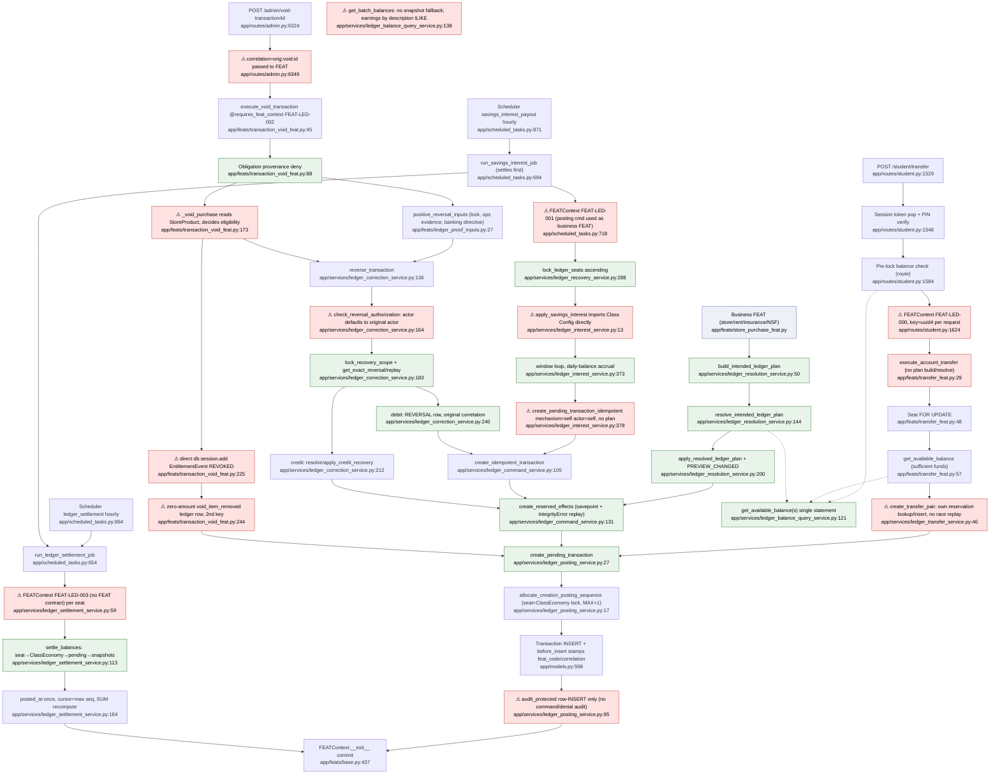

# F4 — Ledger: flowchart and deviation audit

> Descriptive Pathfinder analysis (2026-10-04), not a normative document. The authorities are
> DOM-LED-001 v2.13, FEAT-LED-000 v0.4, FEAT-LED-001 v1.6, FEAT-LED-002 v2.2, SPEC-LED-001,
> SPEC-LED-002, SPEC-ECON-001 v1.3 and SPEC-OPS-001. Code is described against them. All line
> numbers were read on `main` @ 381a12d49 with uncommitted working-tree changes, 2026-10-04.

## Mandated path (docs)

1. **Sole authority.** Ledger is the only schema and mutation authority over `ledger_transaction`
   and `ledger_balance_snapshot`. It is domain-blind: `account_type` and type must not encode
   business meaning (DOM-LED-001 §II, §V, INV-LED-012).
2. **No FEAT-to-FEAT execution.** A money-moving **business** FEAT builds an *intended plan*. In
   its own single FEAT context it then calls the Ledger domain commands in order: `build_intended_ledger_plan`,
   `resolve_intended_ledger_plan` and `apply_resolved_ledger_plan` (FEAT-LED-000 reconciliation box, §VII.2), then the LED-001
   posting command. "Every monetary action MUST be resolved into a ledger plan before posting"
   (FEAT-LED-000 §XII.1). Ledger domain functions **do not import or call Class Configuration or
   Identity**: the FEAT supplies a typed `BankingDirective` (FEAT-LED-000 §VIII.3, v0.4 note §XV).
3. **Command reservation.** Every canonical command reserves `(class_id, feat_code,
   idempotency_key)` with a versioned replay fingerprint. An exact replay returns the accepted outcome. A
   mismatch fails closed. A uniqueness race must be resolved by lookup and comparison, not reported
   as a generic duplicate (DOM-LED-001 INV-LED-005, §VII.1; SPEC-LED-002 §III–VI, §VIII; FEAT-LED-001 §VI.1).
4. **Lock order.** A balance-dependent debit locks the seat row, then ClassEconomy, then the
   original transaction (for compensation), then pending rows and snapshots. A multi-seat command
   locks seats in ascending order first (INV-LED-015, DOM-LED-001 §VII tail, FEAT-LED-001 §VI.2).
5. **Creation.** Each effect gets an immutable class-scoped `posting_sequence` before INSERT. Rows
   are immutable, and status is derived from the reconciliation cursor (INV-LED-002/004/007, §VIII.1.1).
6. **Transfers.** An internal transfer is exactly two legs, equal and opposite, sharing one
   `correlation_id` and one reservation. It requires sufficient funds, with no protection and no
   fee (INV-LED-014; FEAT-LED-000 §VIII.3 ¶3; FEAT-LED-001 §VII).
7. **Settlement.** Settlement locks seat, then ClassEconomy, then pending rows, then snapshots in
   account order. It advances each account cursor without skipping an effect, may initialise
   `posted_at` once, and never patches signed fields or `feat_code` (INV-LED-009, §VIII.1.1).
8. **Reversal.** A reversal is exact and terminal, keeps the original `correlation_id` and
   `original_transaction_id`, and has its own reservation. It runs authorisation through
   `DOM-OPS.check_reversal_authorization` and resolves `REVERSE` or `REFUND`. Store entitlements
   are revoked **through the Store domain command**, and obligation provenance denies the
   reversal. Audit `ACT-MONY-003` (FEAT-LED-002 §V–VIII; SPEC-OPS-001 §III, §VII; DOM-LED-001 §VII.0).
9. **Savings interest.** Payout runs through FEAT orchestration, keyed per seat per closed window,
   on posted end-of-day balances. Banking terms come from the `economic_engine` version in force,
   with no UTC shortcuts (SPEC-ECON-001 §2.1, §7.3, §8.2, §9.2, §14.1).
10. **Audit.** Operations records the command reservation identity, fingerprint version, the
    resolved effects, and success **or denial** (FEAT-LED-000 §XIII, FEAT-LED-001 §VIII).

## Code path

### A. Student own-account transfer (POST `/student/transfer`)
`student.py:1529` → session single-use token `:1548` → PIN `:1571` → pre-lock balance read
`calculate_scoped_balances` `:1584` (→ `get_available_balances`) → validation `:1601-1617` →
`FEATContext("FEAT-LED-000", idempotency_key=f"feat:transfer:{class}:{seat}:{uuid4}")` `:1624` →
`execute_account_transfer` `transfer_feat.py:29` → seat `FOR UPDATE` `:48-53` →
`get_available_balance` `:57` (InsufficientFunds `:58`) → `create_transfer_pair`
`ledger_transfer_service.py:17`. That function computes a transfer-family fingerprint `:45`, looks up the reservation `:46-55`, inserts the
reservation `:56-61`, then calls `create_pending_transaction` ×2 `:62-73`. Each call goes to
`ledger_posting_service.py:27` → scope check `:60-66` → `allocate_creation_posting_sequence` `:17`
(seat + ClassEconomy `FOR UPDATE`, `MAX(posting_sequence)+1`) → `Transaction(...)` `:79` → the
`before_insert` listener `models.py:598` stamps `feat_code` and `correlation_id` from the FEAT
context → `audit_protected(... "INSERT")` `:95` → `FEATContext.__exit__` commits (`base.py:437`).
The GET branch writes a new `transfer_token` into the session (`student.py:1707`).

### B. Charge path (store, rent, insurance, NSF — external callers of Ledger)
Business FEAT → `build_intended_ledger_plan` `ledger_resolution_service.py:50` →
`resolve_intended_ledger_plan` `:144` (reads balances, computes shortfall, protection transfer
and fee; outcome ACCEPT/TRANSFORM, denial only by exception) → `apply_resolved_ledger_plan`
`:200` → `lock_recovery_scope` `ledger_recovery_service.py:300` → re-read and
`PREVIEW_CHANGED` `:293-298` → `create_reserved_effects` `ledger_command_service.py:131`
(lookup `:147`, savepoint insert with IntegrityError replay `:167-183`) →
`create_pending_transaction` per effect. Callers: `rent_payment_feat`, `nsf_fee_feat`,
`store_purchase_feat`, `insurance_premium_payment_feat`, `insurance_coverage_renewal_feat`,
`ledger_fee_service.py:11`.

### C. Settlement job
APScheduler `ledger_settlement` hourly `scheduled_tasks.py:864` → `run_ledger_settlement_job`
`:654` → `settle_pending_transaction_contexts` `ledger_settlement_service.py:20`. This finds the
distinct (seat, class) pairs with `posting_state == PENDING` `:37-55`. For each pair it opens
`FEATContext("FEAT-LED-003")` `:59` → `settle_balances` `:113`, which:

1. rejects a read-only request context `:115`;
2. locks the seat, then ClassEconomy `:125-129`;
3. locks the pending rows, ordered by account and then sequence `:130-139`;
4. locks or creates the snapshots `:145-159`;
5. sets `posted_at` once `:164`;
6. sets the cursor to the max pending sequence `:168`;
7. recomputes `posted_balance_cents` as a SUM through the cursor `:171` (`_posted_history_cents` `:100`).

### D. Savings interest job
Scheduler `savings_interest_payout` hourly `scheduled_tasks.py:871` →
`run_savings_interest_job` `:675` → runs settlement inline first `:694` → loops over claimed
student seats per class `:707-716` → `FEATContext("FEAT-LED-001", key=f"savings-interest-job:{class}:{hour}")`
`:718` → `lock_ledger_seats` `:725` (`ledger_recovery_service.py:288`) → `apply_savings_interest`
`ledger_interest_service.py:337`. That call reads `resolve_savings_policy` `:71`, which imports
`class_configuration_query_service` `:13-16` and `_rate_timeline` `:173`; builds
`_savings_ledger` `:231` from the posted history plus window-keyed credits; computes
`_accrual_floor` `:290`; then runs the window loop `:373`. For each closed window it calls
`_window_interest` `:321` and then `create_pending_transaction_idempotent` `ledger_posting_service.py:99`
(`mechanism="self"`, `actor_seat_id=seat.id`, `type="Interest"`) `:378-389` →
`create_idempotent_transaction` `ledger_command_service.py:105` → `create_reserved_effects`.
On any exception the whole class rolls back `:730-732`.

### E. Admin "void" (reversal) — POST `/admin/void-transaction/<id>`
`admin.py:6324` → unscoped `db.session.get(Transaction)` then a class check `:6344` →
`execute_void_transaction(tx, correlation_id=f"{tx.correlation_id}:void:{id}", idempotency_key=...)`
`:6347-6351` → `@requires_feat_context("FEAT-LED-002")` (`base.py:618`) opens a FEATContext with
that **derived** correlation → `_execute_void_transaction_impl` `transaction_void_feat.py:80`:

1. `obligations_service.is_obligation_related_transaction` `:88`.
2. If `type=='purchase'`, `_void_purchase` `:130`:
   - reads `EntitlementEvent` `:155-166` and `StoreProduct` `:173-178` directly;
   - decides immediate/delayed eligibility `:181-184`;
   - **`db.session.add(EntitlementEvent(REVOKED))`** `:225-242`;
   - posts a zero-amount `void_item_removed` Ledger row under a second key `:244-257`.
3. If the original is a positive credit, `positive_reversal_inputs` `ledger_proof_inputs.py:27`
   runs: lock `:30`, Operations evidence `:37`, `get_banking_directive` `:43`.
4. `reverse_transaction` `ledger_correction_service.py:136` runs:
   - `check_reversal_authorization` `:164` (same-class actor only);
   - `lock_recovery_scope` `:183`;
   - `get_exact_reversal` / replay `:186-201`;
   - positive original: `resolve_credit_recovery` → `apply_credit_recovery` `:203-216`;
   - negative original: `create_idempotent_transaction(type=REVERSAL, correlation_id=original)` `:218-242`.

### F. Balance reads
`get_available_balance(s)` `ledger_balance_query_service.py:121/128` use a single-statement
snapshot-or-posted-sum plus pending `:78-118`. `get_posted_balance` is at `:65`, and
`get_batch_balances_by_class_seat` at `:138`. The proof surfaces (`reconstruct_*`, `verify_*`) are at `:244-335`,
and `verify_class_ledger` at `ledger_verification_service.py:59`. No in-app caller of
`verify_class_ledger` was found.

## Flowchart

## Side effects

| Path | Tables written | Other |
|---|---|---|
| Transfer | `ledger_command_reservation` (1), `ledger_transaction` (2 legs, PENDING); row locks on `seats` and `classes` | `audit_events` via `audit_protected` per leg; Flask session (`transfer_token`) on GET and POST |
| Charge (plan) | reservation (1); principal, optional funding legs (separate `corr_funding_*` correlation) and optional `overdraft_fee` rows | row audit per effect |
| Settlement | `ledger_balance_snapshot` (insert/update cursor, balance, timestamps), `ledger_transaction.posted_at` (write-once) | per-seat commit; failures only logged; **no audit emission observed** |
| Interest | reservation and one `Interest` row per seat per window (`savings` account) | runs settlement first; one class-wide transaction; hourly scheduler |
| Void/reversal | `entitlement_events` (REVOKED, **written by the Ledger FEAT**), zero-amount `void_item_removed` row plus its reservation, the `REVERSAL` row plus its reservation; for credits, funding legs | row audit; Operations evidence read; **no `ACT-MONY-003` emission found** (`grep` of `app/` returns no hit) |
| Balance reads | none (pure) | — |

No external HTTP calls.

## Deviations from docs

| # | Deviation | Code | Governing doc |
|---|---|---|---|
| D1 | Student transfers carry `feat_code=FEAT-LED-000`, a workflow and not a business FEAT. `FEAT-LED-000` is listed in `SYSTEM_ORIGINATED_FEAT_CODES`, so every self-mechanism transfer row is classified **system-originated**. The comment at `:56-58` says transfers are "deliberately excluded" from that set. | `student.py:1624-1626`; `ledger_provenance_query_service.py:58-74, 77-86` | FEAT-LED-000 reconciliation box; DOM-LED-001 §VII.1 (feat_code = originating family); SPEC-ITR-001 §6.3 |
| D2 | The Ledger FEAT writes Store-owned `entitlement_events` directly and reads Policy-owned `store_products` to decide immediate/delayed eligibility. Revocation must go through the Store domain command. | `transaction_void_feat.py:155-184, 225-242` | FEAT-LED-002 §VI.1.3, §VI.2.3; DOM-LED-001 §V; INV-ARC-021 |
| D3 | The void FEAT gets `correlation_id=f"{orig}:void:{id}"`. The REVERSAL row keeps the original correlation (`ledger_correction_service.py:238`), but the zero-amount `void_item_removed` row and the FEAT context use the derived one. | `admin.py:6349`; `transaction_void_feat.py:244-257` | FEAT-LED-002 §V.2, §VII.4 |
| D4 | A zero-amount `void_item_removed` Ledger row records an entitlement removal: business meaning in the Ledger (a "void" posted as money). | `transaction_void_feat.py:244-257` | INV-LED-003, INV-LED-012; SPEC-OPS-001 §4.1–4.2 |
| D5 | Reversal authorization is a same-class check inside Ledger, not `DOM-OPS.check_reversal_authorization`. For a debit original, the admin route passes no actor, so the **student who made the purchase** becomes the reversal's authorizing and recorded actor. No `REVERSE`/`REFUND` outcome is resolved (reason is always `ADMIN_CORRECTION`, subtype `refund`). | `ledger_correction_service.py:100-133, 164-167, 222`; `transaction_void_feat.py:120`; `admin.py:6347` | FEAT-LED-002 §VI.1.2, §VIII; SPEC-OPS-001 §3.1A |
| D6 | No `ACT-MONY-003`. No command-level audit of the reservation identity, fingerprint version or denial (InsufficientFunds and PREVIEW_CHANGED leave no audit). Only row-level INSERT signatures exist. | `ledger_posting_service.py:95`; no `ACT-MONY-003` in `app/` | FEAT-LED-002 §VI.2.4, §VIII; FEAT-LED-001 §VIII; FEAT-LED-000 §XIII |
| D7 | Ledger interest service imports Class Configuration (`get_current_economic_engine`, `economic_engine_timeline`) directly instead of receiving a FEAT-supplied directive. | `ledger_interest_service.py:13-16, 71-99, 173-196` | FEAT-LED-000 §VIII.3 (v0.4); INV-ARC-021 |
| D8 | Interest is posted under `FEAT-LED-001` (the posting command) as if it were a business FEAT, with `mechanism="self"` and `actor_seat_id=seat` for a system credit. It skips plan build/resolve. | `scheduled_tasks.py:718-721`; `ledger_interest_service.py:378-389` | SPEC-ECON-001 §7.3; FEAT-LED-000 §XII.1; DOM-LED-001 §VIII.1 (mechanism SYSTEM) |
| D9 | Transfers and all credits (interest, sysadmin bug reward `system_admin.py:1297`) skip the FEAT-LED-000 plan workflow. The plan functions accept debits only (`ledger_resolution_service.py:71`). | `transfer_feat.py:60`; `ledger_interest_service.py:378` | FEAT-LED-000 §V, §XII.1 (lists "savings transfer", "interest payout") |
| D10 | The transfer reservation is hand-rolled: plain `.first()` then `add`, with no savepoint or IntegrityError lookup-and-compare. The route key is a fresh `uuid4` per POST, so retry idempotency comes from the session token, not the reservation. | `ledger_transfer_service.py:46-61`; `student.py:1626` | SPEC-LED-002 §6.2; DOM-LED-001 §VII.1 ("Transfer execution ... MUST provide the same command reservation identity") |
| D11 | `FEAT-LED-003` (settlement sweep) and `FEAT-LED-004` are registered and used, but no FEAT contract exists. `FEAT_REGISTRY` describes `FEAT-LED-001` as "Overdraft Fee Application", contradicting the doc title "Post Ledger Transaction". | `base.py:204-207`; `ledger_settlement_service.py:59` | FEAT-CORE-000; FEAT-LED-001 §I |
| D12 | `get_batch_balances_by_class_seat` adds no posted-history fallback when a snapshot is missing, unlike `_available_balance_expression`. "Earnings" are derived from `description NOT ILIKE 'Transfer%'`, a label heuristic. | `ledger_balance_query_service.py:150-177` | INV-LED-006; FEAT-LED-000 §IX (no label heuristics) |
| D13 | `routes/api.py` imports the plan functions and the posting functions but never calls them (dead imports that invite route-level posting). | `api.py:58, 105` | INV-ARC-006 (informational) |

## Within-feature repetition

1. **Seat (+ClassEconomy) locking in 5+ forms.**
   - `transfer_feat.py:48-53`
   - `ledger_posting_service.py:20-21` (repeated on **every effect**)
   - `ledger_settlement_service.py:125-129`
   - `ledger_recovery_service.py:288-298` (`lock_ledger_seats`) and `:300-313` (`lock_recovery_scope`)

   On the positive-credit reversal path `lock_recovery_scope` runs three times:
   `ledger_proof_inputs.py:30`, `ledger_correction_service.py:183` and `:209`.
2. **Reservation lookup, fingerprint compare and effect fetch, duplicated 5×.**
   - `ledger_transfer_service.py:46-55`
   - `ledger_command_service.py:147-159`
   - `:171-183` (same block again after IntegrityError)
   - `:213-244` (`replay_reserved_charge`)
   - `:258-279` (`replay_reserved_reversal`)

   The effect-key tuple `_FINGERPRINT_EFFECT_KEYS + (comp…, subtype)` is re-declared at `:56-66`, `:236-241` and `:265-268`.
3. **Posted / pending / posted-through-cursor sums in 5 places.**
   - `ledger_balance_query_service.py:57-75` (fallback + pending)
   - `:78-118` (single-statement expression)
   - `:138-177` (batch)
   - `ledger_settlement_service.py:100-110` (`_posted_history_cents`)
   - the `reconstruct_posted_balance` family `ledger_balance_query_service.py:244-307`
4. **Funding-transfer leg construction vs transfer leg construction.**
   - `ledger_resolution_service.py:218-238` (savings→checking pair, `Withdrawal`/`Deposit`)
   - `ledger_transfer_service.py:62-73` (same pair shape, different serializer)
5. **Scope validation of seats in class.**
   - `ledger_posting_service.py:60-66`
   - `transfer_feat.py:54-55`
   - `ledger_settlement_service.py:117-119`
   - `ledger_correction_service.py:129-133`

## External dependencies

| Called domain | From | Through a FEAT? (INV-ARC-021) |
|---|---|---|
| Class Configuration (`get_current_economic_engine`, `economic_engine_timeline`) | `ledger_interest_service.py:13` | **No.** Ledger service imports it directly (D7) |
| Class Configuration (`get_banking_directive`) | `ledger_proof_inputs.py:43` (FEAT-side helper) | Yes (FEAT composition) |
| Identity (`resolve_teacher_seat_for_class`) | `transaction_void_feat.py:113` | Yes (inside FEAT-LED-002) |
| Obligations (`is_obligation_related_transaction`) | `transaction_void_feat.py:88` | Yes (query from FEAT) |
| Store / Policies (`EntitlementEvent` write, `StoreProduct` read) | `transaction_void_feat.py:155-242` | **No.** Direct ORM read and write of another domain's tables (D2) |
| Operations (`audit_protected` → `emit_audit_event`) | `ledger_posting_service.py:95` | **No.** Ledger service invokes audit directly. FEAT-LED-001 §VI.5 says "No direct Ledger-to-Operations domain invocation" |
| Operations (creation evidence) | `ledger_proof_inputs.py:37` | Yes |
| Economic engine math (`accrue_daily_interest`, `credit_savings_interest`) | `ledger_interest_service.py:17-23` | Pure functions (Class Configuration-owned module); direct import |
| Interpretation consumes `ledger_provenance_query_service` | — | Read-only surface (affected by D1) |
| Callers into Ledger: store purchase, rent, insurance premium/renewal, NSF, prod (payroll), sysadmin bug reward | `system_admin.py:1297` posts from a route decorated `@requires_feat_context("FEAT-OPS-001")` | Partially. The sysadmin route acts as its own FEAT and posts directly |

## Sources consulted (paths + line ranges)

- docs/DOMAIN/DOM-LED-001_LEDGER_DOMAIN.md 1-297 (focus 38-272)
- docs/FEATURE-EXECUTION/FEAT-LED-000_CANONICAL_MONETARY_RESOLUTION_WORKFLOW.md 1-328
- docs/FEATURE-EXECUTION/FEAT-LED-001_POST_LEDGER_TRANSACTION.md 1-69
- docs/FEATURE-EXECUTION/FEAT-LED-002_VOID_REVERSE_TRANSACTION.md 1-115
- docs/SPEC/SPEC-LED-002_COMMAND_IDEMPOTENCY_RESERVATION_AND_ENFORCEMENT.md 21-160
- docs/SPEC/SPEC-ECON-001_SAVINGS_INTEREST_ACCRUAL_AND_DISBURSEMENT_SPECIFICATION.md 29-62, 267-412, 446-525
- docs/SPEC/SPEC-OPS-001_REVERSAL_AND_VOID.md 188-240 (headings 1-567)
- docs/SPEC/SPEC-LED-001_LEDGER_VERIFICATION_PROOF_SURFACES.md (headings only)
- docs/FEATURE-EXECUTION/FEAT-ECON-001_*.md 1-40
- app/routes/student.py 705-714, 1500-1720
- app/routes/admin.py 6290-6385
- app/routes/system_admin.py 1229-1320
- app/routes/api.py 58, 105
- app/feats/transfer_feat.py 1-75
- app/feats/transaction_void_feat.py 1-259
- app/feats/ledger_proof_inputs.py 27-45
- app/feats/base.py 196-207, 355-470, 557-660
- app/services/ledger_transfer_service.py 1-77
- app/services/ledger_posting_service.py 1-117
- app/services/ledger_command_service.py 1-279
- app/services/ledger_resolution_service.py 1-313
- app/services/ledger_settlement_service.py 1-174
- app/services/ledger_balance_query_service.py 31-180 (signatures 1-350)
- app/services/ledger_interest_service.py 1-60, 195-400
- app/services/ledger_correction_service.py 90-253
- app/services/ledger_recovery_service.py 285-316 (signatures 1-709)
- app/services/ledger_fee_service.py 11-54
- app/services/ledger_provenance_query_service.py 44-125
- app/utils/transaction_idempotency.py 7-13, 72-110
- app/models.py 488-600, 598-680, 765-800, 893-901
- app/scheduled_tasks.py 654-735, 855-880

## Confidence & gaps

- **High:** D1, D2, D3, D7, D8, D10, D11, and repetitions 1–3. All were read line by line.
- **Medium:** D5. The FEAT-LED-002 "DOM-OPS.check_reversal_authorization" may be meant as an
  interface Ledger is allowed to host. D6: Operations may be emitting command-level audit through a
  path not grepped here (only `ACT-MONY-003` and `audit_protected` were checked). D9: whether
  credits are meant to bypass plan resolution. FEAT-LED-000 §V lists them, but the plan type is
  debit-only by design.
- **Not traced:** `ledger_recovery_service` resolve/apply internals (L59-265, L460-587); the
  historical reconstruction and assessment modules; payroll allocation; SPEC-LED-001 proof-surface
  conformance in detail; the business-FEAT callers of path B (they belong to other features);
  `forecast_savings` vs runtime parity (SPEC-ECON-001 §10).
- **Doc-side gap:** SPEC-ECON-001 §14 names `FEAT-ECON-001` as executing interest behaviour, but
  FEAT-ECON-001 v3.0 is "Economic Rebalance Execution" (its retired policy_transitions lineage).
  No ratified FEAT contract owns savings-interest payout, which leaves D8 without a correct
  target FEAT code. This needs an owner ruling.
- The scheduler docstring at `scheduled_tasks.py:657-663` says settlement "assigns
  `posting_sequence`". That is stale: creation assigns it (`ledger_posting_service.py:83`).
