# F5 — Obligations: flowchart

Audit date 2026-10-04. Governing: DOM-OBL-001 v3.2 (Constitutional), FEAT-OBL-001 v1.2 (Assess),
FEAT-OBL-002 v2.1 (Schedule Next Bill Cycle), FEAT-OBL-003 v1.1 (Satisfy). FEAT-OBL-004 is an
unratified draft and is NOT treated as authority; insurance purchase belongs to STORE.

## Mandated path (docs)

1. **Sole authority / sole write surface.** Obligations alone writes `assessment_events`,
   `bill_cycles`, `obligation_command_reservation`; consumers SHALL NOT derive status, order
   assessments, or mutate those tables (DOM-OBL-001 §IV, §VI, §IX.1).
2. **Assess (FEAT-OBL-001).** Verify scope / lineage / temporal inputs, write one immutable
   `ASSESSMENT`, optionally hand off to FEAT-OBL-003, and **emit `ACT-OBL-001` via DOM-OPS** with
   correlation_id, seat_id, internal_ref, obligation_type, outcome (FEAT-OBL-001 §III.1–2, §V).
   Idempotent per lineage + `idempotency_key` (§IV.3).
3. **Succession (FEAT-OBL-002 / `schedule_next_bill_cycle`).** Replay by command identity first.
   Then eligibility from Obligations state: empty lineage, or a non-terminal latest cycle whose
   assessment point (`next_assessment_at − preview`, preview read through Policies,
   DOM-POL-001A §V.E) has arrived, evaluated **only through the canonical temporal helper**. Cycle
   number is derived. The cycle row and the reservation are written in one transaction. A
   conflict fails closed (DOM-OBL-001 §V.7; FEAT-OBL-002 §IV).
4. **Termination.** A separate command. It writes a terminal row (`next_assessment_at=NULL`,
   `cycle_boundary_at` = termination instant) and, in the same transaction, withdraws every
   untouched advance assessment whose period begins at or after the instant (§V.7, §V.8).
5. **Satisfy (FEAT-OBL-003).** Verify the assessment, its correlation and method legality; for
   `PAYMENT`, verify the Ledger txn belongs to the same class/seat. Funding follows the shared
   Ledger plan (§IV.1.a). Then append `PAYMENT` or `WAIVED`. `WAIVED` is rent-only. A rent-linked
   perk goes through the Store **grant** surface, idempotent, and never reverses satisfaction
   (§IV.4; DOM-OBL-001 §X).
6. **Derived state only** (§VIII). Status is WITHDRAWN, SATISFIED or OUTSTANDING, from events plus
   the upstream amount. The default payment target is a **domain read**: the oldest OUTSTANDING
   assessment by due boundary. The current cycle is found by period containment, never as the
   latest cycle (§V.7, §VII.2).
7. **Rent disabled** (§IX.15–16). No succession or new assessment. Surviving obligations stay
   payable, and grace and late-fee rules keep applying. A toggle never forgives debt.
8. **Immediate charges** (NSF/overdraft) are obligations too (§II.C).

## Code path

**A. Rent reconcile (scheduler → FEAT-OBL-002 tag)**
`scheduled_tasks.py:170 run_rent_reconciliation_job` (interval 1h, L816-821) loops over classes.
It **skips** a class when `is_feature_enabled(rent)` is false (L206). For each enabled class it calls
`execute_reconcile_rent` (L209) → `reconcile_rent_feat.py:496` → `reconcile_rent` L338:
- `now = utc_now()` L355; settings = `get_rent_settings(class_id)` L363
- succession loop L391-436 → `obligations_service.get_succession_eligibility` L757 (→ `get_assessment_point` L697 → `policy_reference_service.get_bill_preview_days`) → `rent_schedule_service.first_due_local_date/resolve_cycle_schedule` → `_rent_disabled_for_period` L249 → `schedule_next_bill_cycle` (`schedule_next_bill_cycle_feat.py:135`; reservation lookup L155, eligibility L179, INSERT `bill_cycles` + `obligation_command_reservation` L204-217, conflict path L218-237)
- current/upcoming cycle L438-449 (`get_current_bill_cycle` L825, `get_latest_bill_cycle` L577)
- roster assessment L457-470 → `_assess_cycle` L111 → `assess_obligation` (`assess_obligation_feat.py:37`, INSERT L87-102)
- perk expiry L473 → `_expire_ended_period_perks` L266 → `entitlement_service.expire_rent_perks`
- period-start perks L475 → `_grant_period_start_perks` L283 → `rent_payment_feat._award_satisfaction_perks`
- late fees L483-487 → `_assess_late_fees` L175 → `assess_obligation(LATE_FEE)` L219

**B. Student rent payment (route → FEAT-OBL-001 tag)**
`student.py:2743 rent_pay` → resolves the target itself (L2799-2830) → `execute_rent_bill_payment`
(`rent_payment_feat.py:598`) → `pay_rent_bill` L489 → per obligation `pay_rent` L230:
- verification L247-283, seat `FOR UPDATE` L289-293, `lock_recovery_scope` L301
- replay `replay_reserved_charge` L313
- frozen `RentSettings` by policy_uuid L349-357 (falls back to the current settings)
- `resolve_assessment_amount` L363 → slice L386-405
- Ledger: `build_intended_ledger_plan` / `resolve_intended_ledger_plan` / `apply_resolved_ledger_plan` L409-415
- `satisfy_obligation(PAYMENT)` L423 (`satisfy_obligation_feat.py:30`, INSERT L130-145)
- `_award_satisfaction_perks` L442 → `entitlement_service.grant_hall_passes` / `grant_store_entitlements`

**C. Insurance premium manual payment (route → FEAT-OBL-003 tag)**
`student.py:1967 pay_insurance_premium` → `execute_insurance_premium_payment`
(`insurance_premium_payment_feat.py:115`):
- seat lock L135, `lock_recovery_scope` L142, `replay_reserved_charge` L146
- `get_default_payment_target` L159 / `get_obligation_state` L161
- `settle_insurance_premium` L62, which calls `lock_recovery_scope` again (L84), runs the Ledger plan (L86-90) and then `satisfy_obligation` L91

**D. Waiver (admin route → FEAT-OBL-003)**
`admin.py:5597 add_rent_waiver` queries `ObligationAssessment` directly (L5644-5666) →
`execute_satisfy_obligation_waiver` (`satisfy_obligation_feat.py:184`) → `satisfy_obligation(WAIVED)`.

**E. Termination / withdrawal**
- `cancel_insurance_feat.py:150` (tag FEAT-OBL-005) and `insurance_coverage_renewal_feat.py:264` (FEAT-STOR-007) call `terminate_bill_cycle` (`terminate_bill_cycle_feat.py:69`). That function finds the latest cycle (L88), derives the instant through `get_stop_renewal_instant` L102, runs a withdraw loop L108-129 → `withdraw_assessment` (`withdraw_obligation_feat.py:41`, INSERT L92-103), then INSERTs the terminal row (L131-142).
- Disabling rent: `feat_class_004_feature_enablement.py:163-187` runs its own withdraw loop → `withdraw_assessment`.

**F. NSF fee**
`store_purchase_feat.py:443` (FEAT-STOR-001) → `nsf_fee_feat.record_nsf_fee_obligation` L32 →
`assess_obligation(NSF_FEE)` L41, then `satisfy_obligation(PAYMENT)` L51 against the fee debit.

**G. Insurance succession/assessment** (Store-owned callers)
- `purchase_insurance_feat.py:252/266/280` (tagged **FEAT-OBL-004**, a draft)
- `insurance_coverage_renewal_feat.py:397/410/300` (FEAT-STOR-007)

Both call `schedule_next_bill_cycle`, `assess_obligation` and `settle_insurance_premium`.

## Flowchart

```mermaid
flowchart TD
  classDef dev fill:#fde2e1,stroke:#c0392b,color:#000
  classDef ext fill:#e8eefc,stroke:#3b5bdb,color:#000

  SCH["run_rent_reconciliation_job<br/>app/scheduled_tasks.py:170"] --> GATE{"⚠ skip if rent disabled<br/>app/scheduled_tasks.py:206"}
  GATE -->|enabled| RR["execute_reconcile_rent [FEAT-OBL-002]<br/>app/feats/reconcile_rent_feat.py:496"]
  GATE -->|disabled: §IX.16 work never runs| SKIP["⚠ class skipped<br/>app/scheduled_tasks.py:207"]
  RR --> NOW["⚠ now = utc_now()<br/>app/feats/reconcile_rent_feat.py:355"]
  NOW --> ELIG["get_succession_eligibility<br/>app/services/obligations_service.py:757"]
  ELIG --> AP["get_assessment_point → get_bill_preview_days<br/>app/services/obligations_service.py:697"]
  ELIG -->|EMPTY/DUE| SCHED["resolve_cycle_schedule<br/>app/services/rent_schedule_service.py:171"]
  SCHED --> DIS["_rent_disabled_for_period<br/>app/feats/reconcile_rent_feat.py:249"]
  DIS --> SNB["schedule_next_bill_cycle<br/>app/feats/schedule_next_bill_cycle_feat.py:135"]
  SNB --> RES["reservation lookup / replay<br/>app/feats/schedule_next_bill_cycle_feat.py:155"]
  SNB --> BCW[("INSERT bill_cycles + obligation_command_reservation<br/>app/feats/schedule_next_bill_cycle_feat.py:204")]
  SNB -.IntegrityError.-> CONF["SuccessionConflictError<br/>app/feats/schedule_next_bill_cycle_feat.py:232"]
  BCW --> CUR["get_current_bill_cycle / ⚠ get_latest_bill_cycle (no class filter)<br/>app/services/obligations_service.py:825 / :577"]
  CUR --> TERMS["_cycle_terms (reads RentSettings)<br/>app/feats/reconcile_rent_feat.py:307"]
  TERMS --> AC["_assess_cycle<br/>app/feats/reconcile_rent_feat.py:111"]
  AC --> ASSESS["assess_obligation [tag FEAT-OBLI-001]<br/>app/feats/assess_obligation_feat.py:37"]
  ASSESS --> AEW[("INSERT assessment_events ASSESSMENT<br/>app/feats/assess_obligation_feat.py:101")]
  ASSESS --> NOAUD["⚠ ACT-OBL-001 audit not emitted<br/>app/feats/assess_obligation_feat.py:104"]
  RR --> PEXP["_expire_ended_period_perks<br/>app/feats/reconcile_rent_feat.py:266"]
  PEXP --> STX1["entitlement_service.expire_rent_perks<br/>app/services/entitlement_service.py:608"]:::ext
  RR --> PSTART["_grant_period_start_perks<br/>app/feats/reconcile_rent_feat.py:283"]
  RR --> LF["⚠ _assess_late_fees (raw datetime compare/arith)<br/>app/feats/reconcile_rent_feat.py:175"]
  LF --> ASSESS

  RP["rent_pay route<br/>app/routes/student.py:2743"] --> TGT["⚠ route orders rent vs late-fee targets itself<br/>app/routes/student.py:2810"]
  TGT --> RBP["execute_rent_bill_payment [FEAT-OBL-001 tag ≠ doc]<br/>app/feats/rent_payment_feat.py:598"]
  RBP --> PRB["pay_rent_bill<br/>app/feats/rent_payment_feat.py:489"]
  PRB --> PR["pay_rent<br/>app/feats/rent_payment_feat.py:230"]
  PR --> LOCK["Seat FOR UPDATE + lock_recovery_scope<br/>app/feats/rent_payment_feat.py:289"]
  LOCK --> RPL["replay_reserved_charge<br/>app/feats/rent_payment_feat.py:313"]
  RPL --> RS["⚠ RentSettings by policy_uuid, fallback to current<br/>app/feats/rent_payment_feat.py:349"]
  RS --> AMT["⚠ resolve_assessment_amount (reads RentSettings; unknown→0)<br/>app/services/obligations_service.py:204"]
  AMT --> LED["build/resolve/apply_resolved_ledger_plan<br/>app/feats/rent_payment_feat.py:409"]:::ext
  LED --> SAT["satisfy_obligation<br/>app/feats/satisfy_obligation_feat.py:30"]
  SAT --> SATW[("INSERT assessment_events PAYMENT/WAIVED<br/>app/feats/satisfy_obligation_feat.py:144")]
  SAT --> NOLV["⚠ Ledger txn class/seat not verified<br/>app/feats/satisfy_obligation_feat.py:89"]
  SAT --> PERK["_award_satisfaction_perks<br/>app/feats/rent_payment_feat.py:155"]
  PSTART --> PERK
  PERK --> STX2["entitlement_service.grant_hall_passes / grant_store_entitlements<br/>app/services/entitlement_service.py:129"]:::ext

  IP["pay_insurance_premium route<br/>app/routes/student.py:1967"] --> IPF["execute_insurance_premium_payment [FEAT-OBL-003]<br/>app/feats/insurance_premium_payment_feat.py:115"]
  IPF --> DPT["get_default_payment_target<br/>app/services/obligations_service.py:983"]
  IPF --> SIP["settle_insurance_premium (⚠ 2nd lock_recovery_scope)<br/>app/feats/insurance_premium_payment_feat.py:62"]
  SIP --> LED
  SIP --> SAT

  WV["add_rent_waiver route<br/>app/routes/admin.py:5597"] --> WVQ["⚠ route queries assessment_events directly<br/>app/routes/admin.py:5644"]
  WVQ --> WVF["execute_satisfy_obligation_waiver [FEAT-OBL-003]<br/>app/feats/satisfy_obligation_feat.py:184"]
  WVF --> SAT

  CI["cancel_insurance (⚠ tag FEAT-OBL-005, no FEAT doc)<br/>app/feats/cancel_insurance_feat.py:150"]:::ext --> TB["terminate_bill_cycle<br/>app/feats/terminate_bill_cycle_feat.py:69"]
  REN["insurance_coverage_renewal [FEAT-STOR-007]<br/>app/feats/insurance_coverage_renewal_feat.py:264"]:::ext --> TB
  TB --> SRI["get_stop_renewal_instant<br/>app/services/obligations_service.py:597"]
  TB --> WD["withdraw_assessment<br/>app/feats/withdraw_obligation_feat.py:41"]
  WD --> WDW[("INSERT assessment_events WITHDRAWN<br/>app/feats/withdraw_obligation_feat.py:102")]
  TB --> TBW[("INSERT terminal bill_cycles row<br/>app/feats/terminate_bill_cycle_feat.py:141")]
  FE["rent disable withdraw loop [FEAT-CLASS-004]<br/>app/feats/class_configuration/feat_class_004_feature_enablement.py:163"]:::ext --> WD

  PUR["purchase_insurance ⚠ [FEAT-OBL-004 draft]<br/>app/feats/purchase_insurance_feat.py:91"]:::ext --> SNB
  PUR --> ASSESS
  PUR --> SIP
  REN --> SNB

  SP["store_purchase NSF [FEAT-STOR-001]<br/>app/feats/store_purchase_feat.py:443"]:::ext --> NSF["record_nsf_fee_obligation<br/>app/feats/nsf_fee_feat.py:32"]
  NSF --> ASSESS
  NSF --> SAT

  class GATE,SKIP,NOW,CUR,NOAUD,LF,TGT,RBP,RS,AMT,NOLV,SIP,WVQ,CI,PUR dev
```

## Side effects

| Path | DB writes | Ledger | Audit | Other |
|---|---|---|---|---|
| Reconcile | `bill_cycles`, `obligation_command_reservation`, `assessment_events` (RENT, LATE_FEE) | none | none for obligation rows | Store `entitlement_events` (PERK EXPIRED/GRANTED) via `entitlement_service` |
| Rent payment | `assessment_events` PAYMENT | principal debit (+ protection legs) through `apply_resolved_ledger_plan`; `ledger_transaction` is audit_protected (`ledger_posting_service.py:95`) | Ledger only | PERK GRANTED entitlements |
| Premium payment | `assessment_events` PAYMENT | premium debit | Ledger only | — |
| Waiver | `assessment_events` WAIVED | none | none | — |
| Termination | `assessment_events` WITHDRAWN, terminal `bill_cycles` | none | none | — |
| NSF | `assessment_events` ASSESSMENT + PAYMENT | (fee debit posted earlier by Store) | Ledger only | — |
| Scheduler | — | — | — | hourly interval job (`scheduled_tasks.py:816-821`) |

No external HTTP. `assessment_events` and `bill_cycles` have no `audit_protected` call
(grep: only payroll, attendance_interval_invalidation and ledger_transaction).

## Deviations from docs

1. **Rent-disabled classes never reconcile.** The scheduler gate at `scheduled_tasks.py:206` skips the class before `reconcile_rent` runs. That function's own §IX.16 work (late fees L483, perk expiry L473, period-start perks L475) is written to run "whether or not rent is enabled", but it is never reached. This contradicts DOM-OBL-001 §IX.16: grace and late-fee rules must keep applying and the toggle is not debt forgiveness. `execute_reconcile_rent` has no other caller.
2. **No ACT-OBL-001 audit emission** for any obligation event. Emission is marked "deferred" at `assess_obligation_feat.py:104-106`, and none exists in satisfy, withdraw or terminate. FEAT-OBL-001 §III.2.3 and §V require it.
3. **Unknown amount fails open to SATISFIED.** `resolve_assessment_amount` (`obligations_service.py:211-253`) returns 0 for an unresolvable policy or an unsupported type such as NSF_FEE. `get_obligation_state` L486 then reports SATISFIED. A RENT row whose policy_uuid does not resolve therefore shows as paid, which breaks §VIII (the status needs the authoritative assessed amount).
4. **Obligations reads the policy table directly and branches on family.** `obligations_service.py:224-238` reads `RentSettings` for RENT and LATE_FEE; insurance correctly goes through `insurance_definition_service`. The same pattern appears at `rent_payment_feat.py:350`, `reconcile_rent_feat.py:299,324` and `student.py:581,605`. DOM-OBL-001 §V.7 says Obligations reads policy only through the Policies read (DOM-POL-001A §V.E). `rent_payment_feat.py:353-356` also falls back to the class's *current* settings, against the freeze in DOM-POL-001 §VII.
5. **Raw clock and datetime arithmetic outside the canonical temporal helper:**
   - `reconcile_rent_feat.py:355` (`utc_now()`)
   - L168 (`.days` subtraction)
   - L194 (`<=` compare of grace boundary)

   These break INV-ARC-015 §VII as incorporated by DOM-OBL-001 §V.7.
6. **The route builds the default payment target.** `student.py:2810-2830` takes the minimum over the rent and late lineages and reorders them itself. §VIII says this is a domain read and that "callers do not order assessments themselves".
7. **The latest cycle is used as a proxy for the current one:**
   - `student.py:597` (`get_current_bill_cycle(...) or get_latest_bill_cycle(...)`)
   - `get_latest_bill_cycle` at `obligations_service.py:577`, which has no `class_id` filter and is used by terminate L88, reconcile L441 and `get_stop_renewal_instant` L611

   §V.7 and §VII.2 forbid using the latest cycle as a proxy for the current one.
8. **The FEAT registry does not match the docs** (`feats/base.py:246-257`):
   - doc FEAT-OBL-001 = Assess, but code tags Assess as `FEAT-OBLI-001` and Rent Payment as `FEAT-OBL-001`
   - FEAT-OBL-003 is described as "Scheduled Insurance Cycle", but the doc is Satisfy
   - insurance purchase executes under `FEAT-OBL-004` (unratified draft, Store-owned: `purchase_insurance_feat.py:91`)
   - cancel executes under `FEAT-OBL-005`, which has no FEAT document (`cancel_insurance_feat.py:86`)
9. **Satisfy does not verify the Ledger transaction's class/seat.** `satisfy_obligation_feat.py:89` defers this to the caller, and no caller checks it explicitly. FEAT-OBL-003 §IV.1.4 requires the check.
10. **Assess skips mandated checks:**
    - it has no `idempotency_key` and dedupes on (internal_ref, correlation_id) only (`obligations_service.py:622`; FEAT-OBL-001 §IV.3)
    - it does no lineage or temporal validation (§III.1.2–3)
    - it ignores `source_ref` / `source_version_ref` (`assess_obligation_feat.py:30-31`, never persisted)
11. **Server-minted command identity.** `student.py:1999` generates a fresh `uuid4` idempotency key for each premium POST, so a double submit becomes two commands. The rent route uses a render nonce instead (L2726, L2839). Both routes check for an `INSUFFICIENT_FUNDS` error code that FEAT-OBL-003 v1.1 removed (`student.py:2003`, `:2873`); those branches are dead.
12. **Plausible: perks bypass a Store FEAT.** Rent perks go through `entitlement_service` service functions, not a Store FEAT command (`rent_payment_feat.py:190,201`; `reconcile_rent_feat.py:142`). The code comments say this is composition inside a single FEAT envelope (INV-ARC-021 §V.2). Whether `entitlement_service.grant_*` is "the lawful Store grant surface" (DOM-OBL-001 §X) is not confirmed against DOM-STORE-001.

## Within-feature repetition

1. **Temporal "later_than" wrapper**, re-implemented 5 times:
   - `obligations_service.py:686` `_is_later`
   - `reconcile_rent_feat.py:237` `_is_later`
   - `schedule_next_bill_cycle_feat.py:114` `_later_than`
   - `rent_payment_feat.py:138-152` `_period_has_begun`
   - inline at `withdraw_obligation_feat.py:75-82`

   The "current_time" wrapper is duplicated in the same file (`obligations_service.py:532` `_current_reference` vs `:677` `_reference_now`) and appears again in `schedule_next_bill_cycle_feat.py:162` and `withdraw_obligation_feat.py:69`.
2. **"Withdraw untouched future-period assessments" loop**, two copies:
   - `terminate_bill_cycle_feat.py:108-129`
   - `feat_class_004_feature_enablement.py:163-187`
3. **Payment orchestration**: seat lock, `lock_recovery_scope`, `replay_reserved_charge`, the build/resolve/apply Ledger plan, then `satisfy_obligation(PAYMENT)`.
   - rent: `rent_payment_feat.py:289-316,407-432`
   - insurance: `insurance_premium_payment_feat.py:135-148,83-100`

   The insurance path even calls `lock_recovery_scope` twice (L142, then L84 inside `settle_insurance_premium`). The feat_code differs: `get_active_feat_name()` vs a hard-coded "FEAT-OBL-003".
4. **Frozen RentSettings-by-policy_uuid lookup**, 7 sites:
   - `obligations_service.py:225`, `:236`
   - `rent_payment_feat.py:350`
   - `reconcile_rent_feat.py:299`, `:324`
   - `student.py:581`, `:605`
5. **Latest-cycle queries**, 3 variants:
   - `obligations_service.py:577` (no class filter)
   - `:772` (class-scoped)
   - `:812` (terminal-only)
6. **Assessments-of-a-cycle query**:
   - `terminate_bill_cycle_feat.py:61`
   - `obligations_service.py:589` (`_is_cycle_committed`)
   - `obligations_service.py:1028` (`get_assessments_for_bill_cycle`)
   - `feat_class_004_feature_enablement.py:174`
7. **Waiver-exists idempotency check**:
   - `admin.py:5659-5669`
   - `satisfy_obligation_feat.py:110-123`
   - `obligations_service.py:644`
8. **Rent lineage string construction**:
   - `reconcile_rent_feat.py:115-116`
   - `reconcile_rent_feat.py:203`, `:213`
   - `student.py:2815-2816`

## External dependencies

| Domain | Call | Through a FEAT? |
|---|---|---|
| Ledger | `ledger_resolution_service.build/resolve/apply_resolved_ledger_plan`, `ledger_command_service.replay_reserved_charge`, `ledger_recovery_service.lock_recovery_scope` | Domain commands composed inside the obligation FEAT context, which is the INV-ARC-021 §V.2 pattern; no nested FEAT |
| Store/Entitlements | `entitlement_service.grant_hall_passes/grant_store_entitlements/expire_rent_perks`, `store_service.get_current_version` | Service functions, not a Store FEAT (see deviation 12) |
| Policies | `policy_reference_service.get_bill_preview_days` (correct); `insurance_definition_service.get_insurance_definition` (correct); `RentSettings` model queried directly (deviation 4) | Reads |
| Class Configuration | `get_rent_settings`, `get_banking_directive`, `is_feature_enabled`, `get_class_feature_history` | Reads |
| Identity | `resolve_teacher_seat_for_class`, `Seat` queries (roster `reconcile_rent_feat.py:97`) | Reads |
| Inbound (others → OBL) | Store `store_purchase_feat` (NSF), `purchase_insurance_feat` (FEAT-OBL-004 tag), `insurance_coverage_renewal_feat` (FEAT-STOR-007), `cancel_insurance_feat` (FEAT-OBL-005 tag), Class `feat_class_004` (withdraw) | Each calls plain OBL domain commands inside its own FEAT context |

## Sources consulted

- `PATHFINDER-2026-10-04/00-features.md` L28-58
- `docs/DOMAIN/DOM-OBL-001_OBLIGATIONS_DOMAIN.md` L1-412 (full)
- `docs/FEATURE-EXECUTION/FEAT-OBL-001_ASSESS_OBLIGATION.md` L1-73
- `docs/FEATURE-EXECUTION/FEAT-OBL-002_ADVANCE_BILL_CYCLE.md` L1-104
- `docs/FEATURE-EXECUTION/FEAT-OBL-003_SATISFY_OBLIGATION.md` L1-139
- `app/feats/assess_obligation_feat.py` L1-149
- `app/feats/satisfy_obligation_feat.py` L1-218
- `app/feats/rent_payment_feat.py` L1-60, L120-648
- `app/feats/schedule_next_bill_cycle_feat.py` L1-60, L100-269
- `app/feats/terminate_bill_cycle_feat.py` L1-160
- `app/feats/withdraw_obligation_feat.py` L1-104
- `app/feats/nsf_fee_feat.py` L1-61
- `app/feats/insurance_premium_payment_feat.py` L1-192
- `app/feats/reconcile_rent_feat.py` L1-512
- `app/services/obligations_service.py` L204-290, L451-540, L577-1040 (outline of the whole file)
- `app/routes/student.py` L568-686, L1960-2010, L2078-2103, L2619-2895
- `app/routes/admin.py` L5590-5700
- `app/scheduled_tasks.py` L170-230, L815-822
- `app/feats/class_configuration/feat_class_004_feature_enablement.py` L160-200
- `app/feats/base.py` L240-258, plus a grep for audit_protected
- greps of callers for `purchase_insurance_feat`, `cancel_insurance_feat`, `insurance_coverage_renewal_feat` and `store_purchase_feat`

## Confidence & gaps

- **High:** deviations 1, 2, 3, 6, 8 and repetitions 1–4 (read line-by-line).
- **Medium:** deviation 4. DOM-POL-001A §V.E was not opened; I relied on DOM-OBL-001 §V.7's paraphrase of it.
- **Medium:** deviation 12. Not checked against DOM-STORE-001 or the FEAT-STOR grant contract.
- **Not read:** `rent_schedule_service.py` bodies, `obligation_view_model.py`, `get_rent_assessments_for_seat_class`, and `obligations_service.py` L1040-1378 (display reads).
- **Not traced beyond their call sites:** the insurance purchase, renewal and cancel internals (owned by the store-entitlements flowchart).
- **Not checked:** INV-ARC-015 §VII and INV-ARC-021 §V.2 were cited from in-code comments and DOM-OBL references, not opened directly.
- **No tests run.** Read-only audit.
