# F10 operations-audit — Flowchart

Scope: DOM-OPS-001, DOM-OPS-002, FEAT-OPS-001, SPEC-OPS-002..006. Normative docs are authority; code is descriptive.

## Mandated path (docs)

1. **Single legal emit path.** `audit_events` and `chain_heads` are written only by `audit_service.emit_audit_event()`. It must run inside an active FEAT or `SystemAuditAuthority`, otherwise it raises `AuditContextError` (DOM-OPS-002 §2.4, INV-OPS-014/015).
2. **`audit_protected()` sequence.** The caller flushes, then `audit_protected()` resolves `class_id`, `feat_id`, `correlation_id`, `idempotency_key`, `actor_type` and `actor_id_hash` **from the active FEAT context**. It calls `emit_audit_event`, which locks `ChainHead` FOR UPDATE, bootstraps it lazily, computes payload, context and HMAC digests, flushes `AuditEvent` and updates the head. `audit_protected()` then sets `lineage_event_id`, `lineage_token` and `lineage_version`. It never commits (FEAT-OPS-001 §II.2, §III.1–2, §IV; DOM-OPS-002 §6.1).
3. **Field parity.** `PROTECTED_FIELDS_BY_TABLE` in `audit_verifier.py` "shall exactly match" the fields passed at write time (INV-OPS-019, DOM-OPS-002 §5.4 v2/v3 ledger registries).
4. **Fail closed.** A missing `AUDIT_HMAC_KEY` refuses startup (INV-OPS-016). `AuditContextError` is not swallowable (FEAT-OPS-001 §IV.3).
5. **Nightly verification.** At 03:00 UTC, `run_full_invariant_check` → `verify_chain` for each scope → `update_integrity_status(results)` under `SystemAuditAuthority`. That call writes the `integrity_status` singleton and maintains `degraded_since` (DOM-OPS-002 §2.3, §6.3). UNVERIFIED ≠ INVALID (INV-OPS-020).
6. **Append-only lifecycles.** Invariant runs (`invariant_run_events`), background jobs (`job_events`), health checks (`health_check_events`), incidents and alerts are recorded as append-only events. A structured log appends to `operational_events`, with critical trace fields outside JSON and a stable `correlation_id` (DOM-OPS-001 §3 INV-OPS-002/003/004/009, §4, §5).
7. **Pure health.** Health must distinguish liveness, readiness and correctness (INV-OPS-006). An internal health endpoint is a pure GET that reads a bounded assessment and never runs a FEAT or verifier (SPEC-OPS-005 §VII). Public GETs read persisted state only (DOM-OPS-001 §1 Public Request Monitoring; SPEC-OPS-006).
8. **Sysadmin console.** Every route uses `system_admin_required`. The console has 4 nav destinations. Mutations are limited to issue status/annotations on visible tickets and the operator's own passkeys. It MUST NOT create transactions or ledger records (SPEC-OPS-004 §V, §VI, §VII). Note that §6.3 separately allows a bug reward on resolve, citing DOM-SUP-001 §VIII; this is an internal tension.
9. **External status.** Firestore holds append-only snapshots and notices plus replaceable projections. There are no canonical incidents there, and nulls never encode PASS (SPEC-OPS-002 §V, §VII).
10. **Cross-domain composition.** Composition goes through a FEAT (INV-ARC-021). Operations must not mutate business state (INV-OPS-001).

## Code path

**A. Audit emission (hot path, called by Ledger/PROD/ATT FEATs)**
- Callers: `ledger_posting_service.create_pending_transaction` → `audit_protected("ledger_transaction", …, signature_version=3)` at `app/services/ledger_posting_service.py:95`; `app/feats/prod.py:402`; `app/feats/attendance_interval_invalidation_feat.py:344,353,359,431`.
- `audit_protected` at `app/feats/base.py:557`:
  - lazy import, and **ImportError → warning + return** (L590-594)
  - `class_id` and `seat_id` are taken from `getattr(row, …)`, not from the FEAT context (L600-601)
  - calls `emit_audit_event` (L596)
  - sets lineage fields (L606-609)
  - re-raises errors (L610-615)
- `emit_audit_event` at `app/services/audit_service.py:221`:
  - checks the key (L246); `_assert_write_authority` (L93/L251)
  - pulls `correlation_id` and `feat_id` from thread-local; **`idempotency_key` is not pulled** (L254-258)
  - resolves scope (L111/L260)
  - `ChainHead` `with_for_update` (L265-270); bootstraps it if missing (L272-282)
  - digests (L287-306)
  - adds `AuditEvent` (L308-332); updates the head (L336-340); `flush` (L345)

**B. Nightly chain verification**
- Scheduler spec `audit_invariant_check`, cron 03:00, at `app/scheduled_tasks.py:806-811`. It calls `run_audit_invariant_check_job` (L364), which is not FEAT-wrapped and has no `SystemAuditAuthority`.
- `run_full_invariant_check` (`app/utils/audit_verifier.py:367`) loads every `ChainHead` scope and runs `verify_chain(scope, limit=1000)` (L117) on each:
  - checks for a sequence gap, `previous_hash` continuity and an HMAC recompute
  - returns VERIFIED after `limit` events without comparing the walk to `head.latest_sequence` or `latest_hash`
- `record_integrity_verification` (L409) **only logs a warning**. `integrity_status` was dropped by `migrations/versions/7c3d4e5f6a7b_drop_all_unauthorized_tables.py:220`.

**C. Creation-evidence and historical queries (pure)**
- `verified_creation_evidence` L479, `verified_creation_evidences`/`_creation_evidence_batch` L569/L641 and `diagnose_historical_audit_coverage(s)` L706/L725/L853. Each one re-walks and re-HMACs the chain.

**D. Operational events / observability**
- `operational_event_service.record` (`app/services/operational_event_service.py:35`) runs a raw-engine INSERT into `operational_events` and commits independently (L91-110). Its only callers are `app/routes/admin.py:9855` and `:9964` (severity `warning`).
- The unhandled-exception handler (`app/__init__.py:129-193`) logs, then INSERTs into `error_events` only if that (dropped) table exists. It never writes `operational_events`.
- The sysadmin readers `get_recent_error_events` (L139) and `get_error_events` (L157) select `level IN ('ERROR','CRITICAL')`.
- Prometheus: `record_request` (`app/observability.py:51`) runs in an after_request hook (`app/__init__.py:957-966`). Only `main.health_check` is instrumented. `/metrics` is limited to localhost (`app/__init__.py:944-951`).

**E. Health endpoints**
- `/health` at `app/routes/main.py:68` runs `SELECT 1` (L71).
- `/health/status` at L79 runs `SELECT 1` (L101) and returns a database signal plus 9 hardcoded `UNKNOWN/CHECK_NOT_REGISTERED` signals (L104-109). The `invariant_verification` signal is always UNKNOWN even though a nightly verifier exists.

**F. Sysadmin console (`app/routes/system_admin.py`)**
- `dashboard` L446 (GET+POST, pure read, cross-tenant counts); `combined_logs` L501; `logs` L551 (file tail L117); `test-errors` L617-660; `support` L739; `view_issue` L837.
- `update_issue` L892, under `@requires_feat_context("FEAT-OPS-001")`, calls `update_issue_status`.
- `start_review` L1212 is a POST no-op.
- `resolve_escalated_issue` L1229, under **FEAT-OPS-001**, sets issue fields directly and calls `create_pending_transaction` (L1297) for a bug reward with `actor_seat_id=reward_seat.id`. It also calls `record_resolution_action` and `record_status_change`.
- `grafana_proxy` L1003 makes an outbound HTTP call (`requests.request`, L1062).
- Login and passkey routes (L142, L263, L347, L402) are also under FEAT-OPS-001.
- The `FEAT_REGISTRY` entry for FEAT-OPS-001 describes it as "Maintenance/Cleanup Operations" (`app/feats/base.py:258`). `database_maintenance_job` (`app/scheduled_tasks.py:139-140`) also uses it.

**G. External status service (`status_service/`)**
- `collector.collect` (`collector.py:87`) fetches the request snapshot, validates it and calls `store.append_snapshot` (`store.py:97`).
- `collect_platform` (L119) reads `/health/status`, keeps only the database signal and a gate probe, and calls `append_platform` (`store.py:60`).
- Public `GET /` (`app.py:120`) reads the store only.
- Operator POSTs `/operator/notices` (L232) and `/resolve` (L202) are CSRF-checked and call `append_event` / `resolve_notices` (`store.py:170`, `:186`).

## Flowchart

```mermaid
flowchart TD
  classDef dev fill:#fde2e2,stroke:#c0392b,color:#000;

  subgraph A[Audit emission]
    C1["Domain FEAT write + flush<br/>app/services/ledger_posting_service.py:94"] --> AP
    C2["PROD/ATT FEAT emit<br/>app/feats/prod.py:402"] --> AP
    AP["audit_protected<br/>app/feats/base.py:557"] --> APimp{"⚠ ImportError → warn+return<br/>app/feats/base.py:592"}:::dev
    APimp -->|ok| APctx["⚠ class_id/seat_id from row; actor_type None from all callers<br/>app/feats/base.py:600"]:::dev
    APctx --> EM["emit_audit_event<br/>app/services/audit_service.py:221"]
    EM --> KEY{"key present?<br/>app/services/audit_service.py:246"}
    KEY -->|no| ERR["raise AuditContextError<br/>app/services/audit_service.py:247"]
    KEY --> AUTH{"_assert_write_authority<br/>app/services/audit_service.py:93"}
    AUTH -->|no FEAT| ERR
    AUTH --> TL["⚠ correlation/feat from thread-local; idempotency_key NOT pulled<br/>app/services/audit_service.py:255"]:::dev
    TL --> LOCK["ChainHead SELECT FOR UPDATE / bootstrap<br/>app/services/audit_service.py:265"]
    LOCK --> DIG["payload/context digest + HMAC<br/>app/services/audit_service.py:287"]
    DIG --> INS["INSERT audit_events + UPDATE chain_heads + flush<br/>app/services/audit_service.py:332"]
    INS --> LIN["set lineage_event_id/token/version<br/>app/feats/base.py:606"]
    LIN --> CM["caller FEAT commits<br/>app/feats/base.py:277"]
  end

  subgraph B[Nightly verification]
    S1["cron 03:00 audit_invariant_check<br/>app/scheduled_tasks.py:806"] --> J1["run_audit_invariant_check_job (no FEAT/SystemAuditAuthority)<br/>app/scheduled_tasks.py:364"]
    J1 --> RF["run_full_invariant_check<br/>app/utils/audit_verifier.py:367"]
    RF --> VC["⚠ verify_chain limit=1000, no head reconciliation<br/>app/utils/audit_verifier.py:117"]:::dev
    VC --> RIV["⚠ record_integrity_verification logs only; integrity_status dropped<br/>app/utils/audit_verifier.py:409"]:::dev
    RIV --> NOJE["⚠ no invariant_run_events / job_events<br/>app/scheduled_tasks.py:364"]:::dev
  end

  subgraph D[Operational events and errors]
    AD["admin INVALID_CLASS_SCOPE (warning)<br/>app/routes/admin.py:9855"] --> REC["⚠ record: raw-engine INSERT, seat/class only in JSON, join_code in payload<br/>app/services/operational_event_service.py:35"]:::dev
    REC --> OE[("operational_events<br/>migrations/versions/b8e1f4c2a5d9_create_operational_events_table.py:48")]
    EH["⚠ unhandled exception → error_events (dropped) only<br/>app/__init__.py:129"]:::dev
    RD["get_recent_error_events ERROR/CRITICAL<br/>app/services/operational_event_service.py:139"] --> OE
  end

  subgraph E[Health]
    H1["/health SELECT 1<br/>app/routes/main.py:68"]
    H2["⚠ /health/status SELECT 1 + 9 hardcoded UNKNOWN; no health_check_events<br/>app/routes/main.py:79"]:::dev
    M1["/metrics localhost only<br/>app/__init__.py:944"]
    M2["record_request after_request<br/>app/observability.py:51"] --> M1
  end

  subgraph F[Sysadmin console]
    DB["dashboard GET/POST pure read<br/>app/routes/system_admin.py:446"] --> RD
    CL["combined_logs<br/>app/routes/system_admin.py:501"] --> RD
    UI["⚠ update_issue under FEAT-OPS-001 (should be SUP FEAT)<br/>app/routes/system_admin.py:892"]:::dev
    RS["⚠ resolve_escalated_issue under FEAT-OPS-001<br/>app/routes/system_admin.py:1229"]:::dev
    RS --> LP["⚠ create_pending_transaction direct from route; actor=reward seat<br/>app/routes/system_admin.py:1297"]:::dev
    LP --> C1
    SR["⚠ start_review POST no-op<br/>app/routes/system_admin.py:1212"]:::dev
    GP["grafana_proxy outbound HTTP<br/>app/routes/system_admin.py:1062"]
    REG["⚠ FEAT_REGISTRY FEAT-OPS-001 = Maintenance/Cleanup<br/>app/feats/base.py:258"]:::dev
    UI --> REG
    RS --> REG
  end

  subgraph G[External status service]
    CO["collect request snapshot<br/>status_service/collector.py:87"] --> ST1["append_snapshot (Firestore)<br/>status_service/store.py:97"]
    CP["collect_platform reads /health/status<br/>status_service/collector.py:119"] --> H2
    CP --> ST2["append_platform<br/>status_service/store.py:60"]
    PUB["GET / public status (read-only)<br/>status_service/app.py:120"] --> ST1
    OPN["POST /operator/notices<br/>status_service/app.py:232"] --> ST3["append_event<br/>status_service/store.py:170"]
  end
```

## Side effects

| Path | Writes | Other |
|---|---|---|
| Audit emission | INSERT `audit_events`; INSERT/UPDATE `chain_heads` (row lock); UPDATE protected row `lineage_*` | No commit; logger.error on failure |
| Nightly verify | **None** (reads `chain_heads`, `audit_events`) | logger warning/error only |
| `operational_event_service.record` | INSERT `operational_events` on an independent connection + commit | app logger |
| Unhandled exception | INSERT `error_events` only if the table exists (it was dropped) | logger.exception |
| `/health`, `/health/status` | none | DB `SELECT 1` |
| Prometheus | in-process counters/histograms | `/metrics` scrape |
| Sysadmin `update_issue` | UPDATE `issues` + status history via `update_issue_status` | FEAT-OPS-001 commit |
| Sysadmin `resolve_escalated_issue` | UPDATE `issues`; INSERT `ledger_transaction` (+ audit chain); resolution action; status change rows | FEAT-OPS-001 commit |
| Sysadmin passkeys/login | WebAuthn credential rows, session | FEAT-OPS-001 |
| Grafana proxy | none | outbound HTTP to Grafana |
| Status service | Firestore append snapshot/platform/notice events | outbound HTTPS to app via CF Access service token; Loki sampler |

## Deviations from docs

1. **`integrity_status` does not exist, and nightly results are only logged.** DOM-OPS-002 §2.3/§2.4/§6.3 mandates `update_integrity_status()` under `SystemAuditAuthority`, writing a singleton with `degraded_since`. The code calls `record_integrity_verification` (`app/utils/audit_verifier.py:409-417`), which only logs. The table was dropped at `migrations/versions/7c3d4e5f6a7b_drop_all_unauthorized_tables.py:213,220`, with the comment "recomputable". `system_audit_authority()` (`app/services/audit_service.py:61`) has no caller in `app/`. Consequently `/health/status` always reports `invariant_verification` as UNKNOWN (`app/routes/main.py:107`), and INV-OPS-006 correctness health is unobservable. DOM-OPS-002 and the dropped schema conflict; per the ground rule, DOM-OPS-002 is the target.
2. **FEAT-OPS-001 is misused as a catch-all FEAT id.** The doc defines FEAT-OPS-001 as audit-protected emission only. The registry describes it as "Maintenance/Cleanup Operations" (`app/feats/base.py:258`). It wraps:
   - sysadmin login (`app/routes/system_admin.py:144`)
   - passkey register, auth and delete (L265, L348, L404)
   - support issue update (L894) and resolve (L1231)
   - `database_maintenance_job` (`app/scheduled_tasks.py:139`)

   Support transitions belong to FEAT-SUP-001.
3. **The sysadmin console posts to the Ledger directly from a route.** `resolve_escalated_issue` calls `ledger_posting_service.create_pending_transaction` (`app/routes/system_admin.py:1297-1308`) under FEAT-OPS-001. This violates SPEC-OPS-004 §VII ("does not create … transactions or any ledger record") and INV-ARC-021 (cross-domain composition through the owning FEAT). It also records `actor_seat_id=reward_seat.id`, so the student is the actor of their own reward. SPEC-OPS-004 §6.3 conflicts with §VII here.
4. **Audit context is not resolved from the FEAT context** (FEAT-OPS-001 §II.2, §III.2.1):
   - `idempotency_key` is never propagated, even though `get_idempotency_key()` exists (`app/feats/base.py:58`; `app/services/audit_service.py:254-258`).
   - `actor_type`/`actor_id_hash` are None on every production call (`app/services/ledger_posting_service.py:95`, `app/feats/prod.py:402`, …).
   - `class_id` comes from the row, not `FEATContext.class_id` (`app/feats/base.py:600`).
   - `request_id` is never set.
5. **There is a fail-open branch in `audit_protected`.** An ImportError of `audit_service` logs a warning and returns without lineage (`app/feats/base.py:590-594`). This contradicts the INV-OPS-016 fail-closed rule and the function's own docstring.
6. **The chain walk is bounded and not reconciled to the head.** `verify_chain(limit=1000)` returns VERIFIED for a prefix and never compares the walk to `ChainHead.latest_sequence`/`latest_hash` (`app/utils/audit_verifier.py:117-236`). Tail truncation or chains over 1000 events go undetected. §6.2C forbids treating a prefix as complete for the batch query; the nightly path has no equivalent guard.
7. **The error pipeline is split and partly dead.** Unhandled exceptions write only to the dropped `error_events` table (`app/__init__.py:162-189`). The sysadmin dashboard reads `operational_events` at ERROR/CRITICAL (`app/services/operational_event_service.py:139-171`), but the only writers pass `warning` (`app/routes/admin.py:9855,9964`). As a result, "recent errors" is effectively always empty (INV-OPS-009 failure visibility; SPEC-OPS-004 §6.2).
8. **`operational_events` violates INV-OPS-003/004/012.**
   - `actor_seat_id` and `class_id` exist only inside the JSON payload (`app/services/operational_event_service.py:73-86, 91-107`).
   - The admin callers persist `provided_join_code` (`app/routes/admin.py:9865`).
   - Outside a FEAT, `correlation_id` is the placeholder `"NO-CORRELATION"` (`app/feats/base.py:53-55`).
9. **The append-only lifecycle tables are absent.** There is no `invariant_run_events`, `job_events`, `health_check_events`, `incident_events`/`incident_summary` or `alert_events` writer or table in `app/` (DOM-OPS-001 §4/§5, INV-OPS-002/009).
10. **Minor console deviations.**
    - `dashboard` accepts POST (`app/routes/system_admin.py:446`).
    - `start_review` is a POST no-op (L1212-1226).
    - The legacy `"transaction"` registry key remains (`app/utils/audit_verifier.py:37-40`).

## Within-feature repetition

- **The chain walk and HMAC recompute exist three times:**
  - `verify_chain` at `app/utils/audit_verifier.py:117-236`
  - `_creation_evidence_batch` at `app/utils/audit_verifier.py:569-640` (HMAC at L612)
  - `_diagnose_historical_audit_coverages` at `app/utils/audit_verifier.py:725-850` (HMAC at L781)
- **The ledger protected-field list exists three times:**
  - `_TRANSACTION_AUDIT_FIELDS_V2`/`_TRANSACTION_AUDIT_FIELDS` at `app/services/ledger_posting_service.py:8-13`
  - `PROTECTED_FIELDS_BY_TABLE["ledger_transaction"]` at `app/utils/audit_verifier.py:42-46`
  - `LEDGER_FIELDS_BY_VERSION` at `app/utils/audit_verifier.py:50-61`

  INV-OPS-019 parity depends on manual sync.
- **`audit_service.verify_chain` and `verify_row_lineage` are stub delegators** (`app/services/audit_service.py:386-436`) duplicating `app/utils/audit_verifier.py:117`/`:255`, with ImportError fallbacks.
- **The DB `SELECT 1` probe is duplicated:** `app/routes/main.py:71` and `:101`.
- **Error persistence has two raw-engine side-channel writers:** `app/__init__.py:159-189` (`error_events`) and `app/services/operational_event_service.py:91-110` (`operational_events`).
- **The admin INVALID_CLASS_SCOPE record block is copy-pasted:** `app/routes/admin.py:9855-9868` and `:9964-9977`.
- **The status_service transport-exception classifier and the bounded `_unique_object` JSON parse are duplicated:** `status_service/collector.py:91-111` and `:124-145`.
- **The escalated-issue lookup filter is duplicated:** `app/routes/system_admin.py:1219-1223` and `:1237-1241`.

## External dependencies

| Called domain / system | From | Through a FEAT? |
|---|---|---|
| Ledger (`create_pending_transaction`) | `app/routes/system_admin.py:1297` | **No.** The route is wrapped in FEAT-OPS-001, not a SUP/LED FEAT (INV-ARC-021 deviation) |
| Support (`update_issue_status`, `record_status_change`, `record_resolution_action`, `support_operator_access`) | `app/routes/system_admin.py:924, 1310, 1326` | Under the FEAT-OPS-001 label; not FEAT-SUP-001 |
| Identity (`establish_sysadmin_session`, WebAuthn) | `app/routes/system_admin.py:142-430` | FEAT-OPS-001 label |
| Ledger/PROD/ATT → Operations (`audit_protected`) | `app/services/ledger_posting_service.py:95`, `app/feats/prod.py:402`, `app/feats/attendance_interval_invalidation_feat.py:344` | Yes. Runs inside the caller's FEAT (correct direction) |
| Ledger/PROD FEATs → `verified_creation_evidence(s)` | `app/utils/audit_verifier.py:479/641` | Per DOM-OPS-002 §6.2, composed by FEATs (not traced here) |
| Grafana (HTTP) | `app/routes/system_admin.py:1062` | n/a (infra) |
| Prometheus | `app/__init__.py:944` | n/a |
| Cloudflare Access + Firestore + Loki | `status_service/collector.py:185-194`, `log_sampler.py:155` | n/a (independent service) |

## Sources consulted (paths+line ranges)

- `PATHFINDER-2026-10-04/00-features.md` L33-47
- `docs/DOMAIN/DOM-OPS-001_OPERATIONS_DOMAIN.md` L21-360
- `docs/DOMAIN/DOM-OPS-002_AUDIT_LINEAGE_INTEGRITY.md` L38-347
- `docs/FEATURE-EXECUTION/FEAT-OPS-001_AUDIT_PROTECTED_EMISSION.md` L35-125
- `docs/SPEC/SPEC-OPS-004_SYSTEM_ADMINISTRATION_CONSOLE.md` L39-135
- `docs/SPEC/SPEC-OPS-005_FEATURE_HEALTH_EVIDENCE.md` L120-170
- SPEC-OPS-002/003/006 headings and MUST/SHALL grep only
- `app/feats/base.py` L20-70, L258, L540-616
- `app/services/audit_service.py` L28-120, L221-436
- `app/utils/audit_verifier.py` L25-80, L117-255, L360-420; outline of L420-876
- `app/services/operational_event_service.py` L1-173
- `app/observability.py` L1-89
- `app/__init__.py` L128-193, L938-966
- `app/routes/main.py` L60-110
- `app/routes/system_admin.py` L142-206 (grep), L446-500, L892-960, L1212-1350; route outline
- `app/routes/admin.py` L9850-9866, L9960-9975
- `app/scheduled_tasks.py` L130-168, L355-390, L795-820
- `app/services/ledger_posting_service.py` L8-13, L27-96 (grep)
- `app/services/tlcp.py` (outline)
- `migrations/versions/7c3d4e5f6a7b_drop_all_unauthorized_tables.py` L200-220
- `migrations/versions/b8e1f4c2a5d9_create_operational_events_table.py` L48-54
- `status_service/app.py` L110-279
- `status_service/collector.py` L80-198
- `status_service/store.py` (def grep)

## Confidence & gaps

- **High:** deviations 1–8 are read directly from the cited lines.
- **Medium:** deviation 9 rests on a grep showing no table or model names in `app/` or `migrations/`. Writers outside the repo (for example Grafana or Loki) may cover some of that lifecycle, but those would not satisfy the DOM schema.
- **Not traced:**
  - SPEC-OPS-003/006 numerical rules in depth: the Loki sampler, `presentation.py` thresholds and the 404 request-resolution rule
  - SPEC-OPS-001 reversal/void, which belongs under the Ledger feature
  - how `verified_creation_evidence(s)` is consumed by PROD/LED FEATs
  - the passkey routes beyond their decorators
  - `support_operator_access.py`
  - DB-level append-only triggers on `audit_events`
- **Doc tensions to flag to the owner:**
  - SPEC-OPS-004 §6.3 (bug reward allowed) vs §VII (no ledger records).
  - DOM-OPS-002 §2.3 (`integrity_status` mandated) vs migration 7c3d4e5f6a7b and DOM-CORE-002 (table absent).
  - FEAT-OPS-001 §VI lists `teacher_id` as an audit field, which conflicts with INV-OPS-012 and the identity model.
