# F6 — Policies (DOM-POL-001 / 001A, FEAT-POL-001)

Pathfinder flowchart, 2026-10-04. Read-only audit. Normative docs are the authority; code is descriptive.

## Mandated path (docs)

- **Sole write surface.** FEAT-POL is the only surface through which rows enter or change availability in the Policies repository (DOM-POL-001 §VI.1; FEAT-POL-001 §I "single lawful path"). The FEAT owns orchestration only and SHALL NOT mutate downstream facts (FEAT-POL-001 §I, §X; DOM-POL-001 §VIII).
- **Required context.** `user_id`, `class_id`, `seat_id`, `actor_role = teacher`, with a lawful teacher seat. No authority may be rebuilt from labels or join codes (FEAT-POL-001 §III).
- **Five actions.** New, Update (new row and new `policy_uuid`, never an in-place edit), Disable (`HIDDEN`, reversible), Retire (`RETIRED`, permanent), and Delete (only a RETIRED row, and only once no surviving fact can resolve terms from it) (DOM-POL-001 §VI.1, §VIII, §IX; FEAT-POL-001 §V–VIII, §X).
- **`policy_uuid` is the version.** No version pointer or version table exists. `policy_versions`/`policy_transitions` are withdrawn (DOM-POL-001 §VI.0).
- **Payroll is different: append-only and effective-dated.** It has no availability state and no hide, retire or delete. The row in force at t is max `effective_date` ≤ t, then latest `created_at`. The first save is effective immediately; later saves take effect at the next payroll date. All readers go through one domain-service resolver. Legal columns are exactly those in DOM-POL-001A §V.F (DOM-POL-001 §VI.2).
- **Downstream reads.** A downstream fact is frozen by value or by reference. Resolving a reference MUST return that exact `policy_uuid` and MUST NOT substitute a newer, active or latest row (DOM-POL-001 §VII; FEAT-POL-001 §IX).
- **One family-agnostic read for preview interval.** Obligations reads "the preview interval for `policy_uuid` X" from Policies. It does not open `rent_settings` or `insurance_policies` and does not branch on the family (DOM-POL-001A §V.E). Domain isolation applies (INV-ARC-021 §V.1–V.2).
- **Seat attribution.** Policy authors are recorded as `created_by_seat_id` within the class (DOM-POL-001 §XI "Seat attribution").
- **Hall-pass family.** Each submission is a new row (`max_queue_limit`, `pass_type_payload`, `effective_date`). The teacher SHALL be notified when per-pass limits reduce effective capacity. The student selector reads the active payload (FEAT-POL-001 §XII.A).
- **Insurance definitions.** Edits mint a new uuid and retire the prior row. A partial unique index enforces one IN_USE per (class, tier_group, tier_level) (DOM-POL-001A §V.D). FEAT-CLASS-003 delegates the definition change to FEAT-POL-001 (FEAT-CLASS-003 §16).

## Code path

No code path opens `FEATContext("FEAT-POL-001")`. The id is registered at `app/feats/base.py:243` and is never used. Each family has its own route, its own FEAT id and its own domain command:

| Family | Entry route | FEAT opened | Domain command (write) |
|---|---|---|---|
| Store product: create | `admin.py:4553 store_management` POST | `FEAT-SETTINGS-001` (`admin.py:4618`) | `store_service.publish_product` (`store_service.py:266`) |
| Store product: edit | `admin.py:4847 edit_store_item` POST | `FEAT-SETTINGS-001` (`admin.py:4926`) | `store_service.supersede_product` (`store_service.py:304`): retire, then publish |
| Store product: withdraw | `admin.py:4985 delete_store_item` | `FEAT-SETTINGS-001` (`admin.py:5015`) | `store_service.retire_lineage` (`store_service.py:352`) |
| Rent link (as a side effect of a store save) | `admin.py:4475 _apply_rent_link_from_form` / `admin.py:5040 _unlink_product_from_rent` | inherits `FEAT-SETTINGS-001` | `supersede_rent_settings` (`admin_settings_service.py:26`) |
| Rent settings | `admin.py:5202 rent_settings` POST | `FEAT-SETTINGS-001` (`admin.py:5256`) | `supersede_rent_settings` (`admin_settings_service.py:26`): insert, then retire predecessor |
| Economy rebalance (rent and store price) | `admin.py:~6687` | `FEAT-CLASS-005` (`admin.py:6687`) | `economy_rebalance.schedule_rebalance_changes` → `supersede_rent_settings` (`economy_rebalance.py:319`); `_apply_change_list` → `supersede_product` (`economy_rebalance.py:164`) |
| Payroll settings | `admin.py:7729 payroll_settings` POST | `FEAT-ADMN-001` (`admin.py:7858`) | `payroll/settings.save_payroll_setting` (`settings.py:202`) → `append_payroll_setting` (`settings.py:173`) |
| Hall-pass setup | `api.py:1355 save_hall_pass_setup` | `FEAT-SETTINGS-001` (decorator, `feats/attendance.py:71`) | `save_hall_pass_setup_config` (`attendance.py:72`): retire predecessor, then insert |
| Hall-pass queue limit | `api.py:1158 update_hall_pass_settings` | `FEAT-SETTINGS-001`, through `update_hall_pass_queue_settings` (`attendance.py:28`) | same as above |
| Insurance: new / edit / reactivate | `admin.py:5927 / 5989 / 6062` | `FEAT-CLASS-003` (decorator, `feat_class_003…py:420`) | `configure_insurance_definition` → `defs.retire_insurance_definition` (edit) → `_enforce_tier_group_rules` → `defs.create_insurance_definition` (`insurance_definition_service.py:92`) |
| Insurance: hide / "delete" | `admin.py:6040 / 6099` | `FEAT-CLASS-003` (`feat_class_003…py:483`) | `defs.set_availability` (`insurance_definition_service.py:180`) |

**Downstream reads.**

- Payroll reads go through the single resolver `payroll/settings.py:53–128`, protected by a structural guard. This matches the mandated path.
- Rent "current for new work" uses `class_configuration_query_service.get_rent_settings:353`.
- Rent "frozen by reference" is re-implemented at about 9 call sites (see Repetition).
- Insurance by uuid uses `policy_reference_service.get_insurance_recurring_terms:111` and `insurance_definition_service.get_insurance_definition:135`.
- Bill preview interval uses `policy_reference_service.get_bill_preview_days:149` (family-agnostic, as mandated).
- Store by uuid uses `StorePolicyResolver.resolve_store_item:182`.
- Hall pass uses `class_configuration_query_service.get_hall_pass_settings:388`, `feats/prod.py:87,206` and `feats/attendance.py:9`.

## Flowchart

```mermaid
flowchart TD
  T["Teacher request<br/>(admin_required)<br/>app/auth.py"]

  subgraph STORE["Store products"]
    S1["store_management POST<br/>app/routes/admin.py:4553"]
    S2["edit_store_item POST<br/>app/routes/admin.py:4847"]
    S3["delete_store_item POST<br/>app/routes/admin.py:4985"]
    SF["⚠ FEATContext FEAT-SETTINGS-001 (undocumented)<br/>app/routes/admin.py:4618/4926/5015"]
    SP["publish_product<br/>app/services/store_service.py:266"]
    SS["supersede_product (retire+publish)<br/>app/services/store_service.py:304"]
    SR["retire_lineage<br/>app/services/store_service.py:352"]
    SA["⚠ set_availability allows RETIRED→IN_USE<br/>app/services/store_service.py:325"]
    RL["⚠ _apply_rent_link_from_form: store save mints a rent version<br/>app/routes/admin.py:4475"]
  end

  subgraph RENT["Rent settings"]
    R1["rent_settings POST<br/>app/routes/admin.py:5202"]
    RF["⚠ FEATContext FEAT-SETTINGS-001<br/>app/routes/admin.py:5256"]
    RS["⚠ supersede_rent_settings (no created_by_seat_id)<br/>app/services/admin_settings_service.py:26"]
    RD["_resolve_rent_policy_deferral (direct RentSettings read)<br/>app/routes/admin.py:5156"]
  end

  subgraph REB["Economy rebalance"]
    E1["FEATContext FEAT-CLASS-005<br/>app/routes/admin.py:6687"]
    E2["⚠ execute_rebalance → policy writes outside FEAT-POL<br/>app/utils/economy_rebalance.py:241"]
  end

  subgraph PAY["Payroll settings (effective-dated)"]
    P1["payroll_settings POST<br/>app/routes/admin.py:7729"]
    PF["⚠ FEATContext FEAT-ADMN-001 ('Logistics / bulk admin')<br/>app/routes/admin.py:7858"]
    PS["save_payroll_setting (next payroll boundary)<br/>app/services/payroll/settings.py:202"]
    PA["append_payroll_setting INSERT<br/>app/services/payroll/settings.py:173"]
    PR["single resolver payroll_setting_effective_at<br/>app/services/payroll/settings.py:53"]
  end

  subgraph HP["Hall-pass settings"]
    H1["save_hall_pass_setup<br/>app/routes/api.py:1355"]
    H2["⚠ update_hall_pass_settings (no enablement check, no capacity notice)<br/>app/routes/api.py:1158"]
    H3["update_hall_pass_queue_settings<br/>app/feats/attendance.py:28"]
    HF["⚠ @requires_feat_context FEAT-SETTINGS-001<br/>app/feats/attendance.py:71"]
    HS["save_hall_pass_setup_config retire+INSERT (no seat attribution)<br/>app/feats/attendance.py:72"]
  end

  subgraph INS["Insurance definitions"]
    I1["new / edit / reactivate<br/>app/routes/admin.py:5927/5989/6062"]
    I2["hide / delete(=retire)<br/>app/routes/admin.py:6040/6099"]
    IF["⚠ @requires_feat_context FEAT-CLASS-003 (not FEAT-POL-001)<br/>app/feats/class_configuration/feat_class_003_insurance_policy_management.py:420/483"]
    IV["_require_teacher_scope + validate + tier rules<br/>feat_class_003_insurance_policy_management.py:282/158/348"]
    IC["create_insurance_definition INSERT<br/>app/services/insurance_definition_service.py:92"]
    IA["⚠ set_availability allows RETIRED→IN_USE<br/>app/services/insurance_definition_service.py:180"]
    IR["⚠ reactivate = new uuid, not HIDDEN→IN_USE<br/>app/routes/admin.py:6062"]
  end

  subgraph READ["Downstream reads"]
    D1["get_bill_preview_days (family-agnostic)<br/>app/services/policy_reference_service.py:149"]
    D2["get_insurance_recurring_terms<br/>app/services/policy_reference_service.py:111"]
    D3["⚠ obligations_service opens rent_settings directly, unscoped<br/>app/services/obligations_service.py:225"]
    D4["⚠ rent_payment_feat falls back to CURRENT policy<br/>app/feats/rent_payment_feat.py:350"]
    D5["⚠ reconcile_rent falls back to current_settings<br/>app/feats/reconcile_rent_feat.py:320"]
    D6["⚠ resolve_entitlement_product falls back to newest version<br/>app/services/store_service.py:398"]
    D7["StorePolicyResolver.resolve_store_item (unscoped; caller checks class)<br/>app/services/store_policy_resolver.py:182"]
    D8["⚠ prod hall-pass reader (effective_date, ignores availability)<br/>app/feats/prod.py:87"]
    D9["⚠ student rent resolver: uuid then current fallback<br/>app/routes/student.py:568"]
  end

  DB[("rent_settings / store_products / insurance_policies /<br/>payroll_settings / hall_pass_settings<br/>app/models.py:1218-2810")]

  T --> S1 & S2 & S3 & R1 & P1 & H1 & H2 & I1 & I2 & E1
  S1 --> SF --> SP
  S2 --> SF --> SS --> SA
  S3 --> SF --> SR --> SA
  SF --> RL --> RS
  R1 --> RF --> RS --> RD
  E1 --> E2 --> RS
  E2 --> SS
  P1 --> PF --> PS --> PA
  PS --> PR
  H1 --> HF
  H2 --> H3 --> HF --> HS
  I1 --> IF --> IV --> IC
  I1 --> IR
  I2 --> IF --> IA
  SP & SS & SA & RS & PA & HS & IC & IA --> DB
  DB --> D1 & D2 & D3 & D4 & D5 & D6 & D7 & D8 & D9 & PR

  classDef dev fill:#fde2e2,stroke:#c0392b,color:#000
  class SF,SA,RL,RF,RS,E2,PF,H2,HF,HS,IF,IA,IR,D3,D4,D5,D6,D8,D9 dev
```

## Side effects

- **DB writes (all flush inside the caller's FEAT; commit happens at FEATContext exit, `feats/base.py:~442`).**
  - `store_products`: INSERT (`store_service.py:296`) and availability UPDATE (`store_service.py:327`).
  - `rent_settings`: INSERT plus predecessor `availability_state='RETIRED'` (`admin_settings_service.py:74-81`). `updated_at` has `onupdate` (`models.py` RentSettings col 67).
  - `payroll_settings`: INSERT only (`settings.py:197`). A DB trigger refuses UPDATE and DELETE outside class destruction.
  - `hall_pass_settings`: predecessor RETIRED, then INSERT (`attendance.py:98-111`).
  - `insurance_policies`: INSERT (`insurance_definition_service.py:130`) and availability plus `retired_at` UPDATE (`:205-210`).
  - `users.hall_pass_verify_token`: UPDATE (`attendance.py:123`). This is a non-policy write under the same FEAT id.
- **Ledger postings, external HTTP, scheduler.** None from policy writes. Scheduler reads: `payroll/settings.classes_with_payroll_settings:131`; `scheduled_tasks.py:587` reads StoreProduct.
- **Audit emission.** Only the generic FEATContext envelope logging (`feats/base.py:428`). There is no policy-specific audit.
- **Idempotency keys** are logged, not enforced (`feats/base.py:325-351`). Payroll's key hashes only `settings_mode` and `class_id` (`admin.py:7845-7854`). Rent's key hashes only the form keys, not the values (`admin.py:5239-5248`).

## Deviations from docs

1. **FEAT-POL-001 is never executed.** Policy rows enter or change availability under four other ids: `FEAT-SETTINGS-001` (store, rent, hall pass), `FEAT-ADMN-001` (payroll), `FEAT-CLASS-003` (insurance) and `FEAT-CLASS-005` (rebalance). Locations: `admin.py:4618,4926,5015,5256,7858,6687`; `attendance.py:71`; `feat_class_003…py:420,483`. FEAT-SETTINGS-001 and FEAT-ADMN-001 have no normative doc, and FEAT-ADMN-001 is registered to the "Logistics" domain (`base.py:245`). This violates DOM-POL-001 §VI.1 ("FEAT-POL is the only surface") and FEAT-POL-001 §I. FEAT-CLASS-003 §16 says it delegates to FEAT-POL-001, but the code composes the POL commands directly (`feat_class_003…py:25-28, 453-456`).
2. **Frozen-reference reads substitute the current or newest policy.** This breaks DOM-POL-001 §VII ("MUST NOT substitute a newer, active, latest… version"):
   - `rent_payment_feat.py:350-356` falls back to `get_rent_settings` when the assessment has no `policy_uuid`.
   - `reconcile_rent_feat.py:320-323` returns `current_settings`.
   - `store_service.py:398-426` (`resolve_entitlement_product`) falls back to the newest lineage version.
   - `student.py:580-605` and `admin.py:1767-1790` fall back from uuid to current.
   - `obligations_service.py:211-216` treats an unresolved amount as 0.
3. **Obligations opens `rent_settings` directly.** `obligations_service.py:225,236`, `obligation_view_model.py:204` and `reconcile_rent_feat.py:299,324` do this, and several of them skip the `class_id` filter. This contradicts DOM-POL-001A §V.E ("Obligations does not open `rent_settings`…") and INV-ARC-021 §V.1. `policy_reference_service` has no rent-terms-by-uuid read.
4. **A retired row can be revived.** `RETIRED` is meant to be permanent (DOM-POL-001 §VI.1, FEAT-POL-001 §VII), but `store_service.set_availability:325` and `insurance_definition_service.set_availability:180` accept RETIRED→IN_USE. Store also clears `retired_at` on that path. Neither the FEAT nor the service guards the transition. Today it is reachable only by internal callers (`restore_product`, `store_service.py:343`).
5. **Seat attribution is missing.** `rent_settings` and `hall_pass_settings` have no `created_by_seat_id` (models RentSettings, HallPassSettings), and `supersede_rent_settings` / `save_hall_pass_setup_config` take no actor (DOM-POL-001 §XI). `payroll_settings` also has none, but DOM-POL-001A §V.F's exhaustive column list excludes it. That is a doc-internal tension, not a code defect.
6. **Hall-pass gaps against FEAT-POL-001 §XII.A.**
   - The queue-limit endpoint `api.py:1158-1193` returns no capacity-reduction notice (only `/hall-pass/setup` does, `api.py:1418-1421`).
   - The same endpoint skips the feature-enablement check that `/setup` performs (`api.py:1398-1400`).
   - `hall_pass_enabled` is accepted and ignored (`attendance.py:76`).
7. **Hide/restore is replaced by mint-and-retire.** Insurance "reactivate" mints a new uuid and retires the HIDDEN row (`admin.py:6062-6096`) instead of moving HIDDEN→IN_USE (DOM-POL-001 §VI.1 "may later return to IN_USE"). The store has no hide or restore UI (`hide_product`/`restore_product` have no callers).
8. **A store edit also changes rent policy.** Through `_apply_rent_link_from_form` (`admin.py:4475-4517`) and `_unlink_product_from_rent` (`admin.py:5040-5054`), a store edit mints a new rent_settings version, carrying Store↔Rent coupling inside a Store route.
9. **`get_historical_payroll_setting_inputs` uses non-standard locators.** It enforces scope and bounds correctly (`settings.py:255-270`), but its DTO field is `policy_locator` and its timestamp is `effective_at`. DOM-POL-001 §X.1 matches this shape, so no defect is recorded; the item is noted for completeness only.
10. **A default rate fills in for a missing or zero pay rate.** `pay_rate_per_second` substitutes $0.25/min when `pay_rate` is missing or zero (`settings.py:150-153`). The insurance lost-time rate (`insurance_claim_feat.py:1381`) uses it on the current setting, not the frozen one, and so does the PROD-PAY-001 correction (`corrections.py:246`). DOM-POL-001 §X.2 says modern pricing never adopts the legacy falsy-rate rule. This is low-confidence: whether lost-time is "pricing" is undecided.

## Within-feature repetition

- **Supersede pattern** (read current IN_USE, mark predecessor RETIRED, insert successor). It is implemented 4 times, with different ordering:
  - `admin_settings_service.py:49-81` (rent: insert, then retire)
  - `attendance.py:98-111` (hall pass: retire, flush, insert)
  - `store_service.py:304-322` (store: retire, then publish)
  - `feat_class_003…py:466-480` (insurance: retire, guard, insert)
- **Availability state machine.** It is defined twice with identical constants and no transition guard: `store_service.py:65-67,325-331` and `insurance_definition_service.py:46-49,180-211`.
- **"Rent terms by `policy_uuid`" lookup.** It is hand-rolled at 9 sites: `obligations_service.py:225,236`, `obligation_view_model.py:204`, `reconcile_rent_feat.py:299,324`, `rent_payment_feat.py:350`, `student.py:581,605`, `admin.py:1768,1787,5156`. None goes through `policy_reference_service`.
- **"Current hall-pass policy" reader.** It exists 4 times with 2 selection rules. Three use IN_USE newest: `attendance.py:9-25` and `class_configuration_query_service.py:388-415` (identical), plus `api.py:1146`. Two use effective_date ≤ t, ignoring availability: `prod.py:86-94` and `prod.py:205-213`.
- **Insurance type taxonomy.** It is duplicated in `insurance_policy_service.py:24-27` and `feat_class_003…py:52-55`.
- **"Current rent settings for a class" with a cycle fallback.** There are two divergent helpers: `student.py:568-605` (cycle first) and `admin.py:1766-1795` (latest first).
- **Store form contract assembly.** `get_rent_settings(...)` is called twice in one expression at `admin.py:4576` and again at `admin.py:4873`.
- **Validation of the hall-pass payload.** It is done in both the route (`api.py:1376-1394`) and the FEAT (`attendance.py:90-95`).

## External dependencies

| Called domain | From | Through a FEAT? |
|---|---|---|
| Class Configuration: feature enablement (`resolve_feature_class_for_class`), `verify_teacher_owns_class` | routes `admin.py:5228-5232`, `api.py:1335,1398` | Read-only guard in route. Acceptable as a guard, but capability composition belongs in the FEAT (INV-ARC-021 §V.6) |
| Economic Engine (CWI, policy profile, `resolve_insurance` recommendations) | `admin.py:4576-4580`, `feat_class_003…py:390-417` | FEAT-CLASS-003 (read, advisory) |
| Obligations (`get_latest_bill_cycle`, `get_current_bill_cycle`) | `admin.py:5137-5141` (`_resolve_rent_policy_deferral`), `admin.py:4520+` rent-link date validation | Route-level read, no FEAT |
| Identity (`resolve_teacher_seat_for_class`) | `admin.py:4627,4946` | Inside FEAT-SETTINGS-001 |
| Store/Entitlements (EntitlementEvent counts, redemptions, collective goals) | `store_management` GET `admin.py:4645-4760` | Route-level reads (GET) |
| Payroll schedule (`effective_date_for_new_setting`) | `settings.py:212` | Inside the FEAT-ADMN-001 context |
| Temporal resolver (CLE) | `admin.py:5150`, `policy_reference_service.py:71` | n/a (infra) |
| **Inbound:** OBL reads rent and insurance policy; STORE reads products and insurance; PROD reads payroll and hall pass | see Downstream reads | OBL bypasses the Policies read surface for rent (deviation 3) |

## Sources consulted (paths+line ranges)

- `PATHFINDER-2026-10-04/00-features.md:29`
- `docs/DOMAIN/DOM-POL-001_POLICIES_DOMAIN.md:1-271`
- `docs/DOMAIN/DOM-POL-001A_POLICY_SCHEMA_APPENDIX.md:45-202`
- `docs/FEATURE-EXECUTION/FEAT-POL-001_POLICY_REFERENCE_MANAGEMENT.md:1-184`
- `docs/FEATURE-EXECUTION/FEAT-CLASS-003_INSURANCE_POLICY_MANAGEMENT.md` (grep: lines 16, 103)
- `docs/INVARIANT/ARCHITECTURE/INV-ARC-021_CROSS_DOMAIN_REFERENCE_AND_COORDINATION.md:31-80`
- `app/routes/admin.py:4470-5340, 1760-1790, 5890-6125, 6670-6700, 7720-7880, 9658-9670`
- `app/routes/api.py:1130-1432`
- `app/routes/student.py:568-606`
- `app/services/policy_reference_service.py:1-180`
- `app/services/admin_settings_service.py:1-82`
- `app/services/insurance_definition_service.py:1-234`
- `app/services/insurance_policy_service.py:1-57`
- `app/services/store_policy_resolver.py:1-40, 178-244`
- `app/services/store_service.py:1-67, 260-460`
- `app/services/payroll/settings.py:1-270`
- `app/services/class_configuration_query_service.py:340-416`
- `app/services/obligations_service.py:212-245`
- `app/feats/attendance.py:1-125`
- `app/feats/prod.py:80-100, 200-215`
- `app/feats/class_configuration/feat_class_003_insurance_policy_management.py:1-60, 280-512`
- `app/feats/base.py:225-250, 282-351`
- `app/feats/store_purchase_feat.py:210-250`
- `app/feats/direct_entitlement_grant_feat.py:205-230`
- `app/feats/rent_payment_feat.py:346-356`
- `app/feats/reconcile_rent_feat.py:320-330`
- `app/utils/economy_rebalance.py:131-330`
- `app/models.py:1218-1300, 1692-1760, 2542-2580` (column greps)

## Confidence & gaps

- **High confidence:** deviations 1, 2, 3, 4, 6, and the repetition list. Every one was read at the cited lines.
- **Medium confidence:** deviations 5 and 7. Deviation 5 has a doc-internal tension for payroll; deviation 7 is an interpretation of "may return to IN_USE".
- **Low confidence:** deviation 10. Whether lost-time is "pricing" under §X.2 is unresolved.
- **Not traced:**
  - `teacher_destruction.py` / `utils/deletion.py` class-destruction deletes. The Delete action is latent per DOM-POL-001 §IX, and no non-destruction delete path was found.
  - DB triggers for payroll immutability (cited from the docstring, not read in the migrations).
  - `_store_definition_from_form` (`admin.py:4402`) field mapping.
  - Student-side store listing (`student.py:2433`).
  - `transaction_void_feat.py:174` and `scheduled_tasks.py:587` StoreProduct reads.
- `store_item_visibility` writes (lineage-keyed per-seat visibility, `store_service`) were not traced in detail.
