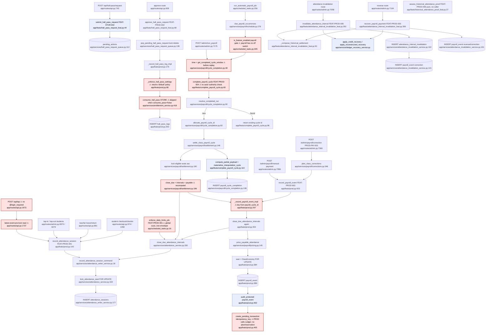

# F7 productivity-payroll — Flowchart audit

Scope: DOM-PROD-001 (v1.14), FEAT-PROD-001…006, SPEC-PROD-001/002. Read-only audit, 2026-10-04.
Normative docs are authority; code is described against them.

---

## Mandated path (docs)

1. **Attendance ingress = FEAT-PROD-001 → PROD command `record_attendance_session_command`.** Append-only, immutable `attendance_sessions` rows; `class_id`+`target_seat_id`+`actor_seat_id`+`mechanism` required; inactive rows need `reason_code`; hall-pass rows need `hall_pass_id` = consumed entitlement id. No delete/edit/correction-in-place (DOM-PROD-001 §VIII.1; FEAT-PROD-001 §VI, §VIII–IX). Every attendance writer locks the target seat before selecting the timeline (FEAT-PROD-001 v1.5; DOM §XV.7).
2. **Due system closure** (`close_due_attendance_intervals`) may be composed only by FEAT-PROD-003/004 (and FEAT-PROD-001 automatic closure). It locks the seat, appends only missing `inactive/done_for_day` rows at the day-end or daily-limit point, and uses the daily-limit setting in force when the interval opened (DOM §XV.7; FEAT-PROD-001 §I).
3. **Hall pass = FEAT-PROD-002 `record_hall_pass_log`.** Reads class-scoped `hall_pass_settings` and fails closed on a disabled destination or a queue/simultaneous limit. Approval and entitlement consumption happen together; `hall_pass_id` = consumed `entitlement_id`; `correlation_id` = consumed grant correlation. Pending requests are `pending_actions` rows submitted under FEAT-STOR-002. Approve, reject and cancel are FEAT-PROD-002 operations that lock and delete the request row in one transaction (DOM §VIII.2; FEAT-PROD-002 §III, §III.A, §V).
4. **Payroll/manual credit = FEAT-PROD-003 → PROD `record_payroll_event`.** Mechanism is `TEACHER`/`SYSTEM`, stated by the caller and never inferred. A `payroll` amount is priced by PROD from closed intervals under the setting in force at each close. The amount is not stored. Replay resolves before pricing. Monetary effects use Ledger command reservations (SPEC-LED-002), not transaction-level uniqueness. **PROD never calls Ledger: the FEAT composes Ledger** (DOM §VIII.3, §XII; FEAT-PROD-003 §V–VI).
5. **Class run = FEAT-PROD-004.** Steps: (0) replay anchor first, (1) confirm the actor is lawful, then allocate `payroll_cycle_id`, (2) lock seats in stable order, then settle each seat via Ledger `build_intended_ledger_plan → resolve_intended_ledger_plan → apply_resolved_ledger_plan` plus PROD `record_payroll_event`. The per-seat reservation key `(class_id, FEAT-PROD-004, per_seat_intent_key)` is derived from the **run's idempotency_key** plus the seat. (3) ITR compute+materialize, (4) `payroll_cycle_completion` anchor last, (5) a single commit (FEAT-PROD-004 §V–VI; DOM §XV.1–2).
6. **Next payroll date is derived** from `payroll_settings` + SYSTEM `payroll` events' scheduled occurrence; never stored; payroll has no off switch (DOM §XV.5–6; DOM-CLASS-001 §VII.3).
7. **Interval invalidation = FEAT-PROD-005.** Sequence: authorize, replay by `(class_id, FEAT-PROD-005, key)`, then lock target seat → ClassEconomy → original credit → monetary sources. Recompute the preview and compare its identity. Append `attendance_interval_invalidation` plus `correction` events per origin and the Ledger recovery, all atomically (DOM §VIII.5–6; FEAT-PROD-005 §VI).
8. **Exact/residual recovery = FEAT-PROD-003 `recover_payroll_payment`.** An exact reversal reuses the original correlation and requires zero prior compensation. A residual recovery is a `correction` with a new correlation (DOM §VIII.4; FEAT-PROD-003 §VI).
9. **Historical proof = FEAT-PROD-006**, a pure read with no FEAT context, writes, locks or route in this phase (FEAT-PROD-006 §II, §VI).
10. **Audit linkage** is initialized once inside the creating transaction for every new `payroll_event` and invalidation (DOM §XV.8).

---

## Code path

### A. Student tap in/out (FEAT-PROD-001)
`POST /api/tap` `routes/api.py:1673` (no `@login_required`; reads `g.canonical_context` + PIN verify) → reads latest `AttendanceSession` **before any lock** (`api.py:~1737`) for an early-return no-op → `record_attendance_session` `feats/prod.py:142` (`@requires_feat_context("FEAT-PROD-001")`) → `record_attendance_session_command` `services/attendance_writer_service.py:18` → `lock_attendance_seat` `attendance_service.py:322` (SELECT … FOR UPDATE on seat) → `is_done_for_day` check → auto-close prior active with `inactive/done_for_day` (`attendance_writer_service.py:106`) or deny hanging hall pass (`:144-175`) → INSERT `attendance_sessions` (`:177-188`) → commit by FEATContext. The post-write response recomputes `calculate_unpaid_attendance_seconds`, `estimate_unpaid_amount` and `calculate_worked_attendance_seconds_today` (`api.py:1791-1806`).

### B. Teacher tap in/out
`POST /admin/tap-in-students` `admin.py:8370` / `tap-out-students` `admin.py:8279` → `_latest_attendance_events_for_class` `admin.py:8259` (pre-lock read) → per seat `record_attendance_session` (`admin.py:8424`, `8329`). Each seat runs as its own FEAT transaction (non-atomic batch, by design per the comment).

### C. Hall pass
- Submit: `POST /api/hall-pass/request` `api.py:743` → PIN, balance, latest-event checks → `submit_hall_pass_request` `feats/hall_pass_request_feat.py:44` (FEAT-STOR-002) → `clear_pending…` + `enqueue_hall_pass_request` (`pending_actions`).
- Approve: `POST /api/hall-pass/request/<id>/approve` `api.py:828` → `approve_hall_pass_request` `hall_pass_request_feat.py:68` (FEAT-PROD-002) → `pop_pending_hall_pass_request` `services/hall_pass_request_queue.py:139` (lock+delete) → `_record_hall_pass_log_impl` `feats/prod.py:176` → `_enforce_hall_pass_settings` `prod.py:80` → re-query `HallPassSettings` `prod.py:206` → `get_available_hall_pass_grant` / `consume_hall_pass` (`services/entitlement_service.py:451/418`, STORE) → INSERT `hall_pass_logs` `prod.py:253`.
- Reject/cancel: `hall_pass_request_feat.py:93/107` → pop row only.
- Leave/return (teacher) `api.py:881` → `record_attendance_session` `api.py:901/924`; student checkout/checkin `api.py:974/1058` → `record_attendance_session` `api.py:1016/1098`.

### D. Manual payroll run (FEAT-PROD-004)
`POST /admin/run_payroll` `admin.py:7175` → `_run_payroll` `admin.py:7181` → `_require_payroll_feature_scope_from_request` `admin.py:1001` → `canonical_temporal_resolver` + `get_completed_cycle_window` `services/payroll/cycle_completion.py:48` (both **before** the replay guard) → `FEATContext("FEAT-PROD-004")` `admin.py:7224` → `complete_payroll_cycle` `feats/complete_payroll_cycle.py:65` →
 0. `resolve_completed_run` `cycle_completion.py:90`
 1. `allocate_payroll_cycle_id` `cycle_completion.py:82`
 2. `settle_class_payroll_cycle` `services/payroll/settlement.py:146` → `class_has_payroll_settings` `:170` → `_eligible_seat_ids` `:96` → lock all seats asc `:190-191` → per seat: `_already_settled` `:132`, `close_due_attendance_intervals` `:196`, `calculate_seat_payroll_intervals` `:197`, `calculate_payable_attendance_seconds` `:201` → `_record_payroll_event_impl` `feats/prod.py:297` (imported as `record_payroll_event_command`) → `close_due_attendance_intervals` **again** `prod.py:354` → `price_payable_attendance` `services/payroll/pricing.py:145` (→ `calculate_seat_payroll_intervals` a **third** time) → `lock_attendance_seat` + `ClassEconomy FOR UPDATE` `prod.py:384-385` → INSERT `payroll_event` `prod.py:386` → `audit_protected` `prod.py:402` → `create_pending_transaction(idempotency_key=…)` `prod.py:405` (`services/ledger_posting_service.py:27` → `create_idempotent_transaction`).
 3. `compute_partial_payload` + `materialize_interpretation_cycle` (ITR) `complete_payroll_cycle.py:110-117`
 4. `record_run_completion` `cycle_completion.py:108` (INSERT `payroll_cycle_completion`)
 5. FEATContext commit.

### E. Automatic payroll job
APScheduler `scheduled_tasks.py:829` (hourly) → `run_automatic_payroll_job` `scheduled_tasks.py:256` → `due_payroll_occurrences` `services/payroll/schedule.py:276` → per class: `is_feature_enabled(class_id,"payroll")` skip gate `scheduled_tasks.py:~305` → synthetic teacher `CanonicalContext` → time + `get_completed_cycle_window` → `FEATContext("FEAT-PROD-004", key=auto-payroll:{class}:{occurrence})` → `complete_payroll_cycle(run_mechanism="SYSTEM", scheduled_occurrence=…)` (same chain as D).

### F. Daily-limit job
`scheduled_tasks.py:795` (hourly) → `enforce_daily_limits_job` `scheduled_tasks.py:16` (`@requires_feat_context("FEAT-PROD-001")`, one envelope for **all classes**) → loads **every** `attendance_sessions` row globally `:40-49` → per class: synthetic teacher ctx, per active seat in `begin_nested()` → `close_due_attendance_intervals` `attendance_service.py:330` → `record_attendance_session_command(mechanism="system", DONE_FOR_DAY)`. `daily_limit` at `:76` is computed and never used.

### G. Manual credit and PROD-PAY-001 correction (FEAT-PROD-003)
`POST /admin/payroll/manual-payment` `admin.py:7956` → per seat `record_payroll_event(manual_credit, TEACHER)` `admin.py:7997` → `_record_payroll_event_impl` (same as D2, minus pricing). `POST /admin/payroll/correction` `admin.py:7360` → `_post_payroll_corrections` `admin.py:7324` → `plan_class_corrections` `services/payroll/corrections.py:346` → `record_payroll_event(manual_credit, SYSTEM)` `admin.py:7339`.

### H. Interval invalidation (FEAT-PROD-005)
`GET|POST /admin/students/<id>/attendance/invalidation` `admin.py:7058`. GET → `preview_attendance_interval_invalidation` `feats/attendance_interval_invalidation_feat.py:220` (pure). POST → `invalidate_attendance_interval` `:292` → `_authorize` `:175` → `FEATContext('FEAT-PROD-005')` `:300` → replay `invalidation_for_command` (×2, pre/post lock) → `lock_recovery_scope` → `interval_eligibility` → `_lock_original` `:165` → recompute preview, compare identity → `apply_reconstructed_recovery` | `apply_credit_recovery` (Ledger) `:318` → `record_interval_invalidation` `services/attendance_invalidation_service.py:102` → `audit_protected` → `record_payroll_business_correction` `attendance_invalidation_service.py:141` per origin → `audit_protected`.

### I. Payroll recovery (FEAT-PROD-003)
`GET /admin/payroll/event/<id>/recovery-preview` `admin.py:7087` → `preview_payroll_recovery` `:364`. `POST …/reverse` `admin.py:7104` → `recover_payroll_payment` `:395` → `FEATContext('FEAT-PROD-003')` → replay ×2 → `lock_recovery_scope` → `_lock_original` → preview identity check → Ledger apply → `record_payroll_business_recovery` `attendance_invalidation_service.py:191` (exact reversal reuses original correlation `:209`) → `audit_protected`.

### J. Historical proof (FEAT-PROD-006)
`assess_historical_attendance_proof` `feats/historical_attendance_proof_feat.py:27`. It is a pure read under `no_autoflush` and has **no caller in `app/`**, which matches FEAT-PROD-006 §II ("no HTTP route in this phase").

---

## Flowchart

---

## Side effects

| Path | Tables written | Ledger | Audit | External / scheduler |
|---|---|---|---|---|
| Tap / teacher tap / hall-pass leave-return | `attendance_sessions` (1–2 rows; auto-close row) | — | none (attendance rows carry no audit linkage) | — |
| Daily-limit job | `attendance_sessions` (system `done_for_day`) | — | — | APScheduler hourly `scheduled_tasks.py:795` |
| Hall-pass submit | `pending_actions` (delete prior + insert) | — | — | — |
| Hall-pass approve | `pending_actions` delete; `entitlement_events` (consume, STORE); `hall_pass_logs` insert | — (purchase ledger is upstream) | — | — |
| Payroll run (manual/auto) | `attendance_sessions` (due closures), `payroll_event` (per seat), `ledger_transaction` (pending credit via `create_idempotent_transaction`), `interpretation_cycle_record` (ITR), `payroll_cycle_completion`; row locks on `seats`, `classes` | pending `payroll` credit | `audit_protected('payroll_event')` | auto: APScheduler hourly `scheduled_tasks.py:829` |
| Manual credit / PROD-PAY-001 | `payroll_event` (`manual_credit`), `ledger_transaction` (`manual_payment`) | pending credit | `audit_protected` | — |
| Interval invalidation | `attendance_interval_invalidation`, `payroll_event` (`correction` per origin), Ledger recovery effects + reservation + protection legs | recovery debit / savings transfer | `audit_protected` ×2+ | — |
| Payroll recovery | `payroll_event` (`reversal`/`correction`), Ledger recovery | exact reversal / residual | `audit_protected` | — |
| Historical proof | none (pure, `no_autoflush`) | read-only | read-only chain walk | — |

---

## Deviations from docs

Ranked by severity. Each one marked ⚠ in the flowchart.

1. **The PROD payroll writer calls Ledger directly, through the legacy transaction-idempotency path. It does not use plan/reservation commands.** `_record_payroll_event_impl` `app/feats/prod.py:405` calls `create_pending_transaction(idempotency_key=…)`, which goes to `create_idempotent_transaction` (`ledger_posting_service.py:44-53`). The docs say "PROD never calls Ledger" (DOM-PROD-001 §XII; FEAT-PROD-004 §VI step 2). They also say the FEAT must compose `build_intended_ledger_plan → resolve_intended_ledger_plan → apply_resolved_ledger_plan`, and that "Monetary commands use Ledger reservations under SPEC-LED-002, not transaction-level uniqueness" (FEAT-PROD-003 §VI.2). No `command_reservation` is passed. **CONFIRMED.**
2. **The per-seat payroll idempotency key derives from a fresh random `payroll_cycle_id`, not from the run's idempotency key.** `settlement.py:209` uses `idempotency_key=f"payroll-cycle:{payroll_cycle_id}:seat:{seat_id}"`. FEAT-PROD-004 §VI.2 requires a `per_seat_intent_key` that is "a versioned canonical encoding of the class-level run's `idempotency_key` and target seat identifier", with reservation identity `(class_id, FEAT-PROD-004, key)`. A failed run and its retry therefore produce different per-seat Ledger keys. **CONFIRMED.**
3. **A hall pass can be recorded without consuming an entitlement, and with a fabricated policy id.** In `prod.py:224-262`, when a destination has `consume_pass=False` the log gets `hall_pass_id=None` and a synthetic `correlation_id`. `_enforce_hall_pass_settings` returns `"default"` as `policy_uuid` when no settings row exists (`prod.py:139`). The docs require: "MUST set `hall_pass_id` to the consumed entitlement instance's `entitlement_id`" (DOM §VIII.2), "Hall-pass approval consumes entitlement" (FEAT-PROD-002 §V.1), and "missing entitlement grant identity" as a failure (§III). **CONFIRMED** against the doc text; the code comment argues the opposite case.
4. **The PROD hall-pass domain command calls a STORE domain service directly.** `_record_hall_pass_log_impl` is called a "Productivity DOMAIN command" (`prod.py:184`) but it calls `consume_hall_pass` / `get_available_hall_pass_grant` (`entitlement_service.py`). The docs give the FEAT, not the PROD domain, the job of composing other domains (INV-ARC-021 §V.2; DOM §XII "Obligations/Store coordination"). This is the same structural issue as #1. **PLAUSIBLE.** It depends on whether `feats/prod.py` counts as FEAT or domain code; its docstrings call it domain.
5. **`complete_payroll_cycle` does not confirm the actor is lawful for the class.** At `complete_payroll_cycle.py:84-87` it only checks that `ctx.class_id` is present. FEAT-PROD-004 §V.3 / §VI step 1 says "MUST fail closed if the initiating actor is not lawful for the class". The automatic path builds a synthetic teacher context (`scheduled_tasks.py:~311`). The manual path relies on `@admin_required` plus `_require_payroll_feature_scope_from_request`. **PLAUSIBLE.**
6. **Time and window are resolved before the replay guard.** `admin.py:7203-7214` and `scheduled_tasks.py:~318-325` resolve the canonical time and `get_completed_cycle_window` (which reads `payroll_event`) before `resolve_completed_run`. FEAT-PROD-004 §VI step 0 says replay must come "before any configuration read, cycle-id allocation, timestamp resolution …". On a replay these values are passed in and then ignored, so the impact is low. **CONFIRMED** (ordering), low severity.
7. **The automatic payroll job skips classes behind the `is_feature_enabled(class_id,"payroll")` gate.** See `scheduled_tasks.py:~305`. DOM-CLASS-001 §VII.3 says payroll "is never disabled", and DOM-PROD §XV.6 says payroll "has no off switch". `is_feature_enabled` also needs `economic_version_id` and a past `effective_at` (`class_configuration_query_service.py:500-517`), so a class whose payroll row is not yet CWI-activated would silently never get automatic payroll. **PLAUSIBLE.**
8. **Several attendance writers read state before taking the seat lock.** The early-return "already active/inactive" checks in `api.py:~1737` (tap), `api.py:887/912` (hall-pass leave/return), `api.py:1001` (checkout) and `admin.py:8259` (teacher batch) all run outside the FEAT, before `lock_attendance_seat`. FEAT-PROD-001 v1.5 says "Every attendance writer locks its class/target seat before selection". The FEAT command re-checks under the lock for hanging passes and done-for-day, but not for "already active". A double tap-in can therefore append two `active` rows. The pairing rules tolerate this. **PLAUSIBLE.**
9. **The daily-limit job runs one FEAT-PROD-001 envelope across every class, loads all `attendance_sessions` globally, and leaves `daily_limit` unused.** See `scheduled_tasks.py:15-76`. FEAT-PROD-001 permits automatic closure, but one envelope spanning many `class_id`s sits badly with per-class FEAT scoping. Per-seat savepoints mean a failure does not roll back other classes. Also, `/api/tap` has no `@login_required` (`api.py:1671-1673`). It depends on `g.canonical_context` being set elsewhere, which is a gap rather than a proven deviation. **PLAUSIBLE.**
10. **`app/attendance.py` is a parallel attendance calculator with production callers only in tests.** `calculate_period_attendance` uses `SYSTEM_LEVEL_EVALUATION` UTC day boundaries (`app/attendance.py:101-122`). FEAT-PROD-001 §VII requires class-local day boundaries. The functions are dead in `app/`, but tests still hold them as DOM-PROD-001 behaviour (`tests/dom/attendance/test_attendance.py:9-13`). **CONFIRMED** (dead/contrary).

---

## Within-feature repetition

| # | Same logic | Locations |
|---|---|---|
| R1 | **Pairing active/inactive rows into intervals: five independent implementations** | `services/attendance_service.py:111` (`_pair_active_intervals`), `services/attendance_service.py:252` (`list_attendance_interval_evidence`, the canonical one), `app/attendance.py:51` (`_calculate_active_seconds_for_range`), `services/payroll/corrections.py:128` (`_replayed_paid_seconds`), `feats/prod.py:61` (`_latest_hall_pass_attendance_state`, a hall-pass variant) |
| R2 | **Historical settlement composition copy-pasted between two FEATs** (settings inputs → graph → business rows filter by `allocation_version/correction_intent_locator/command_receipt` → credit records → `verified_creation_evidences` → `validate_historical_settlement`) | `feats/attendance_interval_invalidation_feat.py:50-83` and `feats/historical_attendance_proof_feat.py:64-93` (they differ only in `as_of_utc` and the exception type) |
| R3 | **Due closure plus payable-interval computation repeated three times per seat per payroll run** | `services/payroll/settlement.py:196-203` (`close_due`, `calculate_seat_payroll_intervals`, `calculate_payable_attendance_seconds`), then `feats/prod.py:354-357` (`close_due` again, `price_payable_attendance` → `calculate_seat_payroll_intervals` again at `pricing.py:147`) |
| R4 | "Hall-pass settings in force at t" lookup | `feats/prod.py:86-94`, `feats/prod.py:205-213` (in the same call, just after `_enforce_hall_pass_settings`), `feats/attendance.py:9` (`_current_hall_pass_settings`) |
| R5 | "Latest attendance event for seat" query inlined in routes | `routes/api.py:767`, `:887`, `:912`, `:1001`, `:1737`, `:1792`; `routes/admin.py:8259`; `services/attendance_service.py:~628`; `services/attendance_writer_service.py:~95` |
| R6 | Worked seconds for a class-local day, body duplicated | `services/attendance_service.py:504-529` (`…_for_date`) and `:532-559` (`…_today`) |
| R7 | `_elapsed_seconds` resolver wrapper | `services/attendance_service.py:99`, `services/payroll/corrections.py:116` |
| R8 | Double-checked replay (before and after `lock_recovery_scope`), idempotency-key validation, and historical-vs-modern Ledger apply branching | `feats/attendance_interval_invalidation_feat.py:294,301-307,318-319` vs `:397,402-408,415-423`; key-length validation also in `routes/admin.py:7068-7070` and `:7115-7117` |
| R9 | Synthetic teacher `CanonicalContext` built from `resolve_teacher_seat_for_class` | `services/payroll/settlement.py:80-93`, `scheduled_tasks.py:~79-85` (daily limit), `scheduled_tasks.py:~311-316` (auto payroll) |
| R10 | Seat-name lookup for the teacher tap response | `routes/admin.py` tap-out and tap-in, 3× `IdentityProfile.query.filter_by(seat_id=…)` blocks |

---

## External dependencies

| Domain | Called from | Mechanism | Through FEAT per INV-ARC-021? |
|---|---|---|---|
| Ledger (DOM-LED-001) | `feats/prod.py:405` `create_pending_transaction` | direct service call from the PROD "domain command" impl | **No.** It is composed by PROD code, not by the FEAT's plan/resolve/apply (deviation #1) |
| Ledger | `attendance_interval_invalidation_feat.py` `resolve/apply_credit_recovery`, `resolve/apply_reconstructed_recovery`, `lock_recovery_scope` | composed by FEAT-PROD-005/003 coordinators | Yes (FEAT composes domain commands) |
| Store/Entitlements (DOM-STORE-001) | `feats/prod.py:228-236` `get_available_hall_pass_grant`, `consume_hall_pass` | direct from the PROD impl | Partial. It is inside the FEAT-PROD-002 context, but called by the domain-labelled impl (deviation #4) |
| Store | `hall_pass_request_queue` (`pending_actions`) | submit under FEAT-STOR-002; pop under FEAT-PROD-002 | Yes (per FEAT-PROD-002 §III.A) |
| Interpretation (DOM-ITR-001) | `complete_payroll_cycle.py:110-117` | domain compute + materialize, inside the FEAT-PROD-004 context | Yes (FEAT-PROD-004 §VI step 3) |
| Policies (DOM-POL-001) | `services/payroll/settings.py` (`payroll_setting_governing_work`, `current_daily_limit_seconds`, `get_historical_payroll_setting_inputs`); `HallPassSettings.query` inline in `prod.py:86,206` | read resolvers; hall-pass settings are raw ORM reads | Reads, acceptable. The hall-pass read bypasses any POL resolver |
| Identity (DOM-IDEN) | `resolve_teacher_seat_for_class`, `resolve_teacher_target_seat` | query services | Yes (reads) |
| Class Configuration (DOM-CLASS) | `is_feature_enabled`, `verify_teacher_owns_class`, `get_banking_directive` | query services | Yes (reads); see deviation #7 |
| Operations (DOM-OPS-002) | `audit_protected` (`feats/base.py`), `verified_creation_evidences`, `diagnose_historical_audit_coverages` | in-transaction audit emission / pure reads | Yes |

---

## Sources consulted

- `PATHFINDER-2026-10-04/00-features.md` L29-58
- `docs/DOMAIN/DOM-PROD-001_PRODUCTIVITY_AND_PAYROLL_DOMAIN.md` L71-107, L215-345, L480-495, L588-690
- `docs/FEATURE-EXECUTION/FEAT-PROD-001_RECORD_ATTENDANCE_SESSION.md` L1-173
- `docs/FEATURE-EXECUTION/FEAT-PROD-002_RECORD_HALL_PASS_LOG.md` L40-135
- `docs/FEATURE-EXECUTION/FEAT-PROD-003_RECORD_PAYROLL_EVENT.md` L30-104
- `docs/FEATURE-EXECUTION/FEAT-PROD-004_COMPLETE_PAYROLL_CYCLE.md` L30-130
- `docs/FEATURE-EXECUTION/FEAT-PROD-005_INVALIDATE_ATTENDANCE_INTERVAL.md` L25-70
- `docs/FEATURE-EXECUTION/FEAT-PROD-006_ASSESS_HISTORICAL_ATTENDANCE_PROOF.md` L1-72
- `docs/SPEC/SPEC-PROD-001…` and `SPEC-PROD-002…` (headings only, L1-183 / L1-82)
- `docs/DOMAIN/DOM-CLASS-001_CLASS_CONFIGURATION_DOMAIN.md` L125-150
- `app/feats/prod.py` L1-450; `app/feats/complete_payroll_cycle.py` L1-136; `app/feats/hall_pass_request_feat.py` L1-125; `app/feats/attendance_interval_invalidation_feat.py` L1-86, L165-183, L288-433; `app/feats/historical_attendance_proof_feat.py` L1-97; `app/feats/attendance.py` (grep)
- `app/services/attendance_writer_service.py` L1-181; `app/services/attendance_service.py` L99-645; `app/services/attendance_invalidation_service.py` (grep, L102-213)
- `app/services/payroll/settlement.py` L1-229; `cycle_completion.py` L48-145; `pricing.py` L60-152; `schedule.py` L276-299; `corrections.py` L116-170, L346-392; `settings.py` (grep)
- `app/services/ledger_posting_service.py` L27-70; `app/services/class_configuration_query_service.py` L500-517
- `app/routes/api.py` L40-60, L741-1137, L1671-1858; `app/routes/admin.py` L1001-1016, L7058-7290, L7324-7360, L7956-8050, L8259-8460
- `app/scheduled_tasks.py` L1-150, L256-360, L785-835; `app/attendance.py` L1-150; `tests/dom/attendance/test_attendance.py` (grep)

## Confidence & gaps

- **High confidence:** deviations #1, #2, #3, #6 and #10, and repetitions R1–R3. All were read line by line.
- **Medium confidence:** #4, #5, #7 and #8. They depend on whether `feats/prod.py` impls count as "domain commands" (their docstrings say they do), on what `_require_payroll_feature_scope_from_request` verifies (read only the first 15 lines), and on how payroll `class_features` rows are seeded.
- **Not read:** SPEC-PROD-001/002 bodies (headings only); `ledger_recovery_service`, `historical_payroll_reconstruction` and `ledger_payroll_allocation` internals; the `/admin/payroll` GET (L7408-7728) and `/payroll/correction` GET (purity not verified); `payroll_settings` POST (`admin.py:7729`, POL scope); `resolve_hall_pass_lifecycle_status`; ITR internals.
- **Line references marked `~` are approximate** (within ±5 lines). Mermaid nodes cite the function's def line or the write line.
- No tests were run. The audit was read-only, apart from this file.
