# F8 `store-entitlements` — Flowchart (Pathfinder 2026-10-04)

> Descriptive analysis only. Authority: DOM-STORE-001 v5.4, FEAT-STOR-001 v3.1, FEAT-STOR-002 v2.3,
> FEAT-STOR-003 v1.4, FEAT-STOR-004 v1.0, FEAT-STOR-007 v1.1, SPEC-STORE-001. FEAT-OBL-004 is an
> unratified draft; insurance purchase is assigned to STORE (00-features.md). Code citations are
> `app/`-relative unless prefixed.

## Mandated path (docs)

1. **Ownership.** Store is sole schema/mutation authority over `entitlement_events`, `pending_actions`,
   `insurance_claims`, `insurance_claim_productivity_dates` (DOM-STORE-001 §VI). It SHALL NOT mutate policy
   definitions (§X.A), SHALL NOT write Ledger outside the Ledger boundary (§X.C), SHALL NOT inspect obligation
   tables for insurance usability — it consumes Obligations' boolean (§VIII.E.1).
2. **Events are immutable facts**; payload carries no quantity, balance, display metadata or policy rules
   (§VII.A L201-203); `actor_seat_id` is the teacher seat for teacher/system actions (§VII.A L188-192).
3. **Purchase** (FEAT-STOR-001 §VI–§X): context → policy/eligibility validation → obligation guard whose denial
   "SHALL come from Obligations authority rather than being reconstructed in Store code" (§VI.D) → Ledger plan
   resolve+apply → one GRANTED row per unit with purchase `correlation_id` → IMMEDIATE_USE also CONSUMED +
   reminder pending action (§VII.C, FEAT-STOR-002 §X) — all atomic, idempotent on the whole batch (§IX).
4. **Lifecycle** (FEAT-STOR-002 §II): sole writer of CONSUMED/EXPIRED/REVOKED; common preconditions (§V)
   established inside the FEAT; delayed-use verdicts Accept→CONSUMED, Deny→REVOKED, Return→none, each deletes
   the pending action atomically (§X.B; DOM §VIII.E.4); pending actions exist only while unresolved (DOM §VII.B).
5. **Cross-domain consumption** (FEAT-STOR-002 §VII, §XIV; DOM §VIII.E.6): hall-pass exercise is recorded by
   Productivity in `hall_pass_logs`; **no duplicate Store CONSUMED row**. Hall-pass REVOKED only for
   direct-grant passes (§VIII.E.6).
6. **Direct grant** (FEAT-STOR-004 §II, §VI–§IX): teacher context → policy `supports_direct_grants` →
   one GRANTED/GRANT row per unit, idempotent on `idempotency_key`; no counters.
7. **Insurance purchase** (DOM §VIII.E.1 L326): Store grants the entitlement and may coordinate the first
   premium through Obligations + Ledger. FEAT-STOR-001 §II routes it to FEAT-OBL-004 (doc conflict, see 00).
8. **Claims** (FEAT-STOR-003 §IV–§XV): usability at filing (Obligations boolean) → SUBMITTED claim → teacher
   APPROVED/REJECTED; TRANSACTION approval → Ledger credit "through the lawful Ledger FEAT" (§VII.5);
   PRODUCTIVITY → Payroll MANUAL_CREDIT via Productivity FEAT (§VIII); NON_MONETARY → approve with no money
   (§IX). Claims never write entitlement events (§XVII).
9. **Coverage renewal / expiry** (FEAT-STOR-007 §V–§X; FEAT-STOR-002 §VIII): advance succession + assessment +
   autopay using Ledger's full-funding conclusion (no Store balance arithmetic); nonpayment → EXPIRED at
   deadline + lineage termination; stop-renewal → EXPIRED at last committed period end; must not inspect
   obligation tables (§X).
10. **Collective goal** (DOM §VIII.E.5): unmet at deadline → EXPIRED + coordinated lawful refund.

## Code path

**Purchase.** `routes/api.py:312 purchase_item` → passphrase → `feats/store_purchase_feat.py:92
execute_store_purchase` → `@requires_feat_context("FEAT-STOR-001")` impl L134 → seat `FOR UPDATE` L170 →
`lock_recovery_scope` L183 → replay `replay_reserved_charge` L198 → `StorePolicyResolver.resolve_store_item`
L223 → rent-late gate via `build_student_obligation_view` L260 → purchasable/direct/price/insurance-reject L315
→ collective deadline L337 → `ensure_within_holding_limit` L360 → `resolve_intended_ledger_plan` L411 →
`apply_resolved_ledger_plan` L424 → `record_nsf_fee_obligation` L443 → GRANTED rows L502 → (IMMEDIATE_USE)
CONSUMED rows written inline L528 → `entitlement_lifecycle_feat.record_immediate_use_acknowledgement` L558.

**Use / redeem.** `api.py:386 use_item` (route does all FEAT-STOR-002 §V preconditions: grant lookup L419,
display status L424, pending check L432, attempt count L492) → `entitlement_lifecycle_feat.py:48
execute_use_item_request` (bare `PendingAction` insert L58-66) or, for `immediate`, L13
`execute_use_item_immediate` → `entitlement_service.consume_entitlement` L456. Teacher verdicts:
`api.py:579/616/655` → `_load_redemption_for_decision` L515 → `execute_approve_redemption` L123 /
`execute_deny_redemption` L170 / `execute_return_redemption` L223 → `consume_entitlement` / `revoke_entitlement`
L565 + `db.session.delete(pending_action)`. Immediate-use reminder: `api.py:694` →
`execute_complete_immediate_use` L281.

**Direct grant.** `routes/admin.py:3712 adjust_hall_pass_entitlements` → `execute_direct_grant(..., product_id=1)`
L3747 (signature has no `product_id`) ; bulk `admin.py:8467` → `direct_entitlement_grant_feat.py:45
execute_hall_pass_adjustment` → `entitlement_service.grant_hall_passes` L129 / `remove_hall_passes` L349.
Generic: `execute_direct_grant` L92 → impl L130 → policy L215 → holding limit L286 → GRANTED rows L329.

**Insurance purchase / cancel / premium.** `routes/student.py:1878` → `feats/purchase_insurance_feat.py:91
execute_purchase_insurance` ("FEAT-OBL-004") → `grant_insurance_entitlement` (`entitlement_service.py:282`) L241 →
`schedule_next_bill_cycle` L252 → `assess_obligation` L266 → `settle_insurance_premium` L280.
`student.py:1924` → `feats/cancel_insurance_feat.py:86 execute_cancel_insurance` ("FEAT-OBL-005") →
`terminate_bill_cycle` L150. `student.py:1969` → `insurance_premium_payment_feat.execute_insurance_premium_payment`.

**Claims.** `student.py:2160 file_claim` → `insurance_claim_feat.submit_insurance_claim` L1056 → impl L1091 →
`evaluate_insurance_usability` L1183 (→ `insurance_coverage_service.py:218`, Obligations boolean L246) →
waiting period L1255 → type enforcement → `insurance_claim_service.create_claim` L1304 →
`add_productivity_claim_dates` L1331. Teacher: `admin.py:6232/6250` → `resolve_insurance_claim` L1724 → impl L1771
→ PRODUCTIVITY `_approve_productivity_claim` L1514 → `prod._record_payroll_event_impl` L1664 → `decide_claim` L1704;
TRANSACTION → `create_pending_transaction_idempotent` L1984 → `decide_claim` L2004; reject → `decide_claim` L2024.

**Scheduler.** `scheduled_tasks.py:502 run_insurance_renewal_job` → `insurance_coverage_renewal_feat.py:455
list_renewable_insurance_entitlements` → L438 `execute_insurance_coverage_renewal` → `renew_insurance_coverage`
L312 → `find_nonpayment_deadline` L199 (`_lineage_premiums` L183) → `_terminate_for_nonpayment` L234
(`expire_entitlement` L243 + `terminate_bill_cycle` L264) → `schedule_next_bill_cycle` L397 → `assess_obligation`
L410 → `_attempt_autopay` L275. `scheduled_tasks.py:395 run_insurance_expiry_job` → `BillCycle.query` L432 →
`with FEATContext("FEAT-STOR-002")` L471 → `expire_entitlement`. `scheduled_tasks.py:555
run_collective_goal_expiry_job` → goal-met decision L614-620 → `collective_goal_expiry_feat.py:122
expire_lapsed_collective_goal` → `reverse_transaction` L178 → `expire_entitlement` L189 → `product.availability_state
= "RETIRED"` L220.

## Flowchart

```mermaid
flowchart TD
  classDef dev fill:#fde2e1,stroke:#c0392b,color:#000;
  classDef ext fill:#e8f0fe,stroke:#3b6fd8,color:#000;

  subgraph Purchase["Purchase (FEAT-STOR-001)"]
    P0["purchase_item<br/>app/routes/api.py:312"] --> P1["execute_store_purchase<br/>app/feats/store_purchase_feat.py:92"]
    P1 --> P2["seat FOR UPDATE + lock_recovery_scope<br/>app/feats/store_purchase_feat.py:170"]
    P2 --> P3["replay_reserved_charge<br/>app/feats/store_purchase_feat.py:198"]
    P3 --> P4["StorePolicyResolver.resolve_store_item<br/>app/feats/store_purchase_feat.py:223"]
    P4 --> P5["⚠ rent-late gate via view model<br/>app/feats/store_purchase_feat.py:260"]:::dev
    P5 --> P6["ensure_within_holding_limit<br/>app/services/entitlement_service.py:74"]
    P6 --> P7["resolve/apply ledger plan<br/>app/feats/store_purchase_feat.py:411"]:::ext
    P7 --> P8["record_nsf_fee_obligation<br/>app/feats/store_purchase_feat.py:443"]:::ext
    P8 --> P9["GRANTED x N<br/>app/feats/store_purchase_feat.py:502"]
    P9 -->|IMMEDIATE_USE| P10["⚠ CONSUMED written inline, not via STOR-002 command<br/>app/feats/store_purchase_feat.py:528"]:::dev
    P10 --> P11["record_immediate_use_acknowledgement<br/>app/feats/entitlement_lifecycle_feat.py:248"]
  end

  subgraph Redeem["Use / redeem (FEAT-STOR-002)"]
    R0["⚠ use_item: §V preconditions in route, unscoped reads<br/>app/routes/api.py:386"]:::dev --> R1["latest_entitlement_grant (no class_id)<br/>app/services/entitlement_read_service.py:709"]:::dev
    R0 -->|delayed| R2["⚠ execute_use_item_request bare insert<br/>app/feats/entitlement_lifecycle_feat.py:48"]:::dev
    R0 -->|immediate legacy| R3["execute_use_item_immediate<br/>app/feats/entitlement_lifecycle_feat.py:13"]
    R3 --> RC["consume_entitlement<br/>app/services/entitlement_service.py:456"]
    T0["approve/reject/return-redemption<br/>app/routes/api.py:579"] --> T1["_load_redemption_for_decision<br/>app/routes/api.py:515"]
    T1 --> T2["execute_approve_redemption<br/>app/feats/entitlement_lifecycle_feat.py:123"] --> RC
    T1 --> T3["execute_deny_redemption<br/>app/feats/entitlement_lifecycle_feat.py:170"] --> RV["revoke_entitlement<br/>app/services/entitlement_service.py:565"]
    T1 --> T4["execute_return_redemption<br/>app/feats/entitlement_lifecycle_feat.py:223"]
    T2 & T3 & T4 --> TD["delete pending_action<br/>app/feats/entitlement_lifecycle_feat.py:165"]
    I0["complete-immediate-use<br/>app/routes/api.py:694"] --> I1["execute_complete_immediate_use<br/>app/feats/entitlement_lifecycle_feat.py:281"]
  end

  subgraph Grant["Direct grant (FEAT-STOR-004)"]
    G0["⚠ adjust_hall_pass_entitlements passes product_id=1 (TypeError)<br/>app/routes/admin.py:3747"]:::dev --> G1["execute_direct_grant<br/>app/feats/direct_entitlement_grant_feat.py:92"]
    G1 --> G2["⚠ GRANTED rows w/ quantity_total payload<br/>app/feats/direct_entitlement_grant_feat.py:324"]:::dev
    GB["⚠ bulk adjust: constant idempotency_key<br/>app/routes/admin.py:8516"]:::dev --> G3["execute_hall_pass_adjustment<br/>app/feats/direct_entitlement_grant_feat.py:45"]
    G3 -->|add| G4["grant_hall_passes<br/>app/services/entitlement_service.py:129"]
    G3 -->|remove| G5["⚠ remove_hall_passes: REVOKED under STOR-004, any provenance, actor=student<br/>app/services/entitlement_service.py:349"]:::dev
  end

  subgraph Ins["Insurance purchase / cancel"]
    N0["purchase_insurance<br/>app/routes/student.py:1878"] --> N1["⚠ execute_purchase_insurance tagged FEAT-OBL-004<br/>app/feats/purchase_insurance_feat.py:91"]:::dev
    N1 --> N2["grant_insurance_entitlement<br/>app/services/entitlement_service.py:282"]
    N2 --> N3["schedule_next_bill_cycle / assess_obligation<br/>app/feats/purchase_insurance_feat.py:252"]:::ext
    N3 --> N4["settle_insurance_premium<br/>app/feats/purchase_insurance_feat.py:280"]:::ext
    C0["cancel_insurance<br/>app/routes/student.py:1924"] --> C1["⚠ execute_cancel_insurance tagged FEAT-OBL-005<br/>app/feats/cancel_insurance_feat.py:86"]:::dev
    C1 --> C2["terminate_bill_cycle<br/>app/feats/cancel_insurance_feat.py:150"]:::ext
  end

  subgraph Claim["Claims (FEAT-STOR-003)"]
    K0["⚠ file_claim: NON_MONETARY not claimable<br/>app/routes/student.py:2187"]:::dev --> K1["submit_insurance_claim impl<br/>app/feats/insurance_claim_feat.py:1091"]
    K1 --> K2["evaluate_insurance_usability<br/>app/services/insurance_coverage_service.py:218"]
    K2 --> K3["create_claim (flush)<br/>app/services/insurance_claim_service.py:136"]
    K3 --> K4["⚠ add_productivity_claim_dates conflict → failure result, claim still commits<br/>app/feats/insurance_claim_feat.py:1331"]:::dev
    A0["resolve_insurance_claim<br/>app/routes/admin.py:6232"] --> A1["impl<br/>app/feats/insurance_claim_feat.py:1771"]
    A1 -->|PRODUCTIVITY| A2["_record_payroll_event_impl MANUAL_CREDIT<br/>app/feats/insurance_claim_feat.py:1664"]:::ext
    A1 -->|TRANSACTION| A3["create_pending_transaction_idempotent<br/>app/feats/insurance_claim_feat.py:1984"]:::ext
    A1 -->|NON_MONETARY| A5["⚠ falls into monetary branch → refused<br/>app/feats/insurance_claim_feat.py:1901"]:::dev
    A2 & A3 --> A4["decide_claim<br/>app/services/insurance_claim_service.py:243"]
  end

  subgraph Sched["Scheduler"]
    S0["run_insurance_renewal_job<br/>app/scheduled_tasks.py:502"] --> S1["renew_insurance_coverage<br/>app/feats/insurance_coverage_renewal_feat.py:312"]
    S1 --> S2["⚠ _lineage_premiums queries obligation tables<br/>app/feats/insurance_coverage_renewal_feat.py:183"]:::dev
    S2 --> S3["_terminate_for_nonpayment → expire_entitlement<br/>app/feats/insurance_coverage_renewal_feat.py:243"]
    S1 --> S4["schedule_next_bill_cycle + assess_obligation<br/>app/feats/insurance_coverage_renewal_feat.py:397"]:::ext
    S4 --> S5["⚠ _attempt_autopay checking_after<0 in Store<br/>app/feats/insurance_coverage_renewal_feat.py:298"]:::dev
    E0["⚠ run_insurance_expiry_job reads BillCycle, opens FEATContext in scheduler<br/>app/scheduled_tasks.py:432"]:::dev --> E1["expire_entitlement<br/>app/services/entitlement_service.py:504"]
    Q0["run_collective_goal_expiry_job (goal-met decision in job)<br/>app/scheduled_tasks.py:614"] --> Q1["expire_lapsed_collective_goal<br/>app/feats/collective_goal_expiry_feat.py:122"]
    Q1 --> Q2["reverse_transaction<br/>app/feats/collective_goal_expiry_feat.py:178"]:::ext
    Q1 --> Q3["expire_entitlement<br/>app/feats/collective_goal_expiry_feat.py:189"]
    Q1 --> Q4["⚠ writes store_products.availability_state=RETIRED<br/>app/feats/collective_goal_expiry_feat.py:220"]:::dev
  end

  subgraph Prod["Hall-pass exercise (Productivity)"]
    H0["⚠ consume_hall_pass writes Store CONSUMED + hall_pass_logs<br/>app/feats/prod.py:232"]:::dev
  end
```

## Side effects

| Path | Tables written | Ledger | Other |
|---|---|---|---|
| Purchase | `entitlement_events` (GRANTED×N, CONSUMED×N), `pending_actions` (ack), command reservation via `replay_reserved_charge` | debit plan + optional NSF fee (`apply_resolved_ledger_plan`) | OBL `record_nsf_fee_obligation` |
| Redeem request / verdict | `pending_actions` insert/delete; `entitlement_events` CONSUMED/REVOKED | none | — |
| Direct grant / hall-pass adjust | `entitlement_events` GRANTED / REVOKED | none | — |
| Insurance purchase | `entitlement_events` GRANTED, `bill_cycles`, `assessment_events` | premium debit (`settle_insurance_premium`) | — |
| Cancel | `bill_cycles` terminal row, withdrawal events | none | — |
| Claim submit | `insurance_claims`, `insurance_claim_productivity_dates` | none | — |
| Claim approve | `insurance_claims` update, date adjudications | TRANSACTION: `insurance_reimbursement` pending txn; PRODUCTIVITY via `payroll_event` | — |
| Renewal job | `bill_cycles`, `assessment_events`, `entitlement_events` EXPIRED | autopay premium | — |
| Expiry job | `entitlement_events` EXPIRED | none | — |
| Collective expiry | `entitlement_events` EXPIRED, **`store_products`** update | `reverse_transaction` | — |

Audit: no explicit `audit_protected`/`emit_audit_event` call in any in-scope Store FEAT; lineage relies on
`correlation_id` and FEATContext logging (FEAT-STOR-001 §XIII audit fields not separately emitted — not
verified beyond grep of the in-scope files). No external HTTP.

## Deviations from docs

| # | Severity | Location | Doc | Deviation |
|---|---|---|---|---|
| D1 | High (broken) | `routes/admin.py:3747` | FEAT-STOR-004 §V | Calls `execute_direct_grant(product_id=1, ...)`; signature (`feats/direct_entitlement_grant_feat.py:92`) takes keyword-only `policy_uuid`, no `product_id` → `TypeError` on every "add" from the **per-student** form `templates/student_detail.html:744`. "remove" flashes "not yet available". **Scope correction (owner, 2026-10-04):** the owner granted hall passes in production repeatedly that week; those grants go through the *bulk* Students-page path (`templates/admin_students.html:1421` → `admin.py:8467` → `execute_hall_pass_adjustment`), which does not call `execute_direct_grant`. Only the per-student detail form is broken. |
| D2 | High | `routes/admin.py:8516` + `feats/direct_entitlement_grant_feat.py:62-70` | FEAT-STOR-004 §IX | Bulk add uses constant key `store:hall-pass-adjust:{class}:{seat}:add`; the FEAT's replay check treats any GRANTED with that correlation as replay → every bulk add after the first for a seat silently grants nothing, while the response still reports success. Reasoned from code (`grant_hall_passes` stores the passed key as `correlation_id`, `entitlement_service.py`); not yet confirmed against production rows. |
| D3 | High | `feats/collective_goal_expiry_feat.py:219-220` | DOM-STORE-001 §VI, §X.A; FEAT-POL-001 sole write surface | Store FEAT mutates Policies-owned `store_products.availability_state/retired_at`. |
| D4 | High | `services/entitlement_service.py:349-394`, `direct_entitlement_grant_feat.py:79` | FEAT-STOR-002 §II, §IX.A; DOM §VII.A actor rules, §VIII.E.6 | Hall-pass REVOKED written under FEAT-STOR-004, FIFO over any provenance (PURCHASE/PERK too), `actor_seat_id = seat.id` (the student). |
| D5 | High | `feats/prod.py:232` → `entitlement_service.py:418-448` | FEAT-STOR-002 §VII, §XIV; DOM §VIII.E.6 | Hall-pass exercise writes a Store `CONSUMED` **and** `hall_pass_logs` (prohibited duplicate). Note DOM §IX L471 says approval "consumes the pass" — internal doc tension; owner ruling needed. |
| D6 | High | `feats/insurance_claim_feat.py:1880-1905`, `routes/student.py:2187` | FEAT-STOR-003 §V.C, §IX | NON_MONETARY claims cannot be filed (route) nor approved (falls into monetary branch → `INVALID_CLAIM_SUBJECT`/`CLAIM_TYPE_UNSUPPORTED`). |
| D7 | Med (PLAUSIBLE bug) | `feats/insurance_claim_feat.py:1304-1342` | FEAT-STOR-003 §XV, FEAT-CORE atomicity | `create_claim` flushes, then `ProductivityDateConflict` returns a failure *result*; `requires_feat_context` commits on normal return (`feats/base.py:437-444`) → orphan SUBMITTED claim with no dates that still draws an allowance slot. Reachable: second claim naming an already-claimed date (no pre-check in `_parse_productivity_dates` L611-738). Same pattern for broad `except Exception` L1354. |
| D8 | Med | `feats/insurance_coverage_renewal_feat.py:183-196`; `scheduled_tasks.py:432` | FEAT-STOR-007 §X; DOM §VIII.E.1 | Store code queries `ObligationAssessment`/`BillCycle` directly to find deadlines and expiry work. |
| D9 | Med | `feats/insurance_coverage_renewal_feat.py:298` | FEAT-STOR-007 §V | Autopay eligibility decided by `resolved.checking_after < 0` in Store, not a Ledger-owned full-funding conclusion (may bypass savings protection). |
| D10 | Med | `feats/purchase_insurance_feat.py:91`, `cancel_insurance_feat.py:86` | DOM §VIII.E.1 L326; 00-features boundary | Insurance purchase/cancel execute under `FEAT-OBL-004`/`FEAT-OBL-005` (unratified draft / no ratified contract) instead of a Store FEAT. Ratified FEAT-STOR-001 §II itself points at OBL-004 (conflict). |
| D11 | Med | `feats/store_purchase_feat.py:528-548` | FEAT-STOR-002 §II, §X | Instant-use CONSUMED written inline, not through FEAT-STOR-002's `consume_entitlement`; the reminder (L558) *does* go through STOR-002's command — inconsistent. |
| D12 | Med | `feats/store_purchase_feat.py:253-267` | FEAT-STOR-001 §VI.D | Lateness reconstructed in Store from `build_student_obligation_view(...).current_period["is_late"]` (a view model), not an Obligations read surface; only RENT considered. |
| D13 | Med | `routes/api.py:386-509`; `entitlement_lifecycle_feat.py:48-66` | FEAT-STOR-002 §V, FEAT-STOR-001 §XIV "route-level orchestration" | Redemption preconditions live in the route; FEAT `execute_use_item_request` is a bare insert (no seat/class/terminal/pending checks, no explicit `submitted_at`). |
| D14 | Med | `services/entitlement_read_service.py:709-756` | multi-tenancy (class_id scoping); DOM §VII.B | `latest_entitlement_grant`, `entitlement_terminal_event`, `pending_action_for_entitlement` have no `class_id` filter; the latter filters `payload.outcome IS NULL`, a residue of persisted-resolved pending actions that §VII.B forbids. |
| D15 | Low | `feats/direct_entitlement_grant_feat.py:322-324` | DOM §VII.A L203 | GRANTED payload stores `unit_index` and `quantity_total`. |
| D16 | Low | `scheduled_tasks.py:429,471,584`; `collective_goal_expiry_feat.py:220`; `entitlement_service.py:24-28` | INV-ARC-015 / FEAT-STOR-002 §XIV | `utc_now()` / SYSTEM-level clock for class boundaries; collective EXPIRED stamped at job time, not deadline; scheduler opens FEATContext and makes the goal-met decision outside the FEAT. |
| D17 | Low | `routes/api.py:436-451`, `api.py:476-479` comment | DOM §VIII.E.3 | `immediate` branch in `use_item` is effectively dead (purchase already CONSUMES); comment claims "FEAT-STOR-001 credits the hall-pass balance at sale" (stale). |

## Within-feature repetition

1. **Terminal-event lookup** (≥8 copies): `entitlement_read_service.py:269`, `:722` (unscoped), `:438`, `:485`;
   `insurance_coverage_service.py:176`; `insurance_claim_service.py:111`; `collective_goal_expiry_feat.py:80-91`;
   `insurance_coverage_renewal_feat.py:462`; `entitlement_service.py` callers (`get_active_holding_quantity` L57 re-derives in Python).
2. **Insurance GRANTED lookup** (≥7): `insurance_claim_feat.py:57-74` and `:1118-1128` (same file, twice);
   `insurance_claim_service.py:92-101`; `insurance_coverage_service.py:162`; `entitlement_service.py:311`;
   `purchase_insurance_feat.py:142`; `routes/student.py:2087`.
3. **"Active insurance grant for policy"** (4): `entitlement_read_service.py:415-457` ≈ `:460-499` (near-identical
   bodies), `routes/student.py:2108-2121`, `cancel_insurance_feat.py:70-83`.
4. **GRANTED-row-per-unit loop** (4): `store_purchase_feat.py:476-517`, `direct_entitlement_grant_feat.py:316-345`,
   `entitlement_service.py:179-196`, `:253-277`; three different `entitlement_id` formats (`uuid4` vs `hpent_…`).
5. **Validate seat → resolve policy → scope-mismatch** block: `store_purchase_feat.py:150-246` ≈
   `direct_entitlement_grant_feat.py:156-257`.
6. **Terminal write commands** `consume_entitlement` L456 / `expire_entitlement` L504 / `revoke_entitlement` L565 /
   `consume_hall_pass` L418 / `expire_rent_perks` L608: same check-then-insert body five times.
7. **Teacher-seat / class-local time helpers** duplicated: `_reference_now` in `insurance_coverage_service.py:200`
   and `insurance_coverage_renewal_feat.py:124`; `_ctx` in both (L63 / L120).

## External dependencies

| Called domain | Call | Via FEAT? (INV-ARC-021) |
|---|---|---|
| Ledger | `resolve/apply_resolved_ledger_plan` (`store_purchase_feat.py:411-424`) | domain command inside FEAT-STOR-001 — OK |
| Ledger | `create_pending_transaction_idempotent` (`insurance_claim_feat.py:1984`) | posting primitive, not "lawful Ledger FEAT" (§VII.5) — questionable |
| Ledger | `reverse_transaction` (`collective_goal_expiry_feat.py:178`) | correction service inside STOR-002 — OK as command |
| Ledger | `lock_recovery_scope`, `replay_reserved_charge` | command services |
| Obligations | `schedule_next_bill_cycle`, `assess_obligation`, `terminate_bill_cycle`, `settle_insurance_premium`, `record_nsf_fee_obligation` | domain commands composed in caller FEAT — OK |
| Obligations | `are_required_obligations_satisfied` (`insurance_coverage_service.py:246`) | read — mandated |
| Obligations | direct `ObligationAssessment`/`BillCycle` queries (renewal L183, scheduler L432, `insurance_coverage_service.py:105`) | **No** — table inspection (D8) |
| Obligations | `build_student_obligation_view` (`store_purchase_feat.py:260`) | view model, not read surface (D12) |
| Productivity/Payroll | `prod._record_payroll_event_impl` (`insurance_claim_feat.py:1664`) | private impl of FEAT-PROD-003 composed in STOR-003 — acceptable but reaches a private symbol |
| Productivity | `feats/prod.py:232` calls Store `consume_hall_pass` | Productivity writes Store table (D5) |
| Policies | `StorePolicyResolver.resolve_store_item`, `insurance_definition_service`, `get_insurance_recurring_terms` | reads — OK |
| Policies | `store_products` write (`collective_goal_expiry_feat.py:220`) | **No** (D3) |
| Class Config | `get_banking_directive`, `get_rent_settings` | reads — OK |
| Identity | `resolve_teacher_seat_for_class` | read — OK |

## Sources consulted

- `docs/DOMAIN/DOM-STORE-001_STORE_AND_ENTITLEMENTS_DOMAIN.md` L1-581 (full)
- `docs/FEATURE-EXECUTION/FEAT-STOR-001_STORE_PURCHASE.md` L1-398; `FEAT-STOR-002_…` L1-303; `FEAT-STOR-003_…` L1-526;
  `FEAT-STOR-004_…` L1-167; `FEAT-STOR-007_…` L1-118
- `docs/SPEC/SPEC-STORE-001_PRODUCT_POLICY_PAYLOAD_SCHEMA.md` L138-160, L391-425, L471-491
- `app/feats/store_purchase_feat.py` L1-575; `entitlement_lifecycle_feat.py` L1-300; `direct_entitlement_grant_feat.py` L1-356;
  `purchase_insurance_feat.py` L1-295; `cancel_insurance_feat.py` L1-163; `insurance_coverage_renewal_feat.py` L1-480;
  `collective_goal_expiry_feat.py` L1-223; `insurance_claim_feat.py` L37-106, L739-830, L1056-1362, L1514-1530, L1640-2054;
  `hall_pass_request_feat.py` L30-110; `prod.py` L215-262; `base.py` L437-468, L618-700
- `app/services/entitlement_service.py` L1-668; `entitlement_read_service.py` L269-300, L415-500, L700-776;
  `insurance_claim_service.py` L83-126, L301-375 (+outline); `insurance_coverage_service.py` L105-280; `store_service.py` (outline)
- `app/routes/api.py` L296-800; `routes/student.py` L1876-2275; `routes/admin.py` L3710-3765, L8465-8535;
  `app/scheduled_tasks.py` L395-640
- `templates/student_detail.html:744`, `templates/admin_students.html:1421` (reachability)

## Confidence & gaps

- High confidence on D1–D6, D8, D10–D15 (read directly). D7 is PLAUSIBLE: reasoning from `FEATContext.__exit__`
  commit-on-return plus absent pre-check; not executed. D9 depends on whether `checking_after` already nets
  savings protection — not traced into `ledger_resolution_service`.
- Not traced: `redemption_query_service.py` (read-only projections), `store_service.py` product writes (Policies
  surface, owned by F6), admin claim-review route bodies beyond the call sites, `insurance_premium_payment_feat`,
  `insurance_eligibility_contract`, `StorePolicyResolver` vs SPEC-STORE-001 parser contract.
- Audit emission for Store FEATs was checked only by grep of in-scope files; FEATContext may emit generic lineage.
- Doc conflicts needing owner ruling: FEAT-STOR-001 §II ↔ DOM-STORE-001 §VIII.E.1 on insurance purchase owner;
  DOM-STORE-001 §IX L471 ("consumes the pass") ↔ §VIII.E.6/FEAT-STOR-002 §VII (no duplicate Store CONSUMED).
