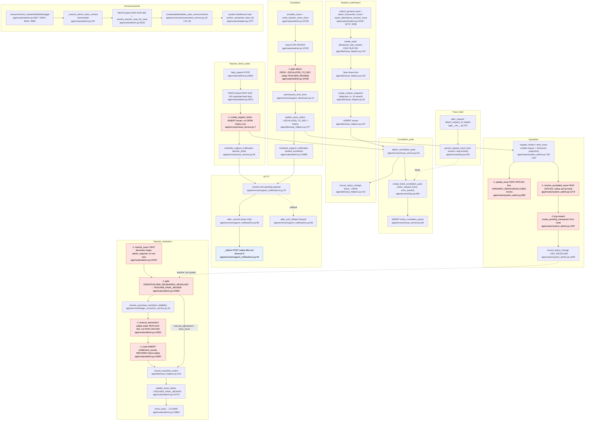

# F9 `support` — flowchart (Pathfinder 2026-10-04)

> Descriptive analysis. Authority: DOM-SUP-001 v1.8, FEAT-SUP-001 v1.1, FEAT-SUP-002,
> INV-ARC-021. Code is what was read on 2026-10-04 at `381a12d49` plus working tree.

## Mandated path (docs)

1. **Ownership.** Support is sole schema/mutation authority over `issue_categories`, `issues`,
   `issue_status_history`, `issue_resolution_actions`, `ticket_correlation_packs`,
   `user_reports`, `announcements` (DOM-SUP-001 §IV L45-55). It records declared actions and
   "does not execute those corrective actions itself" (§I L13-14).
2. **Submission is frozen capture.** Submission text, `submitted_at`, `context_snapshot`,
   `class_label` and the correlation pack are captured once and never mutated (§VI L161-171,
   L232-239; §X L386-392; FEAT-SUP-001 L23-29). A selected transaction must belong to the
   submitting seat and class (FEAT-SUP-001 L7-8). Writers share-lock the live seat (§X L415-417).
3. **State machine.** `OPEN→TEACHER_REVIEW` (teacher/system), `TEACHER_REVIEW→ESCALATED_TO_DEV|CLOSED`
   (teacher), `ESCALATED_TO_DEV→DEV_RESOLVED` (sysadmin), `DEV_RESOLVED→TEACHER_FINAL_REVIEW`
   (system/sysadmin), `TEACHER_FINAL_REVIEW→CLOSED` (teacher), `Any→CLOSED` (system). No state
   skipping; every transition atomically writes a history row (§VIII L320-342, §VI L188-192).
4. **Escalation.** Resolve the teacher's canonical class, verify the ticket belongs to it, lock
   the issue row through commit, write each permission checkbox individually, plus teacher
   public ref, time and history, atomically (FEAT-SUP-001 L10-15, L35-37; §X L368-377).
5. **Operator disclosure.** Every operator read projects the frozen snapshot through
   `support_permissions` server-side; unknown fields withheld (§X L378-384; FEAT-SUP-001 L17-21).
6. **Money effects via FEAT → Ledger.** REVERSE (revoke entitlement + compensate) or REFUND
   (retain entitlement + compensate) only for unused/pending items; "FEAT coordinates the Ledger
   reversal and the Support resolution action row" (§VII L309-313, §IX L346-353). Cross-domain
   coordination must happen inside a FEAT (INV-ARC-021 §V.2, §V.6); sysadmin reward through
   FEAT → Ledger (§VI L271-272, §IX L356-357).
7. **IFTTT notification.** Only teacher direct filing and teacher escalation of a student ticket;
   allow-listed 3-field payload frozen in transaction-local memory; send only after outer commit;
   3 s timeout, no retry; log outcome only (§XI L425-453; FEAT-SUP-001 L31-43).
8. **Announcements.** FEAT-SUP-002 is the only write path; class from session, verified owned;
   acting teacher seat resolved for that class; edit/toggle/delete load by id+class; toggle changes
   only `is_active`/`updated_at`; expiry is display-only (FEAT-SUP-002 L6-24; §VI L290-300).
9. **Deletion closure.** Issues and traces die with their seat/class (§X L394-417).

## Code path

### A. Student issue submission (FEAT-SUP-001)
`student.py` `submit_general_issue` L3218 / `report_transaction_issue` L3273 (validates tx by
`seat_id`+`class_id` L3285-3289) / `report_attendance_session_issue` L3338 →
`issue_helpers.create_issue` L124 (`@requires_feat_context("FEAT-SUP-001")` opens FEATContext with
the route's random-uuid idempotency key) → category lookup L149 → class row L154 → seat
share-lock L163 → `create_context_snapshot` L53 (balances via `get_available_balances` L82,
transaction L91, last 10 tx L106) → `Issue` insert L177-198 → `issue_service.attach_correlation_pack`
L54 → `tlcp.create_ticket_correlation_pack` L605 (reads `actor_request_trace`, `error_events`) →
`TicketCorrelationPack` insert L66 → `record_status_change(None→OPEN)` L210 → FEATContext commit.
No notification (correct per §XI).

### B. Teacher direct ticket (FEAT-SUP-001)
`admin.py help_support` L9004 → ownership `verify_teacher_owns_class` L15 → category whitelist →
payload-hash idempotency L9160-9176 → `FEATContext("FEAT-SUP-001")` L9212 →
`issue_service.create_support_ticket` L7 (teacher seat share-lock L16-18, `Issue` insert L25-44
with `support_permissions={'student_report': True}`) → `attach_correlation_pack` L45 →
`schedule_support_notification("teacher_ticket")` L50 → commit → `after_commit` listener
`support_notifications._send_committed_support_notifications` L88 → `_deliver` L54 (POST
`maker.ifttt.com`, timeout 3).

### C. Teacher escalation (FEAT-SUP-001)
`admin.py escalate_issue` L10738 (`@requires_feat_context`) → `verify_teacher_owns_class` L10759 →
`Issue ... with_for_update()` L10763 → status gate L10768 (OPEN/TEACHER_REVIEW) →
`permissions_from_form` (support_disclosure L13) → `update_issue_status(→ESCALATED_TO_DEV)` L10799
(issue_helpers L277 → history L217) → `schedule_support_notification("student_escalation")` L10809
when pack actor is student → commit → IFTTT post.

### D. Teacher resolve (FEAT-SUP-001 label)
`admin.py resolve_issue` L10547 (`@requires_feat_context` **outside** `@admin_required`) → issue
lookup by id+class_public_id L10574-10580, **no lock** → gate L10583 (OPEN, TEACHER_REVIEW,
DEV_RESOLVED) → for reverse/refund: binding checks L10624-10634 →
`ledger_correction_service.resolve_purchase_resolution_eligibility` L34 →
`reverse_transaction` L136 (called at admin.py L10651, under FEAT-SUP-001) → for REVERSE, route
inserts `EntitlementEvent(event_type='REVOKED')` directly L10665-10681 → `record_resolution_action`
(issue_helpers L243) → `update_issue_status(→TEACHER_FINAL_REVIEW)` L10724.

### E. Teacher close
`admin.py close_issue` L10821 → gate TEACHER_FINAL_REVIEW → `update_issue_status(→CLOSED)` L10863.

### F. Sysadmin
`system_admin.py support_tickets` L739 / `view_issue` L837 — reads via
`support_operator_access.sysadmin_visible_issues` L65 (escalated OR teacher-authored) and projects
through `support_disclosure.disclosed_snapshot/disclosed_report` (system_admin L686-711).
`update_issue` L892 (`FEAT-OPS-001`) moves teacher-direct tickets among OPEN/DEV_RESOLVED/CLOSED
L941. `resolve_escalated_issue` L1232 (`FEAT-OPS-001`) sets `issue.status = DEV_RESOLVED` L1273,
optional `create_pending_transaction(type='bug_reward')` L1297, `record_resolution_action` L1310,
`record_status_change` L1329.

### G. Announcements (FEAT-SUP-002)
`admin.py announcement_create` L9407 / `_edit` L9460 / `_delete` L9540 / `_toggle` L9582 →
`_resolve_admin_class_context` L437 (verify ownership) → `FEATContext("FEAT-SUP-002")` →
`resolve_teacher_seat_for_class` (identity_service L12) → `announcement_service`
`create_class_announcement` L18 / `update_class_announcement` L43 / `delete_class_announcement` L64
(each `_require_teacher_seat` L8). Read: `student.py` L1374-1384 (active, unexpired, class_id).

### H. Correlation trace feed (infrastructure for packs)
`app/__init__.py attach_request_id_header` L475 → independent Session →
`tlcp.persist_request_trace` L432 (skip-locked class+seat share locks L461-470, insert, per-actor
prune, probabilistic TTL prune incl. `error_events`).

## Flowchart

## Side effects

| Path | Tables written | Ledger | External | Other |
|---|---|---|---|---|
| A student submit | `issues`, `ticket_correlation_packs`, `issue_status_history` | none (reads balances) | none | seat FOR SHARE |
| B teacher ticket | `issues`, `ticket_correlation_packs` (no history) | none | IFTTT POST post-commit | teacher seat FOR SHARE |
| C escalate | `issues` (permissions, reviewer, escalated_at, status), `issue_status_history` | none | IFTTT POST post-commit (student tickets only) | issue FOR UPDATE |
| D resolve | `issues`, `issue_resolution_actions`, `issue_status_history`, **`entitlement_events`** (REVOKED) | `ledger_transaction` REVERSAL via `reverse_transaction` (feat_code FEAT-SUP-001) | none | `lock_recovery_scope` |
| E close | `issues`, `issue_status_history` | none | none | |
| F sysadmin | `issues`, `issue_status_history`, `issue_resolution_actions` | `ledger_transaction` `bug_reward` via `create_pending_transaction` | none | runs under FEAT-OPS-001 |
| G announcements | `announcements` | none | none | |
| H traces | `actor_request_trace` insert + prune; `error_events` TTL delete | none | none | independent session, after response |

Audit emission: none Support-specific observed; relies on whatever `FEATContext` emits.

## Deviations from docs

1. **Support route writes Store's table directly.** `admin.py:10665-10681` inserts
   `EntitlementEvent(event_type='REVOKED')` with `db.session.add` in the route. DOM-SUP-001 §I/§VII
   (Support does not execute effects), INV-ARC-021 §V.2/§V.6 (cross-domain coordination only in a
   FEAT), CLAUDE rule "no db.session.add in routes". It also skips `entitlement_service.revoke_entitlement`
   L565's one-terminal-per-lineage guard.
2. **Ledger reversal is not invoked through the Ledger FEAT.** `reverse_transaction` is called from
   the route under `FEAT-SUP-001` (`admin.py:10651`); the reversal's `feat_code` becomes SUP-001,
   whereas FEAT-LED-002 owns reverse (its own `transaction_void_feat.py:45` path). §IX says "FEAT
   coordinates"; there is no Support FEAT module; the route is the coordinator.
3. **State-machine violations** (§VIII L320-342):
   - escalate accepts `OPEN→ESCALATED_TO_DEV` (`admin.py:10768-10773`);
   - resolve moves `OPEN|TEACHER_REVIEW|DEV_RESOLVED → TEACHER_FINAL_REVIEW` (`admin.py:10583-10590`,
     L10724), none of which are allowed transitions; `DEV_RESOLVED→TEACHER_FINAL_REVIEW` is
     system/sysadmin-only but performed by teacher;
   - no writer for `TEACHER_REVIEW` exists anywhere (`grep STATUS_TEACHER_REVIEW` only finds gates);
   - sysadmin `update_issue` (`system_admin.py:892-948`) allows any of OPEN/DEV_RESOLVED/CLOSED to
     any other (incl. CLOSED→OPEN), and `closed_at`/`closed_by_type` are not set on its CLOSED.
4. **Teacher ticket creation writes no history row.** `create_support_ticket`
   (`issue_service.py:7-51`) inserts `OPEN` without `record_status_change`; student path does
   (`issue_helpers.py:210`). §VI L188-191.
5. **Support state mutated under FEAT-OPS-001.** `system_admin.py:894`, L1231 run Support writes and
   a ledger credit under the Operations FEAT; bug reward is `create_pending_transaction` straight
   from the route (L1297), not "FEAT → Ledger" (§IX L356-357). Status is assigned by hand (L1273)
   then history written separately (L1329) — atomic but bypasses `update_issue_status`.
6. **resolve_issue has no row lock and wrong decorator order.** Escalation locks
   (`admin.py:10763`) per FEAT-SUP-001 L35-37; resolve does not, so two concurrent resolves both
   pass the status gate; ledger replay is idempotent but the REVOKED insert is not.
   `@requires_feat_context` sits above `@admin_required` (L10548-10549) so FEAT opens before auth,
   with no idempotency key.
7. **resolve/close/view do not re-verify ownership** (`admin.py:10574-10580`, L10836-10842) and
   silently drop the class filter when `class_row` is None; escalate does verify. Low risk because
   `admin_required` redirects class-less contexts (auth.py L218-220), but inconsistent.
8. **Schema drift vs §VI.** DOM lists `issues.class_id` FK, `escalated_by_public_id`,
   `reviewer_notes`, `resolution`, `resolved_at`; model uses `class_public_id` (no FK),
   `reviewer_public_id`, `teacher_notes`, `teacher_resolution`, `teacher_resolved_at`
   (`models.py` ~L2272-2316). §X itself says `class_public_id` is required — internal DOM tension.
   `user_reports` (§IV, §VI L241-274) has **no model** — teacher reports are folded into `issues`.
9. **Correlation pack not class-scoped.** `tlcp.create_ticket_correlation_pack` L618-626, L653-668
   filter traces/errors by `actor_type`+`actor_public_id` only; per-actor prune L499-509 likewise.
   `seats.public_id` is described in code as unique only per class.
10. **Announcements use the system-transition seat resolver at request time.**
    `resolve_teacher_seat_for_class` docstring (identity_service L15-18) says request-time callers
    must use CanonicalContext; announcement routes call it (`admin.py:9433`, 9500, 9569, 9608).
    Toggle re-writes every field via `update_class_announcement` (L9605-9614) instead of
    `is_active`/`updated_at` only (FEAT-SUP-002 L22) — values unchanged, but contract-shape drift.
11. Minor: `create_support_ticket` raises `ValueError` that `help_support` does not catch (only
    `SQLAlchemyError`, `admin.py:9228`) → 500. Student issue idempotency keys are random uuids
    (`student.py:3255`), so double-submit creates duplicates, unlike the teacher payload-hash key.

## Within-feature repetition

| Logic | Locations |
|---|---|
| Entitlement REVOKED insert for reversed purchase | `admin.py:10665-10681`; `transaction_void_feat.py:224-242`; `entitlement_service.revoke_entitlement` L565-603 |
| Issue ref → id resolver | `admin.py:10388`; `system_admin.py:663` |
| Issue → view dict | `admin.py:10325` `_issue_to_view`; `system_admin.py:667` `_issue_to_view`; `help_support._support_report_views` `admin.py:~9045` |
| Class-scoped issue lookup (`filter_by(id) + if class_row: filter class_public_id`) | `admin.py:10505-10510`, 10574-10580, 10836-10842 (escalate does it differently, L10759-10763) |
| Teacher public id resolution | `issue_helpers.resolve_public_id_for_user` L31 used at `admin.py:10563/10752/10832`; `_get_teacher_seat_for_class` `admin.py:855` in the same handler L10568; `teacher_seat.public_id` `admin.py:~9042`; `student.py _support_actor_public_id` |
| Status change + history | `update_issue_status` L277 vs manual `issue.status=` + `record_status_change` `system_admin.py:1273/1329` |
| help_support error re-render (query + 15-arg render) | `admin.py:9098-9123`, 9126-9151, 9187-9210 |
| Student submit route boilerplate | `student.py:3218`, 3273, 3338 (context, form, recent-error option, create_issue, flash/rollback) |
| Snapshot technical fields (`timestamp`, `page_url`, `ip`, `UA`) | `issue_helpers.py:67-72`; `issue_service.py:33-36` |
| Issue insert + pack + (history) | `issue_helpers.create_issue` L124-214; `issue_service.create_support_ticket` L7-51 |
| Legacy status aliases in gates (`'submitted'`, `'teacher_review'`, `'elevated'`, …) | `admin.py:10417-10441`, 10583-10590, 10768-10773, 10843-10846; `system_admin.py:789-803`, 1222, 1240; canonicalization map `models.py:~2365-2372` |
| Dead code | `issue_categories.init_default_categories` L113 (no callers; categories seeded by migration) |

## External dependencies

| Called domain | Call site | Through a FEAT? (INV-ARC-021) |
|---|---|---|
| Ledger (read balances) | `issue_helpers.py:82` `get_available_balances` | read — permitted (§V.5) |
| Ledger (read tx) | `issue_helpers.py:91,106`; `student.py:3285`; `admin.py:10525,10623` | read |
| Ledger (write reversal) | `admin.py:10651` → `ledger_correction_service.reverse_transaction` | **No** — service call under FEAT-SUP-001 from a route |
| Ledger (write bug reward) | `system_admin.py:1297` `create_pending_transaction` | **No** — under FEAT-OPS-001 from a route |
| Store/Entitlements (eligibility read) | `ledger_correction_service.py:34` reads `EntitlementEvent`, `obligations_service.is_obligation_related_transaction` | read inside Ledger service (itself a cross-domain read in a service) |
| Store/Entitlements (write REVOKED) | `admin.py:10667` | **No** — direct ORM insert in route |
| Identity (seat locks, teacher seat) | `issue_helpers.py:163`; `issue_service.py:16`; `identity_service.resolve_teacher_seat_for_class`; `verify_teacher_owns_class` | reads/locks — permitted |
| Class configuration | `ClassEconomy` reads for label/public id (`issue_service.py:13`, `issue_helpers.py:154`) | read |
| Operations/observability | `tlcp.py` reads `actor_request_trace`, `error_events`; writer in `__init__.py:475` | infrastructure |
| External HTTP | `support_notifications._deliver` → `maker.ifttt.com` | post-commit, matches §XI |

## Sources consulted (paths + line ranges)

- `docs/DOMAIN/DOM-SUP-001_SUPPORT_DOMAIN.md` L1-458
- `docs/FEATURE-EXECUTION/FEAT-SUP-001_ISSUE_SUBMISSION_AND_ESCALATION.md` L1-43
- `docs/FEATURE-EXECUTION/FEAT-SUP-002_CLASS_ANNOUNCEMENT_MANAGEMENT.md` L1-24
- `docs/INVARIANT/ARCHITECTURE/INV-ARC-021_CROSS_DOMAIN_REFERENCE_AND_COORDINATION.md` (headings L1-80)
- `PATHFINDER-2026-10-04/00-features.md`
- `app/services/issue_service.py` L1-73; `announcement_service.py` L1-67; `support_notifications.py` L1-120;
  `support_disclosure.py` L1-43; `support_operator_access.py` L34-91; `tlcp.py` L432-525, L577-717
- `app/utils/issue_helpers.py` L1-292; `app/utils/issue_categories.py` L100-164
- `app/routes/student.py` L3192-3400, L1374-1384 (grep)
- `app/routes/admin.py` L437-457, L855-864, L9004-9258, L9376-9630, L10290-10355, L10388-10870
- `app/routes/system_admin.py` L739-960, L1206-1350
- `app/feats/base.py` L259-260, L618-700; `app/feats/transaction_void_feat.py` L45-59, L190-255
- `app/services/ledger_correction_service.py` L25-60, L136-230; `entitlement_service.py` L565-603
- `app/services/identity_service.py` L12-37; `app/services/context_resolver.py` L57-78; `app/auth.py` L150-235
- `app/models.py` L2255-2360 (Issue); `app/__init__.py` L470-500

## Confidence & gaps

- **High** on paths A-G and deviations 1-6 (lines read directly).
- **Medium** on deviation 9 (public_id scoping): depends on whether `seats.public_id` is globally
  unique in the DB; not checked against DOM-IDEN-001 §VI or the migration.
- Not traced: `FEATContext.__exit__` commit/audit emission details; whether `reverse_transaction`
  emits audit lineage; the templates' use of disclosure; seat/class deletion cascades
  (`student_deletion.py`, `teacher_destruction.py`, `classroom_setup.py`) beyond grep hits.
- No `TEACHER_REVIEW` writer and no `Any→CLOSED` system TTL job were found by grep; a scheduled job
  outside `app/` was not searched.
- `user_reports` absence inferred from no `UserReport`/`user_reports` hits in `app/models.py`,
  routes and services.
