# Pathfinder 2026-10-04 — Unified Proposal

> **Descriptive analysis, not a normative document.** It proposes how the code should be brought into
> line with the existing INV/DOM/FEAT/SPEC text. It does not amend any of those documents.
> Where a normative document was ambiguous or self-contradictory, the owner ruled on 2026-10-04
> (R1–R4 in `02-duplication-report.md`). This proposal follows those rulings. Until U13 lands, the
> rulings run ahead of the documents.

## Design rule used throughout

Every unified system below already has a **canonical component named by the docs**. In most cases it
also already exists in the code. The work is to finish that component where it is incomplete and
delete the copies. No new layer, registry, factory, or feature flag is proposed. The only new
functions are small additions to an existing canonical module where its absence caused the bypass
(credit plan, rent-terms read, as-of CWI).

## Out of scope: legitimate specialization (keep as is)

| Concern | Why it stays split |
|---|---|
| Obligation command reservations versus Ledger reservations | Separate domain-owned tables (DOM-OBL-001 §V.7) |
| `payroll/corrections.py:128` legacy pairing replay | Required by DOM-PROD-001 §683 |
| Teacher versus sysadmin passkey routes | Different principals (DOM-IDEN-003 §VII); `passkey_service` is already shared |
| `admin._issue_to_view` versus `system_admin._issue_to_view` | Different disclosure rules (DOM-SUP-001 §VI/§VII) |
| Synthetic teacher context in scheduler jobs, as a mechanism | `identity_service.resolve_teacher_seat_for_class` is the sanctioned operation; only the three copies are accidental |
| CLASS-004 coordinating the withdrawals when a feature is disabled | DOM-OBL-001 §IX.15; only the selection query moves |
| Student-facing versus guidance-facing "current rent" helpers | They answer different questions (A§6c) |

---

## U1. Monetary posting — one path: FEAT-LED-000 plan → resolve → apply

**Owner:** Ledger (DOM-LED-001; FEAT-LED-000 §V, §XII.1 and §XII.5; SPEC-LED-002 §V).

**Entry point:** `ledger_resolution_service.build_*_plan` → `resolve` → `apply_resolved_ledger_plan`,
with the reservation held by `ledger_command_service.create_reserved_effects`.

**Change.** The plan builder at `ledger_resolution_service.py:70-72` accepts only debits. Add the
credit plan alongside it in the same module. It is a second constructor of the same
`IntendedLedgerPlan`, not a new service. This is the single cause of every bypass in A§1.

| Old call site | Becomes |
|---|---|
| `feats/prod.py:405` (payroll and manual credit) | credit plan under FEAT-PROD-003/004. The per-seat key comes from the run's `idempotency_key` + seat, as FEAT-PROD-004 §VI.2 requires, not from `settlement.py:209`'s random cycle id |
| `feats/insurance_claim_feat.py:1984-2000` (reimbursement) | credit plan under FEAT-STOR-003. Stop setting `original_transaction_id`, which the ITR classifier reads as a reversal |
| `services/ledger_interest_service.py:378-389` | credit plan. The banking directive is supplied as a plan input, not imported from CLASS (FEAT-LED-000 §VIII.3) |
| `routes/system_admin.py:1297-1308` (bug reward) | **retired, not unified (R3).** The reward becomes badge-only (9 badges: 6 categorical + 3 milestones). Remove the ledger posting. The badge system is built only after its governing document exists (U13) |
| `feats/transaction_void_feat.py:244-257` (zero-amount `void_item_removed`) | delete. Entitlement removal is Store's event, not a Ledger row (INV-LED-012) |
| `services/ledger_transfer_service.py:46-72` (hand-rolled reservation) | `create_reserved_effects`. This closes the SPEC-LED-002 §6.2-6.3 breach |

Seat locks (A§9) collapse to the existing `lock_recovery_scope` / `lock_ledger_seats`
(`ledger_recovery_service.py:288-313`). Delete the open-coded copies in nine FEATs. The
`direct_entitlement_grant_feat.py:183` unscoped lock becomes class-scoped.

**Capability lost:** none. Posted amounts are unchanged. The changes are provenance, reservation and
replay safety.

## U2. Entitlement termination — one writer, one reversal entry

**Owner:** Store owns `entitlement_events` (DOM-STORE-001). Ledger owns the reversal (FEAT-LED-002
L66 and L82). FEAT-STOR-002 L178 forbids route-level revocation.

**Entry points:**
- **Write:** `entitlement_service.revoke_entitlement` (`:565`), the only `REVOKED` writer.
- **Reversal:** FEAT-LED-002 `execute_transaction_void/reverse`. Both Support and admin void call it.
- **Read:** `entitlement_read_service.get_entitlement_lineage_terminal_event` (`:269`), class-scoped
  and with ordering added.

| Old call site | Becomes |
|---|---|
| `routes/admin.py:10640-10681` support resolve (inline `reverse_transaction` + `db.session.add(EntitlementEvent)`) | opens FEAT-LED-002 with the issue as correlation. Support records only the resolution action (DOM-SUP-001 §I). The issue row is locked, as escalate already does |
| `feats/transaction_void_feat.py:186-242` inline REVOKED + `StoreProduct` read | Ledger asks Store for the linked entitlements through Store's query, then invokes `revoke_entitlement` |
| `ledger_correction_service.resolve_purchase_resolution_eligibility` versus void's delayed-use rule | **one** eligibility rule, the one FEAT-LED-002 §VI states. The other is deleted |
| `entitlement_read_service.py:722` `entitlement_terminal_event` (no class_id) and 6 inline terminal lookups | deleted, in favour of the class-scoped read |
| 8 re-declarations of the terminal-event set | one constant in `entitlement_read_service` |
| `prod.py:232` → `entitlement_service.consume_hall_pass` (`:418`), the Store `CONSUMED` row for hall-pass use | **deleted (R2).** PROD's `hall_pass_logs` row is the consumption record. Store's hall-pass balance becomes GRANTED − (EXPIRED + REVOKED) − the PROD consumptions that reference the grant, read through a PROD query. Historical grants carry both a Store `CONSUMED` row and a log with the same `entitlement_id`, so the balance must count each entitlement once |
| `entitlement_service.py:349` hall-pass bulk revoke (any provenance, student recorded as actor) | `revoke_entitlement` per unit, restricted to direct-grant provenance per FEAT-STOR-004, with the teacher recorded as actor |

**Also unified (A§8, B SE-3/SE-4).** "Active insurance coverage" becomes one read in
`insurance_coverage_service`, and `has_active_insurance_coverage` becomes a predicate over it. The
copies at `student.py:2108`, `entitlement_read_service.py:415/460` and `insurance_claim_feat.py:1118`
call that read. The GRANTED-per-unit loops (B SE-1) collapse into one `entitlement_service` appender
that writes no quantity (DOM-STORE-001 L203).

**Capability lost:** the issue path's looser eligibility (any purchase with all grants active), if
FEAT-LED-002 states the delayed-use rule. That loss is intended.

## U3. Policy reference — one read surface, one write surface

**Owner:** Policies (DOM-POL-001 §VI.1 "FEAT-POL is the only surface"; §VII "MUST NOT substitute a
newer… version"; DOM-POL-001A §V.E).

**Entry points:**
- **Read:** `policy_reference_service`. Add `get_rent_terms(policy_uuid, *, class_id)` next to
  `get_insurance_recurring_terms`. It resolves the exact version with `one_or_none` and has **no
  fallback to current**.
- **Read (selection of the policy in force):** one reader per family. For hall pass, keep
  `class_configuration_query_service.get_hall_pass_settings` (newest IN_USE). Payroll already
  complies through `payroll/settings.py`.
- **Write:** FEAT-POL-001 through one `supersede(current, successor)` (retire then insert) and one
  availability validator in which RETIRED is terminal.

| Old call site | Becomes |
|---|---|
| Rent terms hand-rolled at `obligations_service.py:225,236`, `obligation_view_model.py:204`, `reconcile_rent_feat.py:299,324`, `rent_payment_feat.py:350-356`, `student.py:581,605`, `admin.py:1768,1787,5156` | `get_rent_terms`. Delete `rent_payment_feat`'s fallback to current settings |
| `feats/prod.py:86-94` and `:205-213` (effective-date selection that ignores availability) | read `get_hall_pass_settings` once and pass it in. Delete `feats/attendance.py:9-25` (an identical copy of the query-service reader) |
| `prod.py:139` invented `"default"` policy id | no settings means an explicit refusal, not a placeholder |
| Supersede at `admin_settings_service.py:49-81`, `feats/attendance.py:98-111`, `store_service.py:304-322`, `feat_class_003…:466-480` | one `supersede`, under FEAT-POL-001 |
| Availability machines at `store_service.py:325-331` and `insurance_definition_service.py:180` | one validator |
| FEAT-SETTINGS-001 (`admin.py:4618,4926,5015,5256`; `feats/attendance.py:71,115`), FEAT-ADMN-001 (`admin.py:7858`), the FEAT-CLASS-003 insurance writes, and the FEAT-CLASS-005 rebalance where it writes policy rows | FEAT-POL-001 |
| `collective_goal_expiry_feat.py:220` writing `store_products.availability_state` | a FEAT-POL-001 call |

**Capability lost:** silent fallback to the current rent when a frozen reference does not resolve. It
becomes a visible refusal. DOM-POL-001 §VII requires exactly this.

## U4. CWI — one derivation, with as-of

**Owner:** Class Configuration (SPEC-ECON-003 §1 "single canonical technical source", §2 and §4.1;
DOM-ITR-001 §II and INV-ITR-004 forbid ITR deriving it).

**Entry point:** `economic_engine.resolve_base(class_id, *, as_of=None)`. Add the `as_of` parameter,
backed by the existing `economic_engine_effective_at`.

| Old call site | Becomes |
|---|---|
| `class_configuration_query_service.py:423-456` `calculate_cwi` (float) | deleted. `get_banking_directive` (`:757,772`) uses `resolve_base(...).cwi`. This changes the overdraft fee by up to one cent (A§4) |
| `class_configuration_economic_service.py:43-56` | deleted |
| `utils/economy_balance.py:256-320` | becomes a thin breakdown wrapper over `resolve_base` |
| `interpretation/reference_configuration.py:62-71` | `resolve_base(class_id, as_of=cycle_completed_at)`. This fixes the mixed as-of rule (DOM-ITR-001 §VII/§IX) |
| Policy-mode readers ×4 (B CC-3), including the user-keyed `FeatureSettings.economy_policy_mode` | `resolve_base(...).economy_policy_mode`. Delete `get_active_policy_mode(user_id, …)` |

**Capability lost:** "hours = 0 → CWI 0.0" becomes "not ready" (`None`), as `resolve_base` already
does. Callers that displayed `$0.00` will show "not ready".

## U5. Attendance intervals and hall-pass lifecycle — one pairing, one lifecycle read

**Owner:** PROD (DOM-PROD-001 L116 and L667; SPEC-PROD-001).

**Entry points:**
- `attendance_service.list_attendance_interval_evidence` (pairing).
- `resolve_hall_pass_lifecycle_status` (pass-scoped lifecycle).

| Old call site | Becomes |
|---|---|
| `attendance_service.py:504-559` `…_for_date` / `…_today` via `_pair_active_intervals` (`:111`) | clip `list_attendance_intervals(...)` to the day window, as `corrections._worked_seconds_in_window` already does. `_today` calls `_for_date`. This changes insurance lost-time payouts (`insurance_claim_feat.py:917,1002,1460,1478`) and student "Time Today" so they match payroll |
| `app/attendance.py:51-148` (no app callers) | deleted |
| Teacher leave and return (`api.py:891-921`), student checkout (`api.py:1000-1013`) on a seat-latest read | `resolve_hall_pass_lifecycle_status`. Idempotency keys become deterministic, with no `secrets.token_hex` |
| Seat-latest-event query inlined 8 or more times | one `latest_attendance_event(seat_id, class_id)` |
| Per-seat payroll recompute ×3 (B PR-7) | compute once in settlement and pass it into the FEAT |
| `api.py:1196-1316` hall-pass history | shares the attendance-history window and pagination, and adds the claimed-seat filter (DOM-IDEN-002 §VIII.2) |

**Capability lost:** none that the docs sanction. The legacy pairing remains only in the correction
replay.

**Hall-pass double record (A§7): resolved by R2.** Using a hall pass is PROD-only. The Store
`CONSUMED` write is removed in U2, and PROD exposes the read Store needs: "consumptions referencing
grant X". The request queue stays in Store's `pending_actions`: a request is a queued use of an
entitlement, and the row is removed on approval or rejection (owner clarification).

## U6. FEAT identity — the registry matches the FEAT documents

**Owner:** each FEAT document owns its id (FEAT-CORE-000). The provenance sets are Ledger and
Interpretation consumers (DOM-LED-001 §VII.1; SPEC-ITR-001 §6.3 and §10.2).

**Entry point:** `feats/base.py:FEAT_REGISTRY`. Every entry corresponds to a document under
`docs/FEATURE-EXECUTION/`, with the document's title. `SYSTEM_ORIGINATED_FEAT_CODES` and the ITR
income-origin sets are reviewed against those titles.

- Delete ids with no document: FEAT-SETTINGS-001 and FEAT-ADMN-001 (absorbed by U3), FEAT-OBLI-001,
  and FEAT-OBL-004/005 (absorbed by U12 under **R1**). FEAT-BYPASS-LEGACY must not be honoured in production code
  (`models.py:709`; `base.py:522-549`).
- Reassign catch-alls:
  - FEAT-OPS-001 is audit emission only. Sysadmin and teacher passkey routes go to
    FEAT-IDEN-102/107, sysadmin login to FEAT-IDEN-1xx, and support updates to FEAT-SUP-001.
  - FEAT-IDEN-001 is the unauthenticated student claim only. Login, switch-class and teacher
    set-class get their documented owners. Where none exists (FEAT-IDEN-005, class binding), that is
    a **documentation gap to fill**, not an id to invent.
- Rent payment moves from FEAT-OBL-001 (Assess) to FEAT-OBL-003 (Satisfy).
- Student transfers stop being classified as system-originated (A§3).
- Insurance premium self-payments are classified the same way as rent self-payments.
- Class creation runs `execute_create_class_boundary` (FEAT-CLASS-001) instead of a route-opened
  context around `classroom_setup.create_class`.

**Capability lost:** none. **Caveat:** ledger rows are immutable, so historical rows keep their old
`feat_code`. The classifiers must still recognise the legacy codes on historical rows, and must not
apply them to new work. This is a read-side mapping, not a data migration.

**Sequencing:** U6 is applied **incrementally**. Each of U1–U5 corrects the FEAT ids at the sites it
touches, and a final sweep handles the remainder and the registry text.

## U7. Principal session and context — one establishment, no alternate constructors

**Owner:** Identity (DOM-IDEN-003 §"Session Establishment" and §VII; DOM-IDEN-006 §IX and §XII).

**Entry points:**
- `auth.establish_teacher_session` / `establish_sysadmin_session`. These now do the whole sequence:
  clear, nonce, `current_session_started_at` / `current_session_expires_at`, timestamps.
- `resolve_canonical_context`, called once at the boundary.

| Old call site | Becomes |
|---|---|
| Teacher TOTP `admin.py:2595-2613`, teacher passkey `:10219-10234`, sysadmin TOTP `system_admin.py:181-187`, sysadmin passkey `:374-381` | one call each |
| `app/__init__.py:787-792` builds a context for another class | a display-metadata read that takes `class_id` directly, with no `CanonicalContext` |
| `admin.py:855` `_get_teacher_seat_for_class` (8 call sites) | `g.canonical_context.seat_id` |
| Scheduler synthetic contexts `scheduled_tasks.py:75-80`, `:317-322`, `payroll/settlement.py:80-93`, plus the insurance `_ctx` copies | one helper beside `identity_service.resolve_teacher_seat_for_class` |
| Teacher-seat authority predicate at four strengths (A§14, B IS-5) | `verify_teacher_owns_class` plus a seat check in one Identity helper |

Also add the step-up for passkey register/remove and account deletion (DOM-IDEN-003 §VII). This is a
missing requirement, not duplication, but it lives in these same functions.

The fixed 60-minute teacher session window conflicts with the current 10-minute idle timeout, and the
`.claude/rules/security.md` summary describes the latter. **DOM-IDEN-003 §VII governs**, and the
agent guidance is what needs correcting.

## U8. Operations integrity — one chain walk, one error sink, one field registry

**Owner:** Operations (DOM-OPS-001/002).

**Entry points:** `audit_verifier._walk_chain` (applying all checks), `operational_event_service`
(errors), and `audit_verifier.LEDGER_FIELDS_BY_VERSION` (protected fields).

| Old call site | Becomes |
|---|---|
| Chain walks at `audit_verifier.py:117`, `:569`, `:725` | one walk with the strictest checks (class_id + `hmac_signature == event_hash`, DOM-OPS-002 L86) |
| `audit_service.py:386-436` stub delegators with ImportError fallbacks | deleted |
| `app/__init__.py:155-189` and `tlcp.py:53`, which write to and gate on the dropped `error_events` | `operational_event_service` |
| `ledger_posting_service.py:8-13` field list | imports `LEDGER_FIELDS_BY_VERSION` |

**Not duplication, surfaced here:** the dropped `integrity_status` table and the log-only nightly
check (operations flowchart, deviation 1). That needs a DOM-OPS-002 decision on where integrity
status persists. It is not a consolidation.

## U9. Presentation builders — domain-owned only

**Owner:** each domain (SPEC-UI-001 §IX; INV-ARC-021 §V.5).

`services/view_model_builders.py` is deleted. Its live functions move to their domains:
`build_identity_profile_view` to `services/identity/builders.py`, and `build_store_management_view` to
`services/store/builders.py`. The three functions with no callers are deleted.
`obligation_view_model.py` becomes `services/obligations/builders.py` and reads rent terms through U3.

## U10. Obligations internals

**Owner:** Obligations (DOM-OBL-001).

- `get_latest_bill_cycle(class_id, internal_ref)` is class-scoped and replaces the inline copies.
  Callers that use "latest" to mean "current" (`admin.py:1785,5149`) switch to the current-period
  read (§158).
- An Obligations query, "untouched assessments at or after instant", is used by both
  `terminate_bill_cycle_feat.py:108-129` and `feat_class_004…:163-187`.
- `settle_insurance_premium` is generalised to `settle_obligation_payment`, which rent and insurance
  share. It takes one recovery lock and reads the feat code from `get_active_feat_name()`.
- The waiver-exists check in the route (`admin.py:5659`) calls `check_idempotency_satisfaction`.

## U11. Local deletions and consolidations (per domain, low coupling)

- **Identity:**
  - Delete the dead teardown helpers (`teacher_destruction.py:229-303`) and the duplicate
    PendingAction block.
  - Delete `classroom_setup.create_student`, `update_or_create_roster_seat` and
    `execute_modify_student`.
  - One `_match_unclaimed_seat` for claim and bind.
  - One `seat_is_claimable` predicate (`user_id IS NULL AND claimed_at IS NULL`).
  - One `clear_onboarding_session`.
  - Delete the dead DOB code (`claim_credentials.py`; `admin.py:639,798`).
- **Class configuration:**
  - Move the interest/compound coupling check into the FEAT-CLASS-005 validator (SPEC-ECON-003 §5.6).
  - Share the CLASS-004/005 preamble.
  - One `enabled_features(class_id)`.
  - The conditional pointer clear.
- **Support:**
  - Teacher ticket creation shares the core that writes the OPEN history row.
  - One fail-closed class-scoped issue lookup.
  - Derive status aliases from `LEGACY_TO_CANONICAL_STATUS` until legacy rows are confirmed gone.
  - Opaque refs only.
  - `update_issue_status` everywhere.
- **Ledger:** delete `get_pending_balance_delta` (no callers; INV-LED-015) and reuse `_share_cents`.
- **Interpretation:**
  - Compute the shared reads once per pass.
  - `_money` becomes `canonical_decimal`.

## U12. Insurance acquisition — split along R1

**Owner (ruling R1):** the purchase (first payment, which gains the entitlement) is Store,
FEAT-STOR-001. Establishing the recurring payment is Obligations: the bill cycle, through the
existing OBL establishment/succession commands. Cancellation follows the established semantics:
stop-renewal is an OBL terminal bill cycle, and coverage is EXPIRED at the boundary by Store's
lifecycle (FEAT-STOR-002). Insurance remains non-revocable.

**Entry points:**
- `store_purchase_feat` (FEAT-STOR-001) for the first payment and the GRANTED event.
- Obligations' bill-cycle command for the recurring schedule, coordinated by FEAT-STOR-001 per
  INV-ARC-021.
- `insurance_coverage_renewal_feat` (FEAT-STOR-007) for later premiums, which already settles
  through Obligations.

| Old call site | Becomes |
|---|---|
| `feats/purchase_insurance_feat.py:91` (FEAT-OBL-004) from `student.py:1876` | FEAT-STOR-001 purchase, plus an OBL call that establishes the bill cycle. The FEAT-OBL-004 module is deleted |
| `feats/cancel_insurance_feat.py:86` (FEAT-OBL-005, no document) from `student.py:1922` | an OBL terminal bill cycle (`terminate_bill_cycle_feat`) plus Store EXPIRED at the boundary. The module is deleted |
| `establish_bill_cycle` kept "only for insurance (interim)" | the OBL establishment command that U12 calls. Confirm it against DOM-OBL-001 before reusing it |

**Capability lost:** none. Whether purchase and bill-cycle establishment are atomic is decided by
FEAT-STOR-001's amended text (U13).

## U13. Normative documents catch up (R1–R4)

These are doc-only amendments under SOP-DOC-000. Code that departs from its governing document is a
defect in one or the other; here the owner has ruled that the documents are behind.

- **R1:** amend FEAT-STOR-001 (L28-32, L332) to own insurance purchase. Retire the draft
  FEAT-OBL-004. State the OBL hand-off for the recurring cycle.
- **R2:** amend DOM-STORE-001 L471 so approval writes the PROD log and does not consume in Store.
  Align FEAT-PROD-002 and FEAT-STOR-002 (L102/L113). Keep §IX's removal of the `pending_actions`
  row on approval or rejection, which is correct as written.
- **R3:** badges are operational and sysadmin-granted (owner). Add them under Operations: a
  DOM-OPS-001 section, or a SPEC-OPS-004 extension, covering tables (DOM-CORE-002), the awarding
  FEAT and the 6 categorical + 3 milestone definitions. They create no ledger, entitlement or class
  economic state. Amend SPEC-OPS-004 to remove the ledger-reward path (§6.3 vs §VII).
  **Do not draft from scratch:** an existing design is preserved at annotated tag `archive/bug-hunter-badges-20260914` → `3cdb1294` (DOM-OPS-003_BADGE_SYSTEM.md, SPEC-OPS-001/002 badge SPECs, 9 SVGs under app/static/badges/; tracked as PL-OPS-04 in docs/TRACKING/POST_LAUNCH_TRACKER_2026.md). Port the badge files only — never merge 3cdb1294 (the rest predates main). Both SPEC numbers are taken on main (SPEC-OPS-001 = reversal/void, SPEC-OPS-002 = external status), so renumber; DOM-OPS-003 is still free. The design already matches the rulings: Operations-owned, non-monetary (§V forbids any ledger effect), recipient anchored to the reporter's seat_id with only seats.public_id exposed, awarded only by the Operations issue-resolution FEAT, not teacher-configurable. Catalog CONFIRMED by owner 2026-10-04: 9 badges = 6 categorical + 3 engineering milestones (Uptime ≥2, System ≥4, Architecture = all 6), as archived. CERTIFICATE SURVIVAL (owner, still to build): a student must be able to validate a badge after their seat is destroyed, without exposing identity. SPEC §IX already defines a detached certificate record (no FK, no class_id/seat_id/user_id; holds a certificate-code lookup digest + first/last-name match digest). What the docs must add before code: (a) explicit authorization for that name-match digest to outlive the seat — INV-ARC-018 requires seat PII deleted with the seat and says an artifact must not outlive its identity 'absent an explicitly authorized, separately scoped requirement', so the requirement must be stated (DOM-OPS-003 + an INV-ARC-018 cross-reference), and INV-ARC-012/013 must treat the certificate as unanchored rather than residue; (b) a PEPPER_KEY rotation strategy for these digests (SOP-SEC-001 §V.2a: rotation cannot reproduce existing digests); (c) how an award is invalidated while the seat exists (e.g. a one-way award→certificate pointer) and that after destruction the certificate is immutable.
- **R4:** DOM-ITR-001 v1.7 (§V, §VIII, §IX, §XIII) and SPEC-ITR-001 §16 must say the writer is
  live. DOM-IDEN-003 §V adds `recovery_class_challenges`, and §IX is reconciled on recovery-code
  hashing. Also: write FEAT docs or record decisions for the documentation gaps U6 surfaces
  (FEAT-IDEN-005 class binding, FEAT-ITR-001), and record where integrity status persists
  (DOM-OPS-002, U8).

---

## Defects surfaced that are not duplication (for separate triage)

These came out of Phase 1 and are cited in the flowcharts. They are not part of any unification.

- Rent debts stop accruing when rent is disabled (`scheduled_tasks.py:206`; DOM-OBL-001 §IX.16).
- An amount that cannot be resolved counts as SATISFIED (`obligations_service.py:211-253,486`; §VIII).
- `ACT-IDEN-*` / `ACT-OBL-*` audit events are never emitted.
- Recovery deletes passkeys locally only (`teacher_recovery_feat.py:286`; DOM-IDEN-003 §V).
- The per-student hall-pass form raises `TypeError` (`admin.py:3747`). The bulk path works (owner-confirmed in production).
- NON_MONETARY insurance claims cannot be filed or approved, and a date conflict leaves an orphan
  SUBMITTED claim (`insurance_claim_feat.py:1304-1342`).
- The roster import uses a random idempotency key per request (`admin.py:8104`).
- `/health/status` invariant verification is always UNKNOWN (U8 note).

---

## Proposed unified system

```mermaid
flowchart TD
  subgraph Boundary["Request / job boundary"]
    R["Route or scheduler job<br/>app/routes/*.py · app/scheduled_tasks.py"]
    CTX["resolve_canonical_context (once)<br/>app/services/context_resolver.py:80"]
    SYS["system teacher context (one helper)<br/>app/services/identity_service.py:12"]
    SES["establish_teacher/sysadmin_session (full sequence)<br/>app/auth.py:390"]
  end
  R --> CTX
  R -. jobs .-> SYS
  R -. sign-in .-> SES

  CTX --> FEAT["FEATContext — registry == FEAT docs<br/>app/feats/base.py:196,277"]
  SYS --> FEAT

  subgraph POL["Policies (DOM-POL-001)"]
    PW["FEAT-POL-001: supersede + availability (RETIRED terminal)<br/>app/services/policy_reference_service.py (new write fns)"]
    PR["exact-version reads: get_rent_terms / get_insurance_recurring_terms<br/>app/services/policy_reference_service.py:111"]
    PS["in-force selectors: hall pass · payroll<br/>class_configuration_query_service.py:388 · payroll/settings.py:43"]
  end

  subgraph CLASS["Class Configuration (DOM-CLASS-001)"]
    RB["resolve_base(class_id, as_of)<br/>app/services/economic_engine.py:286"]
    BD["get_banking_directive<br/>class_configuration_query_service.py:738"]
  end
  RB --> BD

  subgraph PROD["Productivity (DOM-PROD-001)"]
    IV["list_attendance_interval_evidence<br/>app/services/attendance_service.py:252"]
    HL["resolve_hall_pass_lifecycle_status<br/>app/routes/api.py:1083 (resolver)"]
    PF["FEAT-PROD-003/004 payroll<br/>app/feats/prod.py · complete_payroll_cycle.py"]
  end
  IV --> PF
  PS --> PF

  subgraph OBL["Obligations (DOM-OBL-001)"]
    OS["settle_obligation_payment (rent + premium)<br/>app/feats/insurance_premium_payment_feat.py:83 (generalised)"]
    OQ["untouched-assessments query · get_latest_bill_cycle(class_id)<br/>app/services/obligations_service.py:577"]
  end
  PR --> OS

  subgraph STORE["Store & Entitlements (DOM-STORE-001)"]
    SP["FEAT-STOR-001 purchase · 003 claim · 004 grant · 007 renewal<br/>app/feats/store_purchase_feat.py · insurance_claim_feat.py"]
    RV["revoke_entitlement (sole REVOKED writer)<br/>app/services/entitlement_service.py:565"]
    TQ["terminal-event read (class-scoped) · coverage read<br/>entitlement_read_service.py:269 · insurance_coverage_service.py"]
  end
  PR --> SP
  IV -->|lost-time hours| SP

  subgraph LED["Ledger (DOM-LED-001)"]
    PLAN["build debit/credit plan → resolve<br/>app/services/ledger_resolution_service.py:55"]
    APPLY["apply_resolved_ledger_plan + create_reserved_effects<br/>app/services/ledger_command_service.py:131"]
    LOCK["lock_recovery_scope<br/>app/services/ledger_recovery_service.py:288"]
    VOID["FEAT-LED-002 reverse/void<br/>app/feats/transaction_void_feat.py"]
  end
  PLAN --> LOCK --> APPLY
  BD --> PLAN
  PF -->|credit plan| PLAN
  OS -->|debit plan| PLAN
  SP -->|debit / credit plan| PLAN
  VOID --> PLAN
  VOID -->|linked entitlements| RV

  subgraph SUP["Support (DOM-SUP-001)"]
    IS["issue create (+OPEN history) · fail-closed lookup<br/>app/utils/issue_helpers.py:125"]
    RES["resolve: records action, invokes FEAT-LED-002<br/>app/routes/admin.py:10547 (rewritten)"]
  end
  RES --> VOID

  subgraph ITR["Interpretation (DOM-ITR-001)"]
    MAT["materialize_interpretation_cycle (read-only inputs)<br/>app/services/interpretation/"]
  end
  PF -->|FEAT-PROD-004 side effect| MAT
  RB -->|as_of = cycle boundary| MAT

  subgraph OPS["Operations (DOM-OPS-001/002)"]
    AUD["audit_protected → emit_audit_event<br/>app/feats/base.py:557 · audit_service.py:221"]
    WALK["_walk_chain (strict, single)<br/>app/utils/audit_verifier.py:117"]
    ERR["operational_event_service (sole error sink)<br/>app/services/operational_event_service.py:91"]
  end
  APPLY --> AUD
  PF --> AUD
  AUD --> WALK

  CW["FEAT-CLASS-004 disable feature<br/>feat_class_004_feature_enablement.py:163"] --> OQ
  PW -. FEAT-POL-001 .- CTX
```

