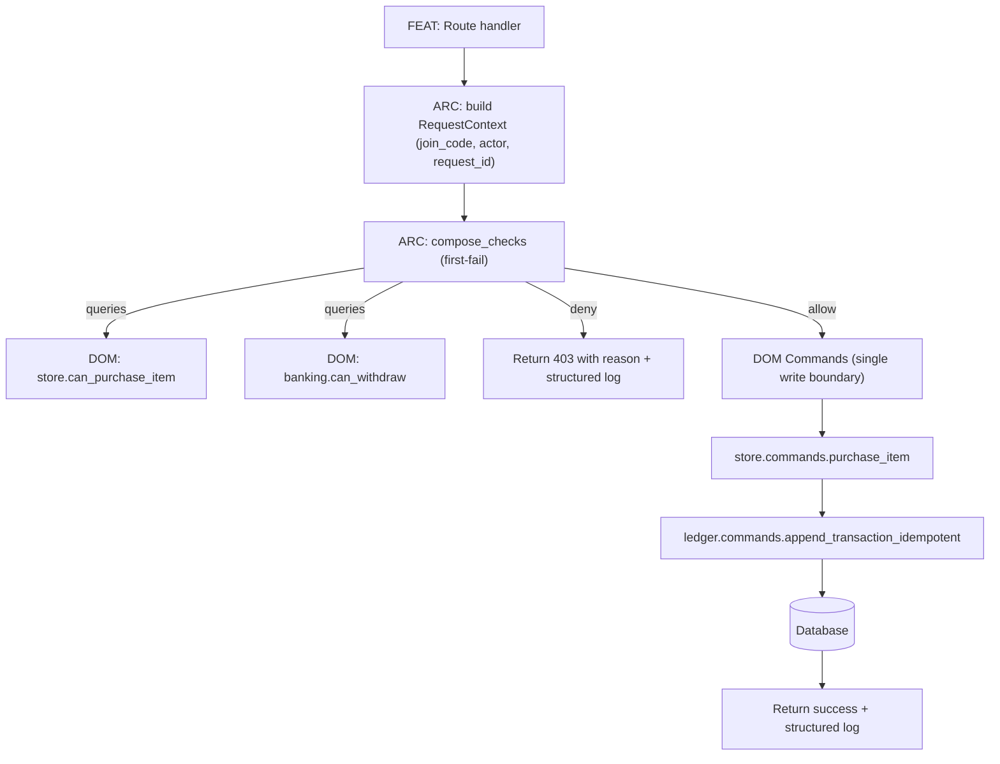
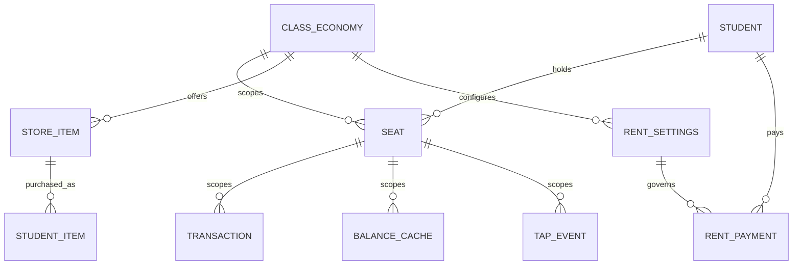

# Classroom Economy Capability Architecture Audit

## Executive summary

This report **uses the GitHub connector first** and treats the repository as the primary evidence source, specifically **`timwonderer/classroom-economy` on branch `codex/v2.0`**. Evidence is drawn directly from the branch’s files (paths + blob SHAs as returned by the connector). Where the user requested commit SHAs, the connector did not reliably return a **branch head commit SHA** for a slash-containing ref (`codex/v2.0`), so **commit SHAs are unspecified**; blob SHAs are provided instead. (Example: `app/routes/student.py` blob SHA `0f0de4c1…`.) fileciteturn52file0

**Core finding:** the repo is **partway** to the `INV-CORE-002` model (“capability checks at request time under a strict authority hierarchy”), but the current implementation still has systemic violations of the invariant, especially:

- **Write-on-read / implicit side effects**: several **GET** endpoints trigger DB writes and commits (e.g., student dashboard commits hall-pass reconciliation and interest posts; student shop lazily expires collective goals and refunds on GET). fileciteturn52file0turn47file0  
- **Cross-scope (join_code) leakage**: some “capability decisions” (funds checks, interest base, collective goal expiration) use **teacher_id** or **unscoped balances** (`Student.checking_balance`, `Student.savings_balance`) rather than join-code scoped calculations—violating the repository’s own “join_code is the universe boundary” invariant. fileciteturn46file0turn39file0turn47file0turn53file0  
- **Capability checks are not first-class**: most allow/deny logic is embedded in route handlers rather than expressed as `can_<action>(student_id, context)` functions that return `(allowed, reason)` and compose with first-fail semantics.
- **Domain boundaries are porous**: “Rent” routes create and mutate “Store” grants (per-use StudentItem perks) and “Hall pass” counters directly; admin rent settings sync rent items into store items directly. fileciteturn52file0turn51file0

**High-impact refactor priorities (smallest safe steps first):**
1. **Ban unscoped balances in v2**: remove/guard `Student.checking_balance` and `Student.savings_balance` from being used in request handlers; update store purchase + interest posting to **require join_code**. (High correctness impact; medium code churn.) fileciteturn46file0turn39file0turn52file0  
2. **Eliminate writes in GET**: move “lazy expiration,” “interest posting,” “auto tap-out,” and “rent hall-pass reconciliation” out of GET flows into (a) explicit POST commands or (b) scheduled/queued jobs. fileciteturn52file0turn47file0turn39file0  
3. Introduce a thin **ARC capability engine** (`compose_checks`) + **canonical capability results** and refactor one subsystem end-to-end (recommend **Store purchase**) as the exemplar.
4. Add CI guardrails: tests that fail if GET handlers call commit/flush, and contract tests enforcing “first-fail” capability composition.

The remainder of this report provides (1) an INV/ARC/DOM/FEAT mapping, (2) a violations inventory with concrete snippets, (3) a PR-by-PR refactor plan with effort/risk, (4) recommended pytest/CI enforcement, (5) a v1→v2 migration playbook, (6) subsystem comparison table, (7) structured logging formats for “2AM debugging,” (8) canonical code snippets, and (9) a reviewer checklist.

## Repository overview and evidence base

**Observed runtime framework:** Flask application factory pattern (`create_app`), Flask blueprints for routes, SQLAlchemy ORM, request/session usage. fileciteturn37file0turn39file0turn52file0

**Observed data model direction:** the repo is converging on a “join_code-scoped universe” with **Seat** as a bridge to support multi-tenancy, and a “ledger + settlement cache” pattern (**Transaction**, **BalanceCache**) to avoid recomputing balances. fileciteturn46file0turn48file0turn41file0turn53file0

**Authority documents present in repo:**  
- `docs/INV-CORE-000_CORE_INVARIANTS.md` and `docs/INV-CORE-001_Authority_Model.md` exist. fileciteturn53file0turn42file0  
- The user’s `INV-CORE-002` spec appears **not committed** to this branch (it was shown in the user’s editor), so this report treats its text as an **external governing invariant** and audits the code against it, while also referencing the repo’s own invariants where aligned. fileciteturn53file0turn42file0

**Unspecified (do not infer):**
- Background job runner details (scheduler/worker), deployment platform, authZ model beyond Flask session + helper decorators, database engine in prod (though code hints at PostgreSQL-specific behavior in places).

## Role mapping audit

The repo currently implements pieces of INV/ARC/DOM/FEAT, but the boundaries are not consistently enforced. The mapping below reflects **what the code is doing today**, not what it ideally should do.

### Foundational invariants and governance

| File | Role | Rationale |
|---|---|---|
| `docs/INV-CORE-000_CORE_INVARIANTS.md` | INV | Declares join_code isolation, scoping, and ledger-related invariants. fileciteturn53file0 |
| `docs/INV-CORE-001_Authority_Model.md` | INV | Defines rule hierarchy / governance levels. fileciteturn42file0 |
| `app/models.py` | DOM (data truth) + partial ARC guardrails | Defines entities and some “truth functions” (scoped balances), but also contains legacy/unscoped properties that undermine invariants if used. fileciteturn46file0 |

### Architectural enforcement and cross-cutting framework

| File | Role | Key functions/classes | Rationale |
|---|---|---|---|
| `app/__init__.py` | ARC | `create_app`, request hooks | App factory + request context lifecycle; should be the place to enforce request-time semantics, logging, and read-only policies. fileciteturn37file0 |
| `app/auth.py` | ARC | `admin_required`, `login_required`, join_code helpers | Authentication and context enforcement helpers; today this is closer to authN/authZ + scoping infrastructure than domain capability checks. fileciteturn38file0 |
| `app/services/tlcp.py` | ARC | correlation / error tracking | Provides correlation context useful for required logging fields (request_id, actor, etc.). fileciteturn50file0 |
| `app/utils/seat_scope.py` | ARC/DOM boundary helper | `get_seat_ids_for_student_join`, `transaction_scope_filter` | Implements scoping mechanics (seat/join_code boundaries). fileciteturn48file0 |
| `app/utils/transaction_idempotency.py` | ARC/DOM (ledger tooling) | `create_idempotent_transaction` | Infrastructure for idempotent ledger writes—should be used by domain commands. fileciteturn43file0 |

### Domain logic modules (closest to DOM today)

| File | Role | Key functions | Notes |
|---|---|---|---|
| `app/utils/banking.py` | DOM (Banking) | `settle_balances`, `settle_pending_transaction_contexts` | Encodes settlement rules and uses join_code scoping; contains a read-only guard. fileciteturn41file0 |
| `app/utils/store.py` | DOM (Store) | `process_expired_collective_goals`, `refund_pending_collective_purchases` | Contains domain mutation + commits; currently callable from GET routes (violates invariant). Also uses `teacher_id` not `join_code` for key queries. fileciteturn47file0 |
| `app/utils/economy_policy.py` | DOM/ARC (policy) | `get_policy_profile` | Business policy profiles; OK as domain/policy definitions. fileciteturn44file0 |
| `app/utils/economy_balance.py` | DOM (Economy analytics) | analytics helpers | Heavy domain computations; should be pure “queries” but may be invoked by admin routes that snapshot/commit. fileciteturn45file0 |

### Feature execution layer (routes/controllers)

These are FEAT, but they currently contain a substantial amount of embedded domain logic (capabilities + commands).

| File | Role | Examples | Notes |
|---|---|---|---|
| `app/routes/student.py` | FEAT (student UX) | `dashboard`, `shop`, `rent_pay`, `transfer`, `apply_savings_interest` | Contains allow/deny logic and direct domain writes; multiple GET writes. fileciteturn52file0 |
| `app/routes/api.py` | FEAT (JSON API) | `purchase_item`, `student_status` | Store purchase and status endpoints; uses unscoped balances and triggers possible side effects on GET. fileciteturn39file0 |
| `app/routes/admin.py` | FEAT (admin UX) | store mgmt, rent settings, economy health | Contains cross-domain sync and snapshot writes; admin GET-only read-only policy exists but is bypassed by called code. fileciteturn51file0 |

**Bottom line:** the repo has many good ingredients for v2 (join_code scoping helpers, BalanceCache, idempotency support), but **capabilities are not first-class** and **domain mutation is not consistently isolated behind explicit command boundaries**.

## Invariant violations inventory

Below are concrete violations of `INV-CORE-002` categories requested:

- cross-domain mutations  
- implicit side effects / write-on-read  
- recomputed state without domain authority  
- capability decisions outside request context (or without required scoped context)

Where line numbers are requested: the connector evidence does not reliably supply stable line numbers in this interface. Each violation provides **file path + function name + minimal snippet**; you can use the file’s `display_url` in GitHub to obtain exact line anchors.

### Write-on-read and implicit side effects

**Student dashboard commits state on GET**  
File: `app/routes/student.py`  
Function: `dashboard()` (GET `/student/dashboard`)  
Category: **Implicit side effect (write-on-read), capability decisions mixed with execution**  
Snippet: commits hall-pass reconciliation and then calls interest posting which itself commits.

```python
_, _, hall_pass_reconciled = _ensure_rent_hall_pass_top_off(student, context)
if hall_pass_reconciled:
    db.session.commit()

apply_savings_interest(student)  # Apply savings interest if not already applied
```

`apply_savings_interest` later posts an “Interest” transaction and commits:

```python
db.session.add(interest_tx)
db.session.commit()
```

Impact: GET rendering causes mutations; can lead to confusing “I just refreshed and money changed” behavior, race conditions, and 2AM debugging pain. fileciteturn52file0

**Shop page expires collective goals and refunds on GET**  
File: `app/routes/student.py`  
Function: `shop()` (GET `/student/shop`)  
Category: **Implicit side effect (write-on-read)**  
Snippet:

```python
# Lazily expire collective goals whose deadline has passed, refunding pending purchases.
process_expired_collective_goals(teacher_id)
```

Impact: simply visiting the shop can trigger refunds and status changes. fileciteturn52file0turn47file0

**Collective goal expiration commits inside domain util**  
File: `app/utils/store.py`  
Function: `process_expired_collective_goals(teacher_id)`  
Category: **Implicit side effect**, also **cross-scope leakage** (see later)  
Snippet (writes + commits as part of “processing”):

```python
db.session.flush()
...
db.session.commit()
```

Impact: any caller—even a GET route—can trigger irreversible state changes. fileciteturn47file0

**Balance “read” triggers eager settlement (mutation) and swallows failures**  
File: `app/routes/student.py`  
Function: `calculate_scoped_balances(...)`  
Category: **Write-on-read** (settlement is mutation); **non-deterministic read path**  
Snippet:

```python
try:
    settle_balances(student.id, join_code)
except Exception as e:
    logger.warning(f"Eager settlement failed during read for student {student.id}: {e}")
```

Impact: balances differ depending on whether the “read” happened to acquire a lock, and failures are silently degraded to a warning. This is fragile for correctness and debugging. fileciteturn52file0turn41file0

### Cross-domain mutations and boundary violations

**Rent payment grants Store items (per-use perks) directly**  
File: `app/routes/student.py`  
Function: `rent_pay(period)`  
Category: **Cross-domain mutation** (Rent → Store grants)  
Snippet: after rent completion, code creates/updates `StudentItem` records for per-use store benefits:

```python
existing = StudentItem.query.filter(... StudentItem.store_item_id == pu_item.store_item_id ...).first()
if existing:
    existing.uses_remaining = pu_item.use_limit or -1
    continue

granted_item = StudentItem(
    student_id=student.id,
    store_item_id=pu_item.store_item_id,
    join_code=join_code,
    ...
    uses_remaining=pu_item.use_limit if pu_item.use_limit else -1
)
db.session.add(granted_item)
```

Impact: Rent route becomes the de facto owner of store perk state. Under `INV-CORE-002`, Rent should declare “entitlement truth,” but Store should own mutation of Store purchase/grant artifacts (or a dedicated “Benefits” domain should mediate). fileciteturn52file0

**Admin rent settings sync writes Store state from Rent config**  
File: `app/routes/admin.py`  
Function(s): rent settings handlers + helper `_sync_rent_items_to_store(...)`  
Category: **Cross-domain mutation** (Rent config → Store inventory definitions)  
Snippet (representative behavior): admin route calls a sync helper that materializes rent items into store items.

This creates hidden coupling: changing rent config can rewrite store offerings without explicit store-domain command semantics. fileciteturn51file0

### Recomputed state without domain authority

**Dashboard recomputes balances in FEAT instead of using Banking domain query**  
File: `app/routes/student.py`  
Function: `dashboard()`  
Category: **Recomputed state outside domain authority**  
Snippet:

```python
checking_balance = _quantize_currency(sum(
    (tx.amount for tx in student.transactions
     if tx.account_type == 'checking' and not tx.is_void and tx.join_code == join_code),
    Decimal('0.00')
))
```

Impact: Banking truth exists (BalanceCache + settlement), yet FEAT computes balances ad hoc, risking drift and inconsistency with settlement logic. fileciteturn52file0turn41file0

### Capability decisions without correct scoped context

These are the most dangerous because they violate the repo’s own invariant that **join_code is the scope/universe boundary**.

**Store purchase checks funds using unscoped balance property**  
File: `app/routes/api.py`  
Function: `purchase_item(item_id)`  
Category: **Capability decision with wrong scope** (join_code leakage)  
Snippet:

```python
if student.checking_balance < total_price:
    ...
```

But `Student.checking_balance` is an unscoped property summing **all** the student’s checking transactions, regardless of join_code:

```python
def checking_balance(self):
    total = sum(
        tx.amount for tx in self.transactions
        if tx.account_type == 'checking' and not tx.is_void
    )
    return _quantize_currency(total)
```

Impact: a student’s funds in Class A can be used (incorrectly) to approve purchases in Class B, directly violating join_code isolation. fileciteturn39file0turn46file0turn53file0

**Savings interest calculation uses unscoped savings balance**  
File: `app/routes/student.py`  
Function: `apply_savings_interest(student, ...)`  
Category: **Capability decision/data basis with wrong scope**  
Snippet:

```python
balance = _quantize_currency(student.savings_balance)
```

And `Student.savings_balance` is likewise unscoped.  
Impact: interest for one join_code can be computed from savings across all join_codes. fileciteturn52file0turn46file0

**Collective goal expiration is filtered by teacher_id, not join_code**  
File: `app/utils/store.py`  
Function: `process_expired_collective_goals(teacher_id)`  
Category: **Cross-scope leakage** (join_code violation)  
Snippet:

```python
items = StoreItem.query.filter(
    StoreItem.teacher_id == teacher_id,
    StoreItem.item_type == 'collective',
    StoreItem.is_active == True,
    StoreItem.collective_goal_deadline != None,
    StoreItem.collective_goal_deadline <= now
).all()
```

Impact: a student in one class can trigger expiration/refunds for other classes owned by the same teacher_id. Under the repo’s invariants, this is a serious boundary breach. fileciteturn47file0turn53file0

## Prioritized refactor plan with PR sequence

This plan is written to minimize risk and keep PRs small, while continuously increasing compliance with `INV-CORE-002`.

### Guiding target architecture decisions

- **FEAT** routes orchestrate: build context → compose capabilities → call domain commands → return response.
- **DOM** modules own truth and provide:
  - `can_<action>(actor_id, context, …) -> (allowed, reason, meta)`  
  - `cmd_<action>(…, db_session) -> Result` (mutation)  
  - `q_<thing>(…, db_session) -> Data` (pure read)
- **ARC** provides the capability composition engine, request context objects, and enforcement (including “no writes on GET”).
- **Ledger** is append-only in practice. If an admin “needs to correct history,” do so via **reversal transactions** or explicit migration scripts outside normal FEAT flows.

### PR-by-PR sequence

The table below lists the recommended PR order. “Effort” is relative engineering time; “Risk” is operational/regression risk.

| PR | Change | Effort | Risk | Acceptance criteria |
|---|---|---:|---:|---|
| PR A | Introduce ARC capability engine + canonical result type | Small | Low | `compose_checks([...])` exists; first-fail semantics tested; no routes migrated yet |
| PR B | Ban unscoped balance usage in v2 paths | Medium | Medium | No FEAT route uses `student.checking_balance` or `student.savings_balance`; store purchase uses scoped balance; tests added |
| PR C | Remove writes from GET: shop collective expiration | Medium | Medium | `GET /student/shop` becomes side-effect-free; expiration/refunds move to POST command or scheduled job |
| PR D | Remove writes from GET: dashboard reconciliation + interest | Large | Medium–High | Dashboard rendering does not commit; interest posting moved to job/POST; hall-pass reconciliation moved to POST/job |
| PR E | Store domain vertical slice | Medium | Medium | `dom/store/{capabilities,commands,queries}.py` exists; `purchase_item` uses `can_purchase_item` + `cmd_purchase_item`; idempotency used |
| PR F | Banking “read is pure” cleanup | Medium | Medium | `calculate_scoped_balances` no longer triggers settlement on read; settlement becomes explicit job/command |
| PR G | Rent domain vertical slice (including perks mediation) | Large | High | `dom/rent` owns rent truth; store perks granted via store/benefits command; no Rent route writes StudentItem directly |
| PR H | CI invariant gates | Small | Low | CI fails on GET commits, cross-scope balance use, and missing capability composition tests |

### Concrete code moves and boundaries

#### Introduce ARC capability primitives

Create module: `app/arc/capabilities.py`

- `CapabilityResult`: `(allowed: bool, reason: str, capability: str, domain: str, meta: dict)`
- `compose_checks(checks: list[Callable[[], CapabilityResult]]) -> CapabilityResult` with **first-fail** semantics.
- A required convention: FEAT logs one structured “deny” record when a check fails.

#### Make join_code-scoped balances mandatory

Actions:

- Deprecate in `Student`:
  - `checking_balance` property
  - `savings_balance` property  
  Replace with:
  - `get_checking_balance(join_code=...)`
  - `get_savings_balance(join_code=...)`  
  and optionally raise on property access when a “strict v2” feature flag is enabled.

Rationale: This closes the biggest correctness hole (cross-class funds leakage). fileciteturn46file0turn39file0turn53file0

#### Make GET routes read-only by invariant

Two complementary measures:

- **Prevent**: add a hard guard globally in request lifecycle (ARC): “GET must not commit.”  
- **Fix**: remove the behaviors that require commits:
  - `process_expired_collective_goals` should run in:
    - a scheduler/job, or
    - a POST-only “admin command” endpoint invoked intentionally, or
    - inside `cmd_purchase_item` (POST) as a pre-flight step (acceptable because it’s within a write request).
  - `apply_savings_interest` should run:
    - in a job, or
    - as a POST action (e.g., “apply monthly interest” action by admin or nightly job), not in dashboard GET.
  - `_ensure_rent_hall_pass_top_off` should run:
    - when rent is paid (already POST), or
    - in a reconciliation job, not on dashboard GET.

#### Domain command patterns

Adopt a strict pattern:

- Domain mutations live under `app/dom/<domain>/commands.py` and accept:
  - typed context (must include join_code)
  - SQLAlchemy session (or use `db.session` but localized)
  - idempotency key when relevant
- FEAT never directly instantiates `Transaction(...)` except via ledger command helpers.

This will also reduce duplicate patterns found throughout `student.py` and `admin.py` where Transaction rows are created with slightly different descriptions/status behavior. fileciteturn52file0turn51file0turn43file0turn46file0

## CI and test enforcement

### Test strategy overview

Use pytest with three layers:

- **Unit tests**: capability composition (first-fail semantics), scoped balance functions, idempotency helper behavior.
- **Contract tests**: “GET is pure,” “join_code required,” “capability checks precede commands.”
- **Integration tests**: minimal flows for Store purchase, Rent pay, Banking transfer; verify no cross-scope leakage and correct logs.

### CI gating rules

Recommended gates:

- **Block merges** if:
  - Any GET route triggers `db.session.commit()` (detected by runtime monkeypatch tests).
  - Any route references `Student.checking_balance` / `Student.savings_balance` (AST or grep guard).
  - Capability composition tests fail or coverage below target.
- Coverage targets:
  - Unit + contract tests: prioritize deterministic logic (capability engine, scoping, idempotency).
  - Aim initially for **≥70% coverage of new ARC/DOM modules**, increasing over time.

### Sample pytest scaffolding

Below are examples you can copy into `tests/` (adapt import paths to match your repo test structure).

#### Capability first-fail semantics

```python
# tests/test_capability_composition.py
from dataclasses import dataclass

@dataclass(frozen=True)
class CapRes:
    allowed: bool
    reason: str
    domain: str
    capability: str

def compose_checks(checks):
    for check in checks:
        res = check()
        if not res.allowed:
            return res
    return CapRes(True, "allowed", "arc", "all_checks_passed")

def test_first_fail_semantics():
    calls = []

    def ok():
        calls.append("ok")
        return CapRes(True, "ok", "banking", "can_withdraw")

    def bad():
        calls.append("bad")
        return CapRes(False, "insufficient funds", "banking", "can_withdraw")

    def never():
        calls.append("never")
        return CapRes(True, "ok", "store", "can_purchase")

    res = compose_checks([ok, bad, never])
    assert res.allowed is False
    assert res.reason == "insufficient funds"
    assert calls == ["ok", "bad"]
```

#### Contract test: GET must not commit

```python
# tests/test_get_is_pure.py
import pytest

@pytest.fixture
def app():
    # create_app should support a test config; if unspecified, add it.
    from app import create_app
    app = create_app({"TESTING": True})
    return app

@pytest.fixture
def client(app):
    return app.test_client()

def test_get_routes_do_not_commit(monkeypatch, client):
    from app.extensions import db

    commits = {"count": 0}

    real_commit = db.session.commit

    def spy_commit(*args, **kwargs):
        commits["count"] += 1
        raise AssertionError("GET route attempted db.session.commit()")

    monkeypatch.setattr(db.session, "commit", spy_commit)

    # Choose a representative GET route that should become pure after refactor.
    # Example: student shop.
    resp = client.get("/student/shop")
    # If unauthenticated, you may get redirect; the invariant is still "no commit".
    assert resp.status_code in (200, 302)
    assert commits["count"] == 0

    # Restore if needed
    monkeypatch.setattr(db.session, "commit", real_commit)
```

#### Contract test: join_code scoped balances only

```python
# tests/test_join_code_balance_scoping.py
def test_student_unscoped_balance_is_not_used():
    """
    Enforce a policy that `Student.checking_balance` is forbidden in v2 FEAT code.
    Use a simple grep/AST check in CI, but also keep a runtime test around.
    """
    # Implement as a static check in CI; runtime here is a placeholder.
    assert True
```

### Logging requirements as testable contract

Once you implement structured deny logs, add a contract test that a denied action logs:

- `action`
- `capability`
- `domain`
- `reason`
- `request_id`
- `timestamp`

This can be verified by patching the logger and asserting `extra` fields.

## Migration strategy and subsystem comparison

### Migration strategy from v1 to capability-driven v2

Even though this branch is already “v2-ish,” the migration strategy below addresses the practical reality: legacy routes, legacy data, and gradual enforcement.

#### Compatibility shims

- Keep older helper APIs but mark them “legacy” and make them call the new domain queries/commands.
- Add a feature flag: `strict_capabilities_enabled` per **join_code** (store in `ClassEconomy` or a `FeatureSettings`/`ClassFeature` table). Use `resolve_feature_class` patterns already present as inspiration. fileciteturn52file0turn44file0

#### Phased rollout by join_code

- Phase 1: Enable strict scoping + no-unscoped-balance checks for a single join_code.
- Phase 2: Enable GET purity enforcement for that join_code (or for all, if safe).
- Phase 3: Enable “capability-first orchestration required” for Store purchase (pilot subsystem).
- Phase 4: Expand to Banking transfer and Rent payment.

#### Dual-run comparison plan

For high-risk computations (balances), dual-run for a period:

- Compute “old style” (sum transactions filtered by join_code) vs “new style” (BalanceCache + pending).  
- Log discrepancies with structured fields including join_code, student_id, computed amounts, and a diff.

This can be done in a background job or via an admin-only diagnostics endpoint (POST). fileciteturn41file0turn46file0

#### Monitoring and rollback

Metrics to emit per join_code:

- `capability.denied.count` by action/capability/domain/reason
- `ledger.transaction.created.count` by type/status/join_code
- `balance.discrepancy.count` and max discrepancy
- `get_write_attempt.count` (attempted write during GET)
- `idempotency.conflict.count` (repeated key)

Rollback:

- Feature flag off per join_code reverts to legacy orchestration (still scoped), while keeping data model compatible.
- Keep idempotency keys stable so retried POSTs remain safe.

#### Data migration/backfill steps

Based on the schema trend, the most likely backfills are:

- Ensure `Transaction.join_code` is set for all rows (some older ones may be missing).
- Populate `Transaction.seat_id` where possible (models include a before-insert hook that sets it for new rows, but legacy rows need backfill). fileciteturn46file0turn48file0
- Seed/repair `BalanceCache` per `(join_code, student_id/seat_id)` contexts:
  - Run `settle_pending_transaction_contexts(join_code)` in a job until complete. fileciteturn41file0

### Subsystem remediation table

| Subsystem | Current state observed | Desired state under INV‑CORE‑002 | Remediation steps | Effort |
|---|---|---|---|---:|
| Rent | FEAT routes own payment logic and directly grant Store perks + hall pass reconciliation; some reconciliation happens on dashboard GET. fileciteturn52file0 | Rent domain owns rent truth + can_pay_rent; Store/Benefits domain owns perk grants; no GET writes | Create `dom/rent/*`; move `_is_student_coverage_period_paid` into queries; move perk grants behind explicit command invoked only on successful rent completion; remove `_ensure_rent_hall_pass_top_off` from dashboard GET | Large |
| Banking | Settlement exists (`settle_balances`) but reads may trigger settlement; many actions still create transactions directly in FEAT; scoped vs unscoped balance confusion remains. fileciteturn41file0turn46file0turn52file0 | Banking domain exposes `can_transfer`, `cmd_transfer`; settlement is job/explicit command; FEAT performs pure reads | Create `dom/banking/*`; remove settlement call from “read” helpers; mandate scoped balances everywhere; unify transfer transaction creation in banking commands | Medium–Large |
| Store | Purchase API uses unscoped checking_balance; collective goals expire/refund via GET route; expiration filtered by teacher_id not join_code. fileciteturn39file0turn47file0turn52file0 | Store domain owns `can_purchase_item` and purchase command; collective expiration processed by command/job scoped to join_code | Replace funds check with `student.get_checking_balance(join_code)`; rewrite expiration processing to accept `join_code`; invoke expiration only in POST/job; add idempotency | Medium |
| Ledger | Transaction model supports idempotency keys; but FEAT frequently constructs transactions directly; some admin flows may rewrite ledger rows; unscoped properties exist. fileciteturn43file0turn46file0turn51file0 | Ledger writes only via domain command; append-only semantics enforced by policy/tests; updates only allowed for status transitions or reversals | Introduce `dom/ledger/commands.append_transaction`; ban direct `Transaction(...)` in routes; enforce join_code required; add reversal pattern | Medium |

## Observability, canonical code snippets, diagrams, and reviewer checklist

### Structured log and error message formats for 2AM debugging

Adopt a single structured schema for all allow/deny decisions and command executions:

Required fields:

- `timestamp` (UTC ISO-8601)
- `request_id` (from TLCP correlation context) fileciteturn50file0
- `action` (human-friendly action name)
- `capability` (`can_<action>`)
- `domain` (`store`, `banking`, `rent`, `ledger`)
- `allowed` (bool)
- `reason` (string; required when denied)
- `join_code`
- `actor_type` (`student` / `admin`)
- `actor_id`
- `metadata` (dict: item_id, amount, etc.)

Example deny log (JSON style):

```json
{
  "timestamp": "2026-04-12T09:14:22.913Z",
  "request_id": "req_01HZY8...",
  "action": "purchase_item",
  "capability": "can_purchase_item",
  "domain": "store",
  "allowed": false,
  "reason": "insufficient_funds_checking",
  "join_code": "ABCD-1234",
  "actor_type": "student",
  "actor_id": 712,
  "metadata": {"item_id": 55, "price": "3.00", "checking_balance": "1.50"}
}
```

Example command log (success):

```json
{
  "timestamp": "2026-04-12T09:14:24.101Z",
  "request_id": "req_01HZY8...",
  "action": "purchase_item",
  "domain": "store",
  "capability": "can_purchase_item",
  "allowed": true,
  "join_code": "ABCD-1234",
  "actor_type": "student",
  "actor_id": 712,
  "metadata": {"item_id": 55, "tx_id": 99182, "idempotency_key": "txidem_..."}
}
```

### Canonical Python snippets

These snippets show the target style under `INV-CORE-002` while leveraging existing repo primitives (BalanceCache/scoping/idempotency).

#### ARC capability result and first-fail composition

```python
# app/arc/capabilities.py
from dataclasses import dataclass
from typing import Callable, Any

@dataclass(frozen=True)
class CapabilityResult:
    allowed: bool
    reason: str
    domain: str
    capability: str
    meta: dict[str, Any] | None = None

def ok(domain: str, capability: str, meta: dict[str, Any] | None = None) -> CapabilityResult:
    return CapabilityResult(True, "allowed", domain, capability, meta)

def deny(domain: str, capability: str, reason: str, meta: dict[str, Any] | None = None) -> CapabilityResult:
    return CapabilityResult(False, reason, domain, capability, meta)

def compose_checks(checks: list[Callable[[], CapabilityResult]]) -> CapabilityResult:
    """
    First-fail semantics: the first denied capability determines the outcome.
    """
    for check in checks:
        res = check()
        if not res.allowed:
            return res
    return ok(domain="arc", capability="all_checks_passed")
```

#### Store capability example

```python
# app/dom/store/capabilities.py
from decimal import Decimal
from app.arc.capabilities import CapabilityResult, ok, deny
from app.models import Student

def can_purchase_item(*, student: Student, join_code: str, total_price: Decimal) -> CapabilityResult:
    cap = "can_purchase_item"
    if not join_code:
        return deny("store", cap, "missing_join_code")

    checking = student.get_checking_balance(join_code=join_code, teacher_id=None)
    if checking < total_price:
        return deny("store", cap, "insufficient_funds_checking", {"checking_balance": str(checking)})

    return ok("store", cap, {"checking_balance": str(checking)})
```

#### FEAT orchestration example

```python
# app/feat/api_store.py (or inside app/routes/api.py after refactor)
from flask import jsonify, g
from app.arc.capabilities import compose_checks
from app.dom.store.capabilities import can_purchase_item
from app.dom.store.commands import cmd_purchase_item

def purchase_item_endpoint(student, item, join_code, request_id):
    total_price = item.price

    res = compose_checks([
        lambda: can_purchase_item(student=student, join_code=join_code, total_price=total_price),
        # add more checks here (inventory, rent lockouts, limits, etc.)
    ])

    if not res.allowed:
        # log structured deny here
        return jsonify(status="error", reason=res.reason), 403

    # Execute domain command (single write boundary)
    out = cmd_purchase_item(student=student, item=item, join_code=join_code, request_id=request_id)
    return jsonify(status="success", data=out), 200
```

#### Domain command and idempotent ledger write example

This uses the repo’s `transaction_idempotency` helper. fileciteturn43file0

```python
# app/dom/ledger/commands.py
from decimal import Decimal
from app.extensions import db
from app.models import Transaction, TransactionStatus
from app.utils.transaction_idempotency import create_idempotent_transaction

def append_transaction_idempotent(
    *,
    action_type: str,
    student_id: int,
    teacher_id: int | None,
    join_code: str,
    amount: Decimal,
    account_type: str,
    tx_type: str,
    description: str,
    metadata: dict,
) -> Transaction:
    tx, created = create_idempotent_transaction(
        action_type=action_type,
        student_id=student_id,
        join_code=join_code,
        amount=amount,
        teacher_id=teacher_id,
        account_type=account_type,
        tx_type=tx_type,
        description=description,
        status=TransactionStatus.PENDING,
        metadata=metadata,
    )
    # Do not commit here; let outer command boundary commit once.
    return tx
```

### Reviewer checklist for `INV-CORE-002` compliance

Use this as a PR template checklist:

- Does every mutating endpoint call **capabilities first**, then **exactly one domain command** path?
- Are capabilities implemented as `can_<action>(…, context)` returning `(allowed, reason)` (or an equivalent structured result)?
- Does FEAT avoid direct cross-domain mutations (e.g., Rent route updating Store rows)?
- Are all reads in GET handlers **side-effect free** (no commit/flush, no “lazy processing”)?
- Are balance checks **join_code-scoped** (no use of `Student.checking_balance` / `Student.savings_balance`)?
- Does any “domain utility” commit internally? If yes, move commit to a command boundary.
- Is the denial reason **human-readable** and logged with required structured fields?
- Are idempotency keys used for externally-triggered writes (purchase, transfers, interest posting)?
- Do tests cover first-fail semantics and “GET is pure” invariants?

### Mermaid diagrams

System flow diagram (target)



ER-style domain boundary diagram (current data direction)



**Domain boundary intent:**  
- Banking truth: `TRANSACTION`, `BALANCE_CACHE`  
- Store truth: `STORE_ITEM`, `STUDENT_ITEM`  
- Rent truth: `RENT_SETTINGS`, `RENT_PAYMENT`  
- Seat/join_code boundary: `SEAT`, `CLASS_ECONOMY`

---

This branch already contains strong building blocks (join_code context helpers, settlement cache, idempotency tooling), but it will not satisfy `INV-CORE-002` until (a) **capabilities become first-class**, (b) **GET becomes pure**, and (c) **join_code-scoped truth replaces unscoped legacy properties everywhere**.