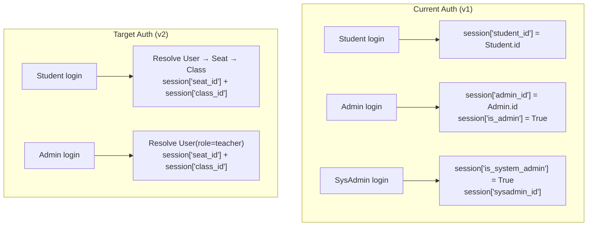
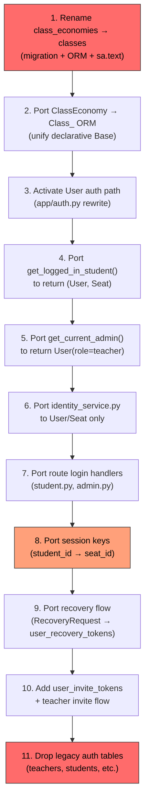

# Wave 3 Identity Domain — Risk & Dependency Analysis

## Scope

This document analyzes the three sub-operations of Wave 3:

1. **Activating `User`/`Seat`/`Class_` as primary auth**
2. **Renaming `class_economies` → `classes`**
3. **Removing legacy auth tables**

---

## 1. Renaming `class_economies` → `classes`

### 1.1 FK Cascade Map

The `class_economies.class_id` column is the FK target for **30+ columns across 25+ ORM models**. Every one of these must have its FK constraint dropped and re-created pointing to `classes.class_id`.

| Model (tablename) | Column | FK Declaration | ondelete |
|---|---|---|---|
| `AnalyticsAlert` (analytics_alerts) | class_id | `class_economies.class_id` | CASCADE |
| `Seat` (seats) | class_id | `class_economies.class_id` | CASCADE |
| `TeacherBlock` (teacher_blocks) | class_id | `class_economies.class_id` | CASCADE |
| `Student` (students) | class_id | `class_economies.class_id` | CASCADE |
| `StudentTeacher` (student_teachers) | class_id | `class_economies.class_id` | CASCADE |
| `EconomySnapshot` (economy_snapshot) | class_id | `class_economies.class_id` | CASCADE |
| `ClassMembership` (class_memberships) | class_id | `class_economies.class_id` | CASCADE |
| `Transaction` (transaction) | class_id | `class_economies.class_id` | CASCADE |
| `BalanceCache` (balance_cache) | class_id | `class_economies.class_id` | CASCADE |
| `StudentBlock` (student_blocks) | class_id | `class_economies.class_id` | CASCADE |
| `TapEvent` (tap_events) | class_id | `class_economies.class_id` | CASCADE |
| `HallPassLog` (hall_pass_logs) | class_id | `class_economies.class_id` | CASCADE |
| `PayrollSettings` | class_id | `class_economies.class_id` | CASCADE |
| `RentSettings` | class_id | `class_economies.class_id` | CASCADE |
| `RentItem` | class_id | `class_economies.class_id` | CASCADE |
| `BankingSettings` | class_id | `class_economies.class_id` | CASCADE |
| `FeatureSettings` | class_id | `class_economies.class_id` | CASCADE |
| `HallPassSettings` | class_id | `class_economies.class_id` | CASCADE |
| `StoreItem` (store_items) | class_id | `class_economies.class_id` | CASCADE |
| `StudentItem` | class_id | `class_economies.class_id` | CASCADE |
| `InsurancePolicy` | class_id | `class_economies.class_id` | CASCADE |
| `StudentInsurance` | class_id | `class_economies.class_id` | CASCADE/SET NULL |
| `RentPayment` | class_id | `class_economies.class_id` | CASCADE |
| `InsuranceClaim` | class_id | `class_economies.class_id` | CASCADE |
| `PayrollReward` | class_id | `class_economies.class_id` | CASCADE |
| `PayrollFine` | class_id | `class_economies.class_id` | CASCADE |
| `ClassFeature` | class_id | `class_economies.class_id` | CASCADE |
| `ErrorEvent` | class_id | `class_economies.class_id` | SET NULL |
| `ActorRequestTrace` | class_id | `class_economies.class_id` | SET NULL |
| `UserReport` | class_id | `class_economies.class_id` | CASCADE |
| `Announcement` | class_id | `class_economies.class_id` | CASCADE |
| `PayrollCache` | class_id | `class_economies.class_id` | CASCADE |

> [!CAUTION]
> **Minimum 30 FK constraints** must be dropped and re-created in a single migration. If any are missed, `flask db upgrade` will fail with a "table does not exist" FK error, and the migration cannot be partially applied.

### 1.2 Raw SQL `sa.text()` References

**12+ raw SQL strings** in `app/models.py` event listeners reference `class_economies` by name:

| Location | Pattern |
|---|---|
| `_sync_seat_scope` (L263) | `SELECT class_id FROM class_economies WHERE join_code = :join_code` |
| `_sync_class_membership_class_id` (L756) | `SELECT class_id FROM class_economies WHERE join_code = :join_code LIMIT 1` |
| `_enforce_transaction_integrity` (L946) | `SELECT class_id FROM class_economies WHERE join_code = :jc LIMIT 1` |
| `_enforce_transaction_integrity` (L964) | `SELECT join_code FROM class_economies WHERE class_id = :class_id LIMIT 1` |
| `_sync_student_block_seat` (L1188) | `SELECT class_id FROM class_economies WHERE join_code = :join_code LIMIT 1` |
| TapEvent sync (L1212) | `SELECT class_id FROM class_economies WHERE join_code = :join_code LIMIT 1` |
| HallPassLog sync (L1448) | `SELECT class_id FROM class_economies WHERE join_code = :join_code LIMIT 1` |
| StoreItem sync (L1635) | Same pattern |
| RentPayment sync (L1664) | Same pattern |
| InsuranceClaim sync (L1694) | Same pattern |
| Admin model `_sync_admin_…` (L2042, 2049, 2064, 2075, 2091, 2107, 2172) | Multiple INSERT INTO / SELECT / JOIN references |

> [!WARNING]
> These are **string-literal** SQL — they will silently fail or raise at runtime if the table is renamed without updating the strings. They are invisible to ORM FK introspection.

### 1.3 ORM `__tablename__` and Relationship Strings

- `ClassEconomy.__tablename__ = 'class_economies'` (L619) — must change to `'classes'`
- `backref=db.backref('class_economies', ...)` on `Admin.teacher` relationship (L645) — the backref name `class_economies` should be renamed for clarity
- `ClassEconomy` class name itself is used in 10+ `relationship()` backrefs across models

### 1.4 Risk Assessment

| Risk | Severity | Detail |
|---|---|---|
| Missed FK in migration | **CRITICAL** | Single miss = migration rollback required |
| Missed `sa.text()` string | **HIGH** | Silent runtime failure on next seat/tx/attendance write |
| Inconsistent ORM backref | **MEDIUM** | Will cause `AttributeError` if code accesses old backref name |
| Index name collisions | **MEDIUM** | Postgres may auto-name indexes with old table name; rename migration should also handle index renames |
| Test fixtures | **LOW** | No tests reference `class_economies` table name directly (confirmed via grep) |

---

## 2. Activating `User`/`Seat`/`Class_` as Primary Auth

### 2.1 Current Auth Architecture



### 2.2 Session Key Dependencies

All route decorators and helper functions currently depend on **v1 session keys**:

| Session Key | Set By | Read By | Count |
|---|---|---|---|
| `student_id` | `routes/student.py` login | `auth.login_required`, `auth.get_logged_in_student()`, `routes/student.py`, `routes/api.py`, `routes/docs.py`, `routes/main.py` | **50+ reads** |
| `admin_id` | `routes/admin.py` login | `auth.admin_required`, `auth.get_current_admin()`, `routes/admin.py` | **20+ reads** |
| `is_admin` | `routes/admin.py` login | `auth.admin_required`, `auth.is_viewing_as_student()`, `routes/` broadly | **15+ reads** |
| `is_system_admin` | `routes/system_admin.py` | `auth.system_admin_required` | **10+ reads** |
| `current_seat_id` | `auth.sync_student_session_context()` | Student routes (newer code) | ~5 reads |
| `current_class_id` | `auth.sync_student_session_context()` | Student routes (newer code) | ~5 reads |

> [!IMPORTANT]
> The `student_id` key is the **primary gating key** for the `login_required` decorator (L120 of `auth.py`). Changing this to `seat_id` or removing it breaks every student-facing route simultaneously.

### 2.3 Model Import Dependencies

Removing `Student` and `Admin` from `app/models.py` will break:

**Admin (teachers table) — direct imports:**
- `app/routes/main.py:16` — `from app.models import Admin`
- `app/routes/api.py:1646` — lazy import
- `app/routes/student.py:319,3849,3916,3928` — 4 lazy imports
- `app/__init__.py:667,851` — app factory
- `app/auth.py:372` — `get_current_admin()`

**Student (students table) — direct imports:**
- `app/auth.py:356,414` — `get_logged_in_student()`, `get_admin_student_query()`
- `app/routes/student.py:501,901,1315,4191,4259` — 5+ lazy imports
- `app/routes/admin.py:4215,5619` — via `StudentItem`, `RentItem`
- `app/routes/api.py:1988,2495,2820,2886` — `StudentBlock`
- `app/services/identity_service.py:4,30`
- `app/services/attendance_service.py:5`
- `app/services/obligations_service.py:4`
- `app/services/store_service.py:6`
- `app/services/tlcp.py:14`
- `app/payroll.py:4,352`
- `app/attendance.py:490`
- `app/scheduled_tasks.py:18`
- `app/utils/money_guard.py:6`
- `app/utils/insurance_eligibility.py:11`
- `app/utils/store.py:8`
- `app/cli_commands.py:15`
- `app/feats/transaction_void_feat.py:8`

> [!CAUTION]
> **`Student` is imported in 20+ files.** `Admin` in 10+ files. These cannot be removed until every consumer is ported to `User`/`Seat`.

### 2.4 `get_logged_in_student()` → `(User, Seat)` Transition

Current signature returns `Student | None`. The plan changes this to return a `(User, Seat)` tuple.

**Breaking points:**
- Every caller that does `student = get_logged_in_student()` and then accesses `student.id`, `student.full_name`, `student.checking_balance`, etc.
- Template contexts that pass `student` to Jinja2 templates
- API JSON serializers that access Student properties
- The `sync_student_session_context()` function which takes a `Student` parameter

### 2.5 `get_current_admin()` → `User(role=teacher)` Transition

Current returns `Admin | None` from `db.session.get(Admin, admin_id)`.

**Breaking points:**
- `admin.id` is used as FK value for `teacher_id` across 29 columns — these must resolve to the same integer after migration
- `admin.get_display_name()` — custom method on `Admin`
- `admin.teacher_public_id` — used for display
- `admin.totp_secret` — auth credential
- `ensure_admin_join_code(admin.id)` — queries `ClassEconomy.teacher_id`

### 2.6 Dual `Base` Registration Issue

`models_canonical.py` uses `declarative_base()` (standalone SQLAlchemy Base), while `models.py` uses `db.Model` (Flask-SQLAlchemy). This means:

- `models_canonical.Class_` targets table `classes` — a different Base from the Flask app
- `models.ClassEconomy` targets table `class_economies` — the Flask app's Base
- Both cannot coexist pointing at the same table without one being a mirror/alias
- The canonical models will need to be moved to `db.Model` before activation

---

## 3. Removing Legacy Auth Tables

### 3.1 Tables Targeted for Removal

| Table Name | ORM Class | FK Dependents |
|---|---|---|
| `teachers` | `Admin` | **29 FK columns** across entire codebase (see §2.3) |
| `students` | `Student` | **17+ FK columns** across entire codebase |
| `student_teachers` | `StudentTeacher` | None (junction table) |
| `student_blocks` | `StudentBlock` | None |
| `teacher_blocks` | `TeacherBlock` | None |
| `class_memberships` | `ClassMembership` | None |
| `recovery_requests` | `RecoveryRequest` | None |
| `student_recovery_codes` | `StudentRecoveryCode` | None |
| `teacher_onboarding` | `TeacherOnboarding` | None |
| `teacher_credentials` | `AdminCredential` | None |
| `admin_credentials` | (if exists) | None |

### 3.2 FK Dependency Depth for `teachers` Table

The `teachers` table is the FK parent for columns in:

```
class_economies.teacher_id         → teachers.id (CASCADE)
class_economies.created_by_admin_id → teachers.id (SET NULL)
class_memberships.admin_id         → teachers.id (CASCADE)
transaction.teacher_id             → teachers.id (nullable)
tap_events.deleted_by              → teachers.id (SET NULL)
teacher_blocks.teacher_id          → teachers.id (CASCADE)
student_teachers.teacher_id        → teachers.id (CASCADE)
hall_pass_logs.teacher_id          → teachers.id
payroll_settings.teacher_id        → teachers.id (CASCADE)
rent_settings.teacher_id           → teachers.id (CASCADE)
rent_items.teacher_id              → teachers.id
insurance_policies.teacher_id      → teachers.id
banking_settings.teacher_id        → teachers.id
feature_settings.teacher_id        → teachers.id
hall_pass_settings.teacher_id      → teachers.id
store_items.teacher_id             → teachers.id
student_items.created_by_teacher_id → teachers.id
recovery_requests.teacher_id       → teachers.id
teacher_credentials.teacher_id     → teachers.id (CASCADE)
payroll_rewards.teacher_id         → teachers.id
payroll_fines.teacher_id           → teachers.id
payroll_cache.teacher_id           → teachers.id (CASCADE)
teacher_onboarding.teacher_id      → teachers.id (CASCADE, UNIQUE)
announcements.teacher_id           → teachers.id (CASCADE)
announcements.target_teacher_id    → teachers.id (CASCADE)
user_reports.teacher_id            → teachers.id (CASCADE)
economy_snapshot (indirect via class_economies)
```

> [!CAUTION]
> **Dropping `teachers` requires first removing or re-pointing 27+ FK constraints.** This is the single most dangerous operation in Wave 3 and cannot be done until Waves 4–10 have dropped `teacher_id` from all those domain tables.

### 3.3 FK Dependency Depth for `students` Table

Similar to teachers: `students.id` is FK parent for 17+ columns including in `seats`, `teacher_blocks`, `student_teachers`, `transaction`, `balance_cache`, `student_blocks`, `tap_events`, `hall_pass_logs`, `rent_payments`, `insurance_claims`, `student_items`, `student_insurance`, and more.

---

## 4. Ordered Dependency Chain



### Strict Dependency Order

| Step | Operation | Prerequisite | Can Fail Independently? |
|---|---|---|---|
| **1** | Rename `class_economies` → `classes` (DB + ORM + raw SQL) | Wave 2 complete | YES — can be rolled back with downgrade |
| **2** | Unify canonical models into Flask-SQLAlchemy `db.Model` | Step 1 | YES |
| **3** | Add `User` auth login path in `auth.py` (parallel to existing) | Step 2 | YES — additive, no breaking change |
| **4** | Rewrite `get_logged_in_student()` to resolve `User` → `Seat` | Step 3 | **NO — breaks all student routes** |
| **5** | Rewrite `get_current_admin()` to resolve `User(role=teacher)` | Step 3 | **NO — breaks all admin routes** |
| **6** | Rewrite `identity_service.py` | Steps 4, 5 | YES |
| **7** | Port route login handlers (student, admin) | Steps 4, 5 | **NO — must be atomic with 4+5** |
| **8** | Migrate session keys (`student_id` → `seat_id` everywhere) | Step 7 | **NO — breaks session gating** |
| **9** | Port recovery flows | Steps 4, 8 | YES |
| **10** | Add `user_invite_tokens` table and invite flow | Steps 4, 5 | YES — additive |
| **11** | Drop legacy tables | **All above + Waves 4–10** | **NO — cannot drop `teachers`/`students` until all FK dependents are ported** |

---

## 5. Known Breaking Points Summary

### 5.1 Import Breakage (if models removed prematurely)

| Symbol | Files Importing | Impact |
|---|---|---|
| `Student` | 20+ files | App won't start |
| `Admin` | 10+ files | App won't start |
| `StudentTeacher` | 6 files | Login/roster broken |
| `TeacherBlock` | 8 files | Roster/claim broken |
| `ClassEconomy` | 15+ files | Class ops broken |
| `SystemAdmin` | 3 files | Sysadmin broken |
| `RecoveryRequest` | 2 files | Recovery broken |
| `StudentRecoveryCode` | 3 files | Recovery broken |

### 5.2 Session Handling Breakage

| Change | Blast Radius |
|---|---|
| Remove `session['student_id']` gating | Every `@login_required` route fails |
| Remove `session['admin_id']` gating | Every `@admin_required` route fails |
| Change `get_logged_in_student()` return type | Every student route that accesses `.id`, `.full_name`, `.checking_balance` |
| Change `get_current_admin()` return type | Every admin route that accesses `.id`, `.get_display_name()` |

### 5.3 FK Cascade Breakage

| Table to Drop | FK Children Count | Risk |
|---|---|---|
| `teachers` | 27+ FK columns | **EXTREME** — cannot drop in Wave 3 |
| `students` | 17+ FK columns | **EXTREME** — cannot drop in Wave 3 |
| `class_economies` | 30+ FK columns | **HIGH** — rename is viable but must update all |

---

## 6. Recommended Safe Execution Order

> [!IMPORTANT]
> The migration plan's Wave 3 scope is **too aggressive**. Dropping `teachers` and `students` tables is gated on every downstream domain wave (4–10) first removing their `teacher_id` and `student_id` columns. The recommended approach splits Wave 3 into sub-phases.

### Phase 3A: Table Rename + ORM Unification (Safe, Reversible)

1. Migration `0002a`: rename `class_economies` → `classes`
   - Drop all 30+ FK constraints
   - Rename table
   - Re-create all FK constraints pointing to `classes.class_id`
   - Update all indexes
2. Update `ClassEconomy.__tablename__` to `'classes'` 
3. Update all 12+ `sa.text()` strings from `class_economies` to `classes`
4. Merge canonical `Class_` into `ClassEconomy` (or vice versa), unify onto `db.Model` Base
5. **Gate:** `flask db upgrade` + `flask db downgrade` + `flask db upgrade` + full test suite

### Phase 3B: Auth Dual-Write (Safe, Additive)

1. Add `User` login resolution alongside `Student`/`Admin` login (don't remove old path)
2. Populate `user_id` on existing `Seat` records
3. Add `user_invite_tokens` and `user_recovery_tokens` tables
4. Rewrite `identity_service.py` to work with both old and new
5. **Gate:** Both login paths work; session has both `student_id` AND `seat_id`

### Phase 3C: Auth Cutover (Breaking, Coordinated)

1. Switch `login_required` to gate on `seat_id` instead of `student_id`
2. Switch `admin_required` to gate on new User-based auth
3. Rewrite `get_logged_in_student()` and `get_current_admin()`
4. Update all route handlers that access Student/Admin properties
5. Update all templates
6. **Gate:** Full app operational on User/Seat auth only

### Phase 3D: Legacy Auth Table Removal (Deferred to Post-Wave 10)

> [!CAUTION]
> **Do NOT drop `teachers` or `students` tables in Wave 3.** They are FK parents for 44+ columns across domains that aren't ported until Waves 4–10. Instead:
> - Mark `Student`, `Admin`, `TeacherBlock`, etc. as `@deprecated` in code
> - Add to the "tables to drop" backlog for Wave 12
> - The table drop migration is the **final** migration in the sequence

Only after Waves 4–10 have each removed their `teacher_id`/`student_id` columns can the parent tables be safely dropped.

---

## 7. Pre-Execution Checklist

- [ ] Triage all 123 failing tests — classify which are fixed by Wave 3 vs need rewrite
- [ ] Build complete FK graph for `class_economies.class_id` (automated, not manual)
- [ ] Audit all `sa.text()` strings in `models.py` for `class_economies` references
- [ ] Verify `models_canonical.py` Base unification plan (Flask-SQLAlchemy vs standalone)
- [ ] Map all Jinja2 template references to `Student`/`Admin` properties
- [ ] Design session key migration strategy (dual-key period vs atomic cutover)
- [ ] Write `0002_identity_domain.py` migration skeleton with FK drop/recreate for rename
- [ ] Confirm `teachers` and `students` table drops are **NOT** in Wave 3 migration
